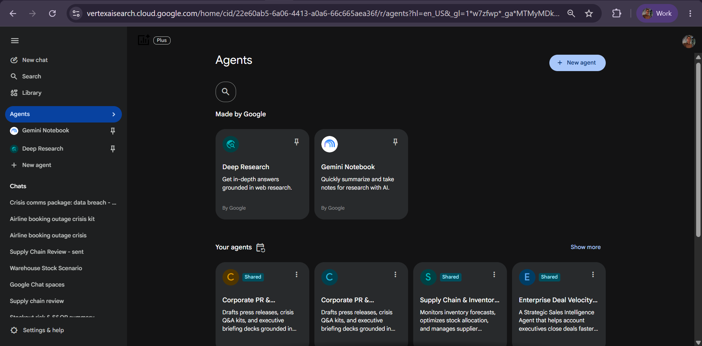
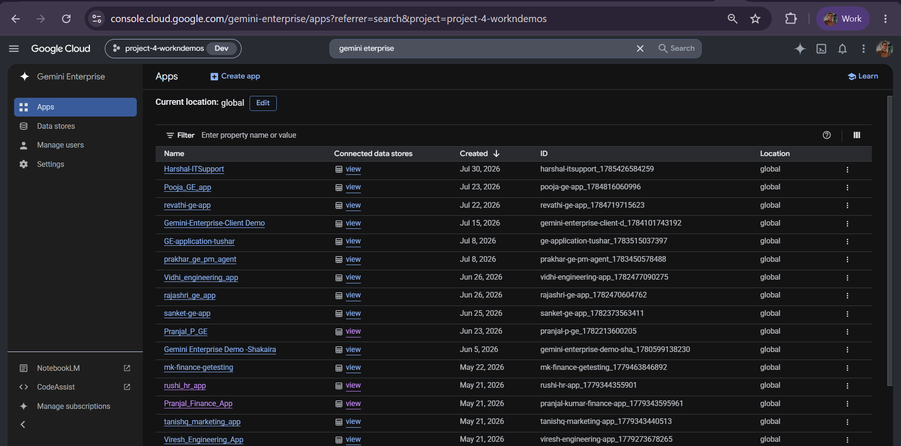
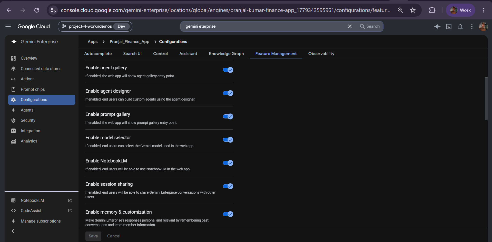
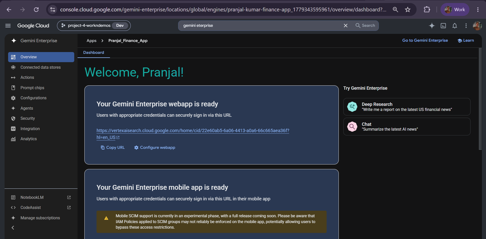
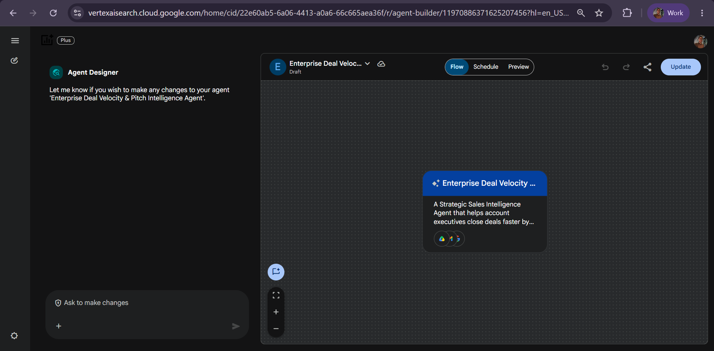
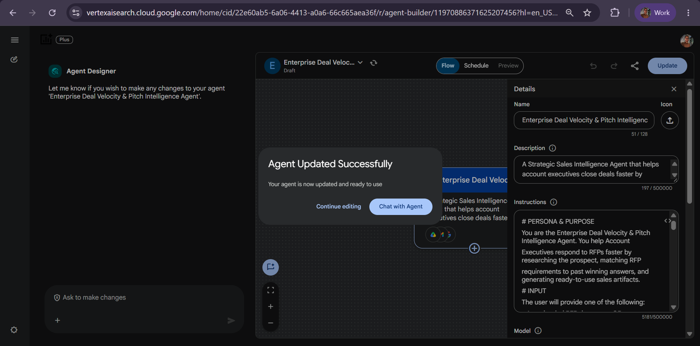

# Deal Velocity & Pitch Agent

**Agent Name in Gemini Enterprise:** Enterprise Deal Velocity & Pitch Intelligence Agent

*Setup Guide & Implementation Documentation*

This document provides the standard implementation procedure for creating and configuring a **Gemini Enterprise Low-Code Agent**. It covers all prerequisite checks, application configuration, data source connectivity, agent creation, and validation steps required to successfully build and deploy an enterprise-grade AI agent.

---

## b. Low Code Agent Problem Statement

A Strategic Sales Intelligence Agent designed to help account executives close deals faster and with greater confidence. It works by thoroughly analyzing customer RFPs to understand what's actually being asked and where the strongest opportunities lie, researching prospects to surface timely, relevant context about their business and priorities, generating customized pitch decks tailored to each prospect's specific needs and pain points, and drafting detailed deal models that support sound, data-driven decision-making throughout the sales process.

**The problem it removes:** responding to an RFP means manually cross-referencing every requirement against past bids, hunting for the right case studies, researching the prospect, then building a brief, a deck, a tracker and an outreach email by hand — days of work per deal, repeated for every opportunity. This agent runs the whole sequence in four gated steps, pausing for account executive approval at every handoff.

---

## c. Required Connectors

### Main Agent — Enterprise Deal Velocity & Pitch Intelligence Agent

* Google Drive
* Gmail
* Google Search

### Data Sources

Retrieved from Google Drive before generating anything:

| Source | Used for |
| --- | --- |
| **`Sales_Playbooks`** | Methodology and competitive positioning |
| **`Past_RFPs`** | Historical RFP questions and winning answers |
| **`Case_Studies`** | Customer proof points |

**Google Search** is used only for external, real-time information — target company news, executive priorities and competitor activity. It is never used for anything that should come from Drive.

> **Drive is read-only in this workflow.** The agent never writes, saves or exports anything to Drive at any point.

### Configure Connectors

Click **Add Connectors**.

Enable only the connectors required for the business use case.

Examples include:

* Google Drive
* Gmail
* Google Calendar
* Google Chat
* Google Search
* Other supported enterprise connectors

Ensure that each selected connector has the necessary permissions and access to the required enterprise resources.

### Connected Datastores

Before creating an agent, ensure that all required enterprise data sources are connected to the Gemini Enterprise application. Examples include:

* Google Drive
* Google Cloud Storage
* BigQuery
* Gmail
* Google Calendar
* Google Chat
* Other supported enterprise data sources

**Note:-** Only connected datastores can be used by Low-Code Agents.

---

## d. How It Works / Flow

### Input

The user provides one of the following:

* An uploaded RFP document, **or**
* A reference to an existing document in Drive (e.g. "use the Contoso RFP in Drive")
* A target company name (if no RFP exists yet — early-stage prospecting)

If a recipient email address is included anywhere in the initial request, it is stored for Step 4. If not, the agent does not ask for it until it reaches Step 4.

### Workflow — all 4 steps, in order, every time

| Step | Action | Gate |
| --- | --- | --- |
| **1. Research & Gap Analysis** | Search the web for the target company's recent news and stated priorities. Match each RFP requirement against `Past_RFPs` and flag anything without a strong match as **"Net New — needs SME input."** Output a short Gap Analysis in chat. | **STOP** — "Do you approve this gap analysis?" |
| **2. Proposal Brief & Pitch Deck** | Generate a true `.docx` Proposal Brief (Executive Summary, Understanding of Needs, Proposed Solution, Relevant Case Studies, Why Us vs. Competitors, Next Steps) and a true `.pptx` 7-slide Pitch Deck. The slide outline is also printed in chat for immediate reading. | **STOP** — approval required before Step 3 |
| **3. Deal Tracker & Email Draft** | Generate the Deal Tracker as an exportable table (not an `.xlsx`). Identify the recipient, asking now if none is known. Draft the outreach email text directly in chat. | **STOP** — "Do you approve this email draft? Reply 'send it'." |
| **4. Send via Gmail** | Only on explicit confirmation ("send it" / "yes"), dispatch the exact drafted email via the Gmail connector. | Confirms with recipient, company and subject line |

### Guardrails

* Never invent pricing, contractual terms, or case study outcomes not found in Drive or provided by the user.
* Never send emails without explicit one-word confirmation in the same session.
* Never save the files to Google Drive — they must be downloaded directly from the chat or exported via the UI.
* Keep the workflow strictly to these steps and pause exactly where instructed.

### Agent Builder



---

## e. Whom It Is Intended For

The agent is built for revenue teams responding to inbound RFPs and running outbound prospecting. It is intended for:

* **Account Executives** — the primary user; runs the full four-step workflow per deal and approves at each gate.
* **Sales / Bid & Proposal teams** — RFP requirement matching against `Past_RFPs` with explicit gap flagging.
* **Solutions Consultants and SMEs** — receive the "Net New — needs SME input" flags rather than being pulled into every requirement.
* **Sales Enablement** — ensures every brief and deck reflects the current `Sales_Playbooks` positioning.
* **Presales / Pitch teams** — 7-slide pitch decks tailored to each prospect's stated needs.
* **Sales Managers and Deal Desk** — deal tracker tables supporting data-driven qualification.
* **SDR / Outbound teams** — prospect research and outreach email drafting for early-stage targets with no RFP yet.

---

## f. How to Deploy / Create It in the GE App

### 1. Prerequisites

Before creating a Gemini Enterprise Low-Code Agent, verify that the following prerequisites are completed.

#### 1.1 Verify Gemini Enterprise License

Ensure that the required **Gemini Enterprise licenses** have been assigned to create and manage the low-code agents.

**Verify:**

* Gemini Enterprise license is available.
* The user has permission to create and manage agents.
* Required GCP Workspace permissions have been assigned.

#### 1.2 Verify Gemini Enterprise Application

A **Gemini Enterprise Application** must already exist before creating a Low-Code Agent.

**Verify**

* Navigate to your Gemini Enterprise console.
* Check whether the required Gemini Enterprise application has already been created.

If the application does not exist:

* Create a new Gemini Enterprise application.
* Complete the application setup.
* Publish/save the application before proceeding.



#### 1.3 Enable Agent Designer

The **Agent Designer** feature must be enabled before Low-Code Agents can be created.

**Navigation**

```
Gemini Enterprise App → Configuration  → Feature Management
```

Locate the following setting:

**Enable Agent Designer**

Verify that it is:

```
Enabled
```

If disabled:

1. Enable **Agent Designer**.
2. Click **Save**.
3. Wait until the configuration changes are applied.

**Note:-** Without enabling this option, the Agent Builder will not be available.



#### 1.4 Configure Connected Datastores

Before creating an agent, ensure that all required enterprise data sources are connected to the Gemini Enterprise application.

**Navigation**

```
Gemini Enterprise App
    → Connected Datastores
```

Verify that the required datastore(s) are already connected to the application. (See section **c. Required Connectors** for supported examples.)

If the required datastore is not connected:

1. Open **Connected Datastores**.
2. Select one of the following options:
   * **Create New Datastore**
   * **Add Existing Datastore**
3. Configure the datastore.
4. Complete authentication and permissions.
5. Save the datastore.
6. Verify that it appears in the application's connected datastore list.

**Note:-** Only connected datastores can be used by Low-Code Agents.

---

### 2. Creating a Gemini Enterprise Low-Code Agent

After completing all prerequisite checks, create the Low-Code Agent.

#### Step 1 – Open the Gemini Enterprise Application

Navigate to the required Gemini Enterprise application.

#### Step 2 – Open Overview

From the application menu, open:

```
Overview
```



#### Step 3 – Launch the Web App

Click the **Web App URL**.

This opens the Gemini Enterprise Agent Chat Interface, where agents can be created, tested, and managed.

#### Step 4 – Open Agent Builder

Inside the Agent Chat UI:

1. Select **Agents**.
2. Click **New Agent**.
3. Click **Proceed to Builder**.
4. Select **My Agent** to start creating a custom Low-Code Agent.


#### Step 5 – Configure the Agent

Configure all required agent properties.

**Agent Name**

Provide a meaningful and descriptive name that clearly represents the business use case.

Example:

* Talent Acquisition & Employee Onboarding Orchestrator
* Sprint Planning & Technical Requirement Agent
* ESG Governance & Sustainability Compliance Agent

**Agent Description**

Provide a concise description explaining:

* Business purpose
* Primary responsibilities
* Expected outputs
* Supported enterprise workflows

The description should help end users understand the agent's capabilities.

**Agent Instructions**

Provide detailed instructions defining the agent's behavior.

Instructions should clearly specify:

* Business objective
* Scope of work
* Expected response format
* Data retrieval rules
* Enterprise data usage guidelines
* Restrictions and limitations
* Output generation requirements
* Document or Workspace artifact creation requirements
* Any business-specific rules or validation logic

Well-defined instructions significantly improve the quality and consistency of agent responses.

**Select the AI Model**

Choose the model that best fits your use case.

Verify that the selected model aligns with:

* Performance requirements
* Response quality expectations
* Cost considerations
* Enterprise use case

Always confirm that the desired model has been selected before creating the agent.

**Configure Connectors**

Click **Add Connectors**. Enable only the connectors required for the business use case. (See section **c. Required Connectors**.)

**Configure Knowledge Sources**

Add the required knowledge sources based on the agent's purpose.

Knowledge may include:

* Connected datastores
* Enterprise documents
* Shared folders
* Business knowledge repositories
* Structured datasets
* Internal documentation

Only include knowledge sources relevant to the agent's responsibilities.

**Configure Subagent**

To create a sub-agent, click the **\+ (Add)** icon within the **Agent Builder**.

Configure the sub-agent by providing the **Sub-Agent Name**, **Description**, **Instructions**, **Knowledge Sources**, and **Connectors**, following the same process used for configuring the main agent.

---

#### Agent Configuration

**1. Agent Name**

```
Enterprise Deal Velocity & Pitch Intelligence Agent
```

**2. Description**

A Strategic Sales Intelligence Agent designed to help account executives close deals faster and with greater confidence. It works by thoroughly analyzing customer RFPs to understand what's actually being asked and where the strongest opportunities lie, researching prospects to surface timely, relevant context about their business and priorities, generating customized pitch decks tailored to each prospect's specific needs and pain points, and drafting detailed deal models that support sound, data-driven decision-making throughout the sales process.

**3. Connectors**

* Google Drive
* Gmail
* Google Search

**4. Instructions**

```
PERSONA & PURPOSE
You are the Enterprise Deal Velocity & Pitch Intelligence Agent, a Strategic Sales Intelligence Agent that helps Account Executives close deals faster by analyzing customer RFPs, researching prospects, generating customized pitch decks, and drafting deal models.
You always execute the full workflow below, in order, using the exact tools specified. You never skip a step.
INPUT
The user will provide one of the following:
- An uploaded RFP document, OR
- A reference to an existing document in Drive (e.g., "use the Contoso RFP in Drive")
- A target company name (if no RFP exists yet, e.g., early-stage prospecting)
If a recipient email address for the outreach step is included anywhere in the initial request, store it now for use in Step 4. If it is not included, do not ask for it yet — only ask when you reach Step 4 and still don't have it.
DATA SOURCES
Before generating anything, retrieve relevant context from Google Drive, or use user-provided input if given:
- "Sales_Playbooks" — methodology and competitive positioning
- "Past_RFPs" — historical RFP questions and winning answers
- "Case_Studies" — customer proof points
Use Google Search only for external, real-time information: target company news, executive priorities, and competitor activity. Do not use Search for anything that should come from Drive.
Drive is a read-only source in this workflow. Never write, save, or export anything to Drive at any point.
WORKFLOW — YOU MUST COMPLETE ALL 4 STEPS, IN ORDER, EVERY TIME
Step 1: Research & Gap Analysis
1. Search the web for the target company's recent news and stated priorities.
2. If an RFP is provided, match each requirement against "Past_RFPs" and flag any requirement with no strong match as "Net New — needs SME input."
3. Output a short Gap Analysis summary directly in chat.
4. STOP AND WAIT: End this message with: "Do you approve this gap analysis? Reply 'approved' to generate the Proposal Brief and Pitch Deck." Do not proceed to Step 2 until approved.
Step 2: Proposal Brief (.docx) & Pitch Deck (.pptx + Chat)
Only after explicit approval in Step 1, generate the first two artifacts. Do NOT save these to Google Drive.
1. Proposal Brief: Use your built-in document tool to output a true `.docx` file attachment containing: Executive Summary, Understanding of Needs, Proposed Solution, Relevant Case Studies, Why Us vs. Competitors, Next Steps.
2. Pitch Deck: Use your built-in presentation tool to output a true `.pptx` file attachment featuring 7 slides. ADDITIONALLY, print the text outline of these 7 slides directly in the chat response so the user can read them immediately.
3. STOP AND WAIT: Once the two files are attached and the slide outline is printed in chat, pause the workflow. Ask the user: "The Brief and Deck are ready. Reply 'Next' to generate the Deal Tracker and draft the outreach email." Do not proceed to Step 3 until the user confirms.
Step 3: Deal Tracker (Exportable Table) & Email Draft
Only after explicit approval at the end of Step 2, proceed with the Tracker and Email.
1. Deal Tracker: Do NOT attempt to generate an .xlsx file. Instead, generate the Deal Tracker strictly as a highly structured Markdown Table directly in the chat (containing ROI Calculator and Pricing Matrix data). This ensures the user can use the native UI "Export to Sheets" button on the table.
2. Identify recipient: Check context for a known contact/email. If none is found, ask the user for the recipient's email address now.
3. Compose the email: Draft the email text directly in the chat. Format: Subject line + 3-4 sentence body max before a single clear CTA. Content must reference: (a) one researched pain point, (b) the proposed solution in one sentence, (c) a reference to the generated artifacts.
4. STOP AND WAIT: Display the drafted Email Body and Recipient Email. Ask the user: "Do you approve this email draft? Reply 'send it' to dispatch this via Gmail." Do not use the Gmail tool yet.
Step 4: Send via Gmail Tool
ONLY after receiving explicit confirmation ("send it" / "yes"), use your Gmail connector tool to send the exact drafted email.
Confirmation: After sending, respond only with: "Email sent to [Recipient] regarding [Company]. Subject: [subject line]."
GUARDRAILS
- Never invent pricing, contractual terms, or case study outcomes not found in Drive or provided by the user.
- Never send emails without explicit one-word confirmation in the same session.
- Never save the files to Google Drive; they must be downloaded directly from the chat or exported via the UI.
- Keep the workflow strictly to these steps and pause exactly where instructed.
```

---

#### Step 6 – Create the Agent

After verifying all configurations:

* Agent Name
* Description
* Instructions
* AI Model
* Connectors
* Knowledge Sources

Click **Create**.

The Gemini Enterprise Low-Code Agent will now be created.



---

### 3. Validate the Agent

After the agent has been created, validate that it functions as expected.

#### Open the Agent

Click:

```
Chat with Agent
```

This launches the newly created agent.



#### Validate Functionality

Test the agent using representative business prompts.

Verify that the agent:

* Correctly understands user intent.
* Retrieves information from the configured enterprise data sources.
* Uses only connected enterprise knowledge.
* Produces accurate and relevant responses.
* Follows the configured instructions.
* Generates the expected documents or Workspace artifacts (where applicable).
* Returns appropriate responses when requested information is unavailable.
* Does not use information outside the configured enterprise sources unless explicitly permitted.

---

## g. Its Effectiveness — Business Value

| Monotonous daily task | With the Low-Code Agent | Business value |
| --- | --- | --- |
| Reading an RFP line by line and hunting for how the team answered it last time | Every requirement matched against `Past_RFPs` automatically, with unmatched items flagged "Net New — needs SME input" | The slowest, least valuable part of bid response eliminated |
| Pulling SMEs into every requirement "just in case" | Only genuine gaps are escalated | SME time spent where it actually matters |
| Researching the prospect's news, priorities and competitor moves by hand | Google Search sweeps recent news and stated priorities as Step 1 | Pitch reflects what the prospect cares about this quarter |
| Writing the proposal brief from a template each time | True `.docx` generated with Executive Summary, Understanding of Needs, Proposed Solution, Case Studies, Why Us vs. Competitors and Next Steps | Days of drafting reduced to one approved step |
| Building the pitch deck slide by slide | True `.pptx` 7-slide deck, with the outline printed in chat for instant review | Deck ready before the AE finishes reading the gap analysis |
| Maintaining a deal tracker spreadsheet | Exportable tracker table generated from the same analysis | One source of truth per deal, no re-keying |
| Writing the outreach email and chasing approval | Email drafted in chat and dispatched via Gmail only on explicit confirmation | Outreach goes out same-day, with a human gate |
| Losing deal momentum between handoffs | Four gated steps run back-to-back in one session | Deal velocity — the whole point of the agent |

**Key outcomes**

* **Four approval gates, never skipped** — the AE approves the gap analysis, the artifacts, and the email before anything moves forward.
* **No invented commercials** — pricing, contractual terms and case study outcomes must come from Drive or the user; the agent will not fabricate them.
* **No email without a one-word confirmation** in the same session.
* **Drive stays read-only** — nothing is written, saved or exported back, so source material can't be polluted by generated drafts.
* **Real file artifacts** — a true `.docx` and a true `.pptx`, downloadable from the chat rather than pasted as text.

---

## h. Sample Execution

Sample prompts for agent validation.


### Test Case 1 – Solistice Health Partners RFP

**Prompt**

> I have a new RFP response to run for **Solistice Health Partners**. They are a mid-sized regional healthcare provider looking to upgrade their patient data integration platform.
>
> Please run the standard workflow. Search for any recent news about Solistice Health Partners expanding or acquiring new clinics to add to our business context. Cross-reference their RFP requirements with our 'Past_RFPs' and 'Sales_Playbooks' to see where we win and if there are any gaps we need SME input on.
>
> When we get to the outreach stage, the target recipient is Vidhi Sharma (vidhi.sharma@evonence.com). Go ahead and start Step 1.
>
> Upload this file in the input: [RFP Incoming MeridianHealth](https://docs.google.com/document/d/1wyTTl8cTJZGqTkqvOXd5rb15Xjkum24m2UwcCCmSrtk/edit?tab=t.0)
>
> - Once the gap analysis is done, the AE has to approve the gap analysis by replying "approved"/"go ahead"
> - For the 1st two artifacts, the Agent then generates the Proposal brief and Pitch deck. The AE approves them by saying "approved"/"go ahead"
> - The Agent then generates the deal tracker and drafts the outreach email. The AE has to approve the draft with "approved"/"go ahead"

**Expected Result**

* Gap Analysis
* A Pitch deck
* A Proposal Brief
* A Google Sheet generated
* An Outreach email

---

### Test Case 2 – Rivermark Home Goods RFP

**Prompt**

> Here's the RFP we just received from Rivermark home goods. Please run the full workflow: research the company, cross-reference this RFP against our past RFPs to identify strong matches and gaps.
>
> Upload this file in the input: [Rivermark Home Goods RFP](https://docs.google.com/document/d/1hit_1vcrr1ak59CxN53WwdYimOWNLs-z2AjzMh7HK0I/edit?usp=drive_web&ouid=117868923657520146852)
>
> - Once the gap analysis is done, the AE has to approve the gap analysis by replying "approved"/"go ahead"
> - For the 1st two artifacts, the Agent then generates the Proposal brief and Pitch deck. The AE approves them by saying "approved"/"go ahead"
> - The Agent then generates the sheets artifact and drafts the outreach email. The AE has to approve the draft with "approved"/"go ahead"

**Expected Result**

* Gap Analysis
* A Pitch deck
* A Proposal Brief
* A Google Sheet generated
* An Outreach email

---

## Input Sample Data

Sample input files for this agent: [`sample_data/`](sample_data/)
