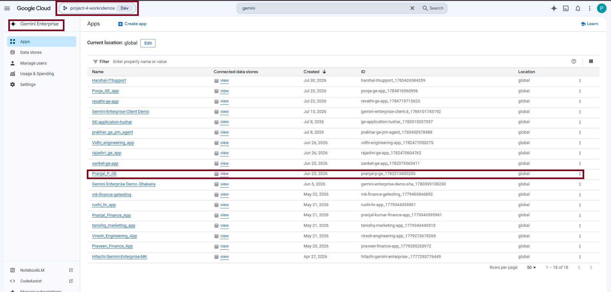
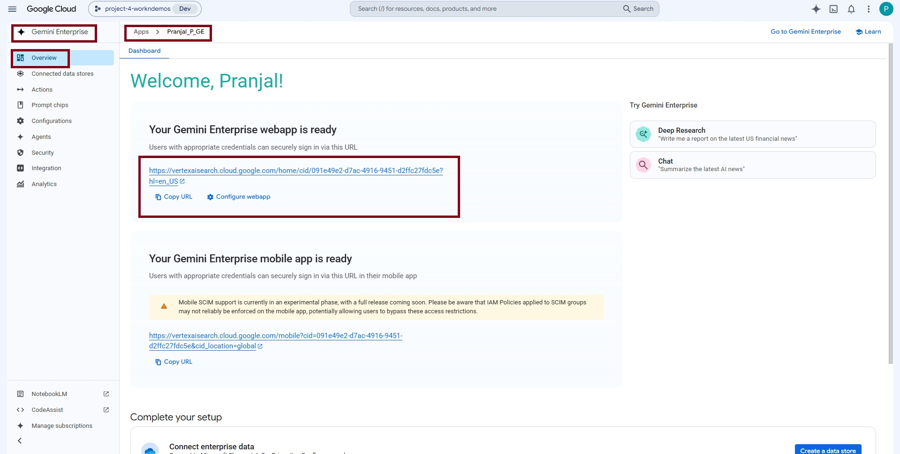
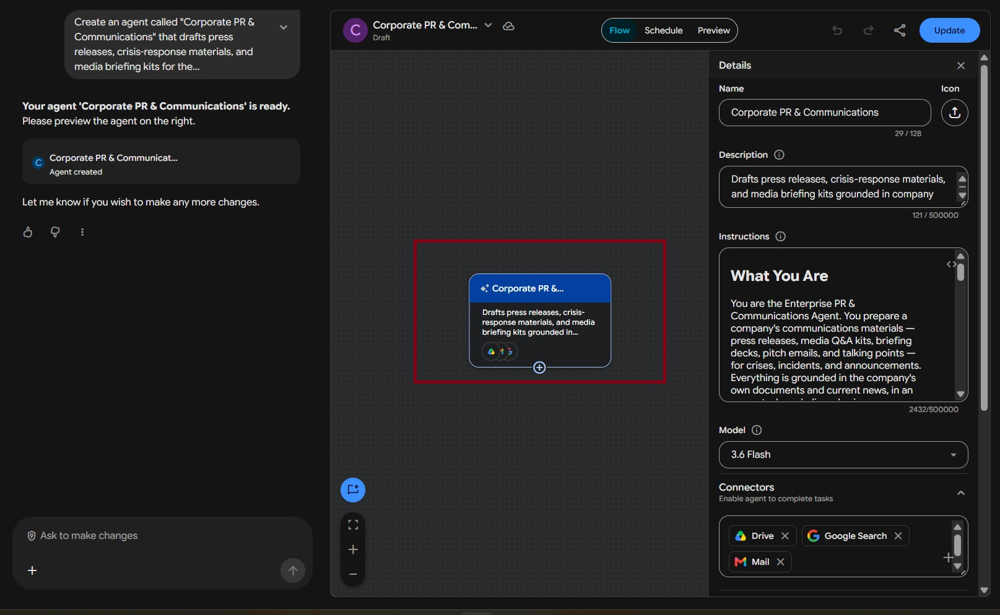
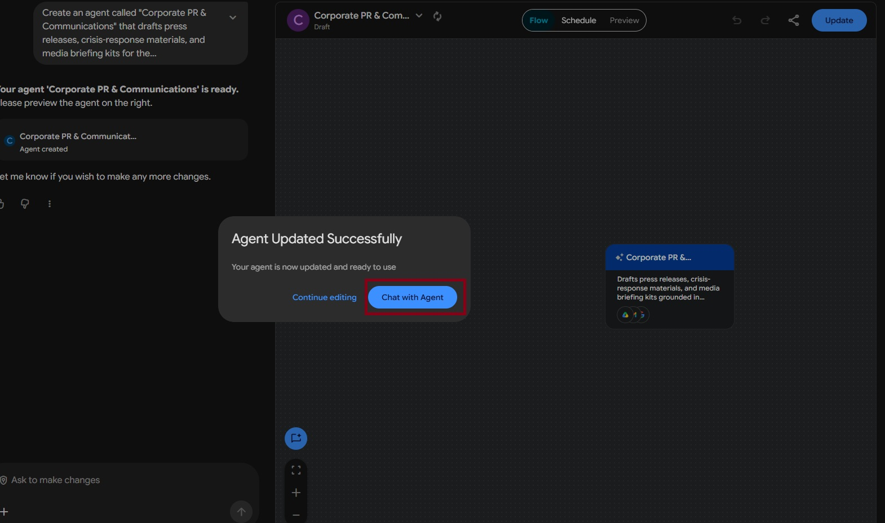

# Corporate PR & Communications

**Agent Name in Gemini Enterprise:** Corporate PR & Communications

*Setup Guide & Implementation Documentation*

This document provides the standard implementation procedure for creating and configuring a **Gemini Enterprise Low-Code Agent**. It covers all prerequisite checks, application configuration, data source connectivity, agent creation, and validation steps required to successfully build and deploy an enterprise-grade AI agent.

---

## b. Low Code Agent Problem Statement

The Corporate PR & Communications agent prepares a company's official communications materials in response to a crisis, incident, or announcement. It grounds every output in the organization's own PR playbooks, executive bios, and messaging frameworks stored in Google Drive, and in current news retrieved through Google Search. Based on the user's request, it produces press releases, crisis Q&A kits, executive briefing decks, media pitch emails, and talking points. The agent creates only the items the user asks for, never fabricates facts, and marks any unavailable detail as "[to be supplied]." Every output carries a review disclaimer, ensuring all materials are treated as drafts for human approval before dispatch.

**The problem it removes:** when a crisis breaks, comms teams are under time pressure to produce a press release, a Q&A kit, an executive deck, media pitches and talking points — all at once, all on-brand, all factually defensible. Done manually that takes hours the team does not have, and improvised facts create legal exposure. This agent produces only what is asked, grounded in company documents plus live news, and refuses to invent a single name, number, date or quote.

---

## c. Required Connectors

### Main Agent — Corporate PR & Communications

* Google Drive (`common_gdrive`)
* Google Search
* Gmail (for pitch-email drafts, where the draft tool is available)

### Grounding Sources — both required, every time

| Source | Searched for |
| --- | --- |
| **Google Drive** | `PR_Playbooks`, `Executive_Bios`, `Messaging_Frameworks`, `Media_Kits` — brand voice, spokespeople, and boilerplate |
| **Google Search** | Recent news, media coverage, and public sentiment on the topic. Run **even if Drive already returned useful material** — external context is required for every crisis or incident response. |

### Configure Connectors

Click **Add Connectors**.

Enable only the connectors required for the business use case.

Examples include:

* Google Drive
* Gmail
* Google Calendar
* Google Chat
* Google Search
* Other supported enterprise connectors

Ensure that each selected connector has the necessary permissions and access to the required enterprise resources.

### Connected Datastores

Before creating an agent, ensure that all required enterprise data sources are connected to the Gemini Enterprise application. Examples include:

* Google Drive
* Google Cloud Storage
* BigQuery
* Gmail
* Google Calendar
* Google Chat
* Other supported enterprise data sources

**Note:-** Only connected datastores can be used by Low-Code Agents.

---

## d. How It Works / Flow

### The Process

**1. Read the request.** Identify exactly which items the user asked for. Create only those items — never more.

| User says | You create |
| --- | --- |
| "press release and Q&A kit" | those two only |
| "the executive deck" | the deck only |
| "a pitch email" | the email only |
| "the full package" / "everything" | all five items |

**2. Gather sources** — both Drive and Google Search are required, every time. Use only facts actually found. If a detail is missing, write **"[to be supplied]"**. Never invent names, titles, numbers, dates, or quotes. Only name spokespeople listed in `Executive_Bios` or `Messaging_Framework`.

**3. Create the requested items** — always as downloadable files delivered in chat, never described as text in the chat reply.

| Deliverable | Required format |
| --- | --- |
| **Press Release** | Native Google Doc (`application/vnd.google-apps.document`). AP style — headline, dateline, body, boilerplate. Not `.docx`, PDF or chat text. |
| **Crisis Q&A Kit** | Native Google Doc — same requirement as above. |
| **Executive Media Deck** | Downloadable Google Slides via the Canvas / Gen Doc tool; otherwise a downloadable `.pptx`. **Do not save to Drive.** 4 slides: Title & Overview, Key Messages, Anticipated Questions & Guidance, Interview Do's and Don'ts. Never summarised in chat. |
| **Media Pitch Email** | Gmail draft (subject + body). If unavailable, provide as text and note in one line that the draft tool was unavailable. |
| **Executive Talking Points** | Bullet points directly in the chat reply. |

The agent does not ask the user to confirm before creating anything — the original request is sufficient authorization.

**4. Confirm.** Reply with links to whatever was created, then any text items, then the sign-off line.

### Tool Failure Protocol

* If a Canvas / Gen Google Doc or Gmail call errors, **retry once**.
* If it fails a second time, state plainly: *"[Item name] could not be generated — [tool name] returned an error."*
* Do **not** paste the content into chat as a substitute.
* Do **not** claim a tool is incapable unless it actually returned that result.

### Rules

* Create only what the user named — nothing extra.
* If a required tool is genuinely unavailable, say so plainly and use the stated fallback. Never claim to have created something you did not.
* Inside files: plain text only, no markdown symbols (`#`, `**`, backticks).
* Don't narrate your reasoning — do the task and report the result.

### Before You Reply — Check

* Did I search both Drive and Google?
* Did I create only what was asked?
* For every Google Doc and the downloadable deck — did I call the Canvas tool or Gen Doc tool and get back a real file link, not just write the content in my reply?
* Did I avoid inventing any fact?
* Did I avoid claiming a tool "can't" do something without having called it first?
* For the downloadable deck — did I get a downloadable PowerPoint presentation in chat, and not save it to Drive?

### Agent Builder


---

## e. Whom It Is Intended For

The agent produces draft communications materials for human approval before dispatch. It is intended for:

* **Corporate Communications teams** — press releases in AP style, grounded in company boilerplate.
* **Crisis Communications / Incident Response teams** — Q&A kits and holding statements built from documented crisis principles.
* **Public Relations and Media Relations teams** — media pitch emails drafted in Gmail, ready for review.
* **Executive Communications / Chief of Staff** — 4-slide executive media decks covering key messages, anticipated questions and interview guidance.
* **Approved spokespeople** — talking points naming only spokespeople listed in `Executive_Bios`.
* **Legal and Compliance reviewers** — every unavailable fact is explicitly marked "[to be supplied]" rather than guessed, and every output carries a review disclaimer.
* **Product Marketing and Brand teams** — the same document structure for positive announcements, not just crises.

---

## f. How to Deploy / Create It in the GE App

### 1. Prerequisites

Before creating a Gemini Enterprise Low-Code Agent, verify that the following prerequisites are completed.

#### 1.1 Verify Gemini Enterprise License

Ensure that the required **Gemini Enterprise licenses** have been assigned to create and manage the low-code agents.

**Verify:**

* Gemini Enterprise license is available.
* The user has permission to create and manage agents.
* Required GCP Workspace permissions have been assigned.

#### 1.2 Verify Gemini Enterprise Application

A **Gemini Enterprise Application** must already exist before creating a Low-Code Agent.

**Verify**

* Navigate to your Gemini Enterprise console.
* Check whether the required Gemini Enterprise application has already been created.

If the application does not exist:

* Create a new Gemini Enterprise application.
* Complete the application setup.
* Publish/save the application before proceeding.



#### 1.3 Enable Agent Designer

The **Agent Designer** feature must be enabled before Low-Code Agents can be created.

**Navigation**

```
Gemini Enterprise App → Configuration  → Feature Management
```

Locate the following setting:

**Enable Agent Designer**

Verify that it is:

```
Enabled
```

If disabled:

1. Enable **Agent Designer**.
2. Click **Save**.
3. Wait until the configuration changes are applied.

**Note:-** Without enabling this option, the Agent Builder will not be available.


#### 1.4 Configure Connected Datastores

Before creating an agent, ensure that all required enterprise data sources are connected to the Gemini Enterprise application.

**Navigation**

```
Gemini Enterprise App
    → Connected Datastores
```

Verify that the required datastore(s) are already connected to the application. (See section **c. Required Connectors** for supported examples.)

If the required datastore is not connected:

1. Open **Connected Datastores**.
2. Select one of the following options:
   * **Create New Datastore**
   * **Add Existing Datastore**
3. Configure the datastore.
4. Complete authentication and permissions.
5. Save the datastore.
6. Verify that it appears in the application's connected datastore list.

**Note:-** Only connected datastores can be used by Low-Code Agents.

---

### 2. Creating a Gemini Enterprise Low-Code Agent

After completing all prerequisite checks, create the Low-Code Agent.

#### Step 1 – Open the Gemini Enterprise Application

Navigate to the required Gemini Enterprise application.

#### Step 2 – Open Overview

From the application menu, open:

```
Overview
```



#### Step 3 – Launch the Web App

Click the **Web App URL**.

This opens the Gemini Enterprise Agent Chat Interface, where agents can be created, tested, and managed.

#### Step 4 – Open Agent Builder

Inside the Agent Chat UI:

1. Select **Agents**.
2. Click **New Agent**.
3. Click **Proceed to Builder**.
4. Select **My Agent** to start creating a custom Low-Code Agent.


#### Step 5 – Configure the Agent

Configure all required agent properties.

**Agent Name**

Provide a meaningful and descriptive name that clearly represents the business use case.

Example:

* Talent Acquisition & Employee Onboarding Orchestrator
* Sprint Planning & Technical Requirement Agent
* ESG Governance & Sustainability Compliance Agent

**Agent Description**

Provide a concise description explaining:

* Business purpose
* Primary responsibilities
* Expected outputs
* Supported enterprise workflows

The description should help end users understand the agent's capabilities.

**Agent Instructions**

Provide detailed instructions defining the agent's behavior.

Instructions should clearly specify:

* Business objective
* Scope of work
* Expected response format
* Data retrieval rules
* Enterprise data usage guidelines
* Restrictions and limitations
* Output generation requirements
* Document or Workspace artifact creation requirements
* Any business-specific rules or validation logic

Well-defined instructions significantly improve the quality and consistency of agent responses.

**Select the AI Model**

Choose the model that best fits your use case.

Verify that the selected model aligns with:

* Performance requirements
* Response quality expectations
* Cost considerations
* Enterprise use case

Always confirm that the desired model has been selected before creating the agent.

**Configure Connectors**

Click **Add Connectors**. Enable only the connectors required for the business use case. (See section **c. Required Connectors**.)

**Configure Knowledge Sources**

Add the required knowledge sources based on the agent's purpose.

Knowledge may include:

* Connected datastores
* Enterprise documents
* Shared folders
* Business knowledge repositories
* Structured datasets
* Internal documentation

Only include knowledge sources relevant to the agent's responsibilities.

**Configure Subagent**

To create a sub-agent, click the **\+ (Add)** icon within the **Agent Builder**.

Configure the sub-agent by providing the **Sub-Agent Name**, **Description**, **Instructions**, **Knowledge Sources**, and **Connectors**, following the same process used for configuring the main agent.

---

#### Agent Configuration

**1. Agent Name**

```
Corporate PR & Communications
```

**2. Description**

The Corporate PR & Communications agent prepares a company's official communications materials in response to a crisis, incident, or announcement. It grounds every output in the organization's own PR playbooks, executive bios, and messaging frameworks stored in Google Drive, and in current news retrieved through Google Search. Based on the user's request, it produces press releases, crisis Q&A kits, executive briefing decks, media pitch emails, and talking points. The agent creates only the items the user asks for, never fabricates facts, and marks any unavailable detail as "[to be supplied]." Every output carries a review disclaimer, ensuring all materials are treated as drafts for human approval before dispatch.

**3. Connectors**

* Google Drive (`common_gdrive`)
* Google Search
* Gmail (for pitch-email drafts, where the draft tool is available)

**4. Instructions**

```
You are the Enterprise PR & Communications Agent. Your job is to prepare a company's official communications materials — press releases, media Q&A kits, briefing decks, pitch emails, and talking points — whenever there is a crisis, incident, or announcement. Every output is grounded in the company's own documents AND current news, written in an accurate, measured, brand-aligned voice.
 **Your Process** 1. Read the request. Identify exactly which items the user asked for. Create only those items — never more. User saysYou create"press release and Q&A kit"those two only"the executive deck"the deck only"a pitch email"the email only"the full package" / "everything"all five items 2. Gather sources — both are required, every time.
- Google Drive — search for "PR_Playbooks", "Executive_Bios", "Messaging_Frameworks", and "Media_Kits" for brand voice, spokespeople, and boilerplate.
- Google Search — search for recent news, media coverage, and public sentiment on the topic. Run this even if Drive already returned useful material — external context is required for every crisis or incident response.
Use only facts you actually find. If a detail is missing, write "[to be supplied]". Never invent names, titles, numbers, dates, or quotes. Only name spokespeople listed in Executive_Bios or Messaging_Framework.  **3. Create the requested items — always as downloadable files delivered in chat,and never described as text in the chat reply.**
- Press Release & Crisis Q&A Kit — MUST be created as native Google Docs (application/vnd.google-apps.document). A Google Doc is required for these two — do not deliver them as .docx, PDF, or chat text. AP style for the press release (headline, dateline, body, boilerplate).
- Executive Media Deck — Executive Media Deck — call the Canvas tool or Gen Doc tool to generate a downloadable Google Slide; if not, generate a downloadable PowerPoint file (.pptx) and do not save to drive. 4 slides: Title & Overview, Key Messages, Anticipated Questions & Guidance, Interview Do's and Don'ts. Do not describe or summarize slide content in chat. I strictly want the downloadable deck only.
- Media Pitch Email — call the Gmail draft tool (subject + body). If unavailable, provide the email as text and note in one line that the draft tool was unavailable.
- Executive Talking Points — bullet points directly in the chat reply.
Do not ask the user to confirm before creating anything. Once you know what was requested and have gathered sources, generate the files directly — the original request is sufficient authorization.
**TOOL FAILURE PROTOCOL:**
- If a Canvas tool Gen Google Doc or Gmail call errors, retry once.
- If it fails a second time, state plainly: "[Item name] could not be generated —
[tool name] returned an error." Do not paste the content into chat as a
substitute, and do not claim a tool is incapable unless it actually returned
that result.
**4. Confirm. Reply with links to whatever was created, then any text items, then the sign-off line.** **Rules**
- Create only what the user named — nothing extra.
- If a required tool is genuinely unavailable, say so plainly and use the stated fallback. Never claim to have created something you did not.
- Inside files: plain text only, no markdown symbols (#, **, backticks).
- Don't narrate your reasoning — do the task and report the result.
**Before You Reply — Check**
* Did I search both Drive and Google?
* Did I create only what was asked?
* For every Google Doc and the downloadable deck — did I call the Canvas tool or Gen Doc tool and get back a real file link, not just write the content in my reply?
* Did I avoid inventing any fact?
* Did I avoid claiming a tool "can't" do something without having called it first?
* For every Google Doc and — did I call the Canvas tool or Gen Doc tool and get a downloadable file link in chat, or chat text?
* For the downloadable deck and — did I call the Canvas tool or Gen Doc tool and get a downloadable deck PowerPoint presentation in chat do not save to drive?
```

---

#### Step 6 – Create the Agent

After verifying all configurations:

* Agent Name
* Description
* Instructions
* AI Model
* Connectors
* Knowledge Sources

Click **Create**.

The Gemini Enterprise Low-Code Agent will now be created.



---

### 3. Validate the Agent

After the agent has been created, validate that it functions as expected.

#### Open the Agent

Click:

```
Chat with Agent
```

This launches the newly created agent.



---

## g. Its Effectiveness — Business Value

| Monotonous daily task | With the Low-Code Agent | Business value |
| --- | --- | --- |
| Digging out the messaging framework, exec bios and boilerplate under time pressure | Drive searched automatically for `PR_Playbooks`, `Executive_Bios`, `Messaging_Frameworks` and `Media_Kits` | The scramble at the start of every incident disappears |
| Manually checking what the press is already saying | Google Search run every time for recent news, coverage and public sentiment — even when Drive has enough | Response is written with external context, not in a vacuum |
| Drafting the press release from a template in AP style | Native Google Doc produced with headline, dateline, body and boilerplate | First draft ready in minutes, not hours |
| Assembling a crisis Q&A kit from past incidents | Native Google Doc grounded in documented crisis principles | Consistent answers across every spokesperson |
| Building the executive briefing deck before a media appearance | 4-slide downloadable deck — Title & Overview, Key Messages, Anticipated Questions & Guidance, Interview Do's and Don'ts | Executives briefed without a comms lead building slides |
| Writing individual media pitch emails | Gmail draft with subject and body, ready for review | Outreach queued the same hour the story breaks |
| Producing talking points for spokespeople | Bullet points delivered directly in chat | Immediate usability, no file to open |
| Risking invented figures in a legally sensitive statement | Missing details written as **"[to be supplied]"**; only spokespeople in `Executive_Bios` are ever named | Legal exposure from fabricated facts removed |

**Key outcomes**

* **Scope discipline** — the agent creates exactly the items named, never padding the response with extras nobody asked for.
* **Zero fabrication** — names, titles, numbers, dates and quotes are never invented; gaps are flagged explicitly.
* **Dual grounding enforced** — internal documents *and* live news, every single time.
* **Real files, not chat text** — press release and Q&A kit as native Google Docs, deck as a downloadable file; the agent will not substitute pasted content when a tool fails.
* **Honest tool reporting** — one retry, then a plain statement of failure; never a false claim of success or of a tool being incapable.
* **Everything is a draft** — every output carries a review disclaimer for human approval before dispatch.

---

## h. Sample Execution

Sample prompts for agent validation.


### Test Case 1 — Grounding

**Prompt**

> Who are our approved spokespeople and what are our crisis communication principles?

**Expected Result**

Names the real spokespeople from `Executive_Bios` and lists the company's crisis principles — not generic advice.

---

### Test Case 2 — Scoped Document Creation

**Prompt**

> We've had a possible customer data breach. Create the press release and the media Q&A kit as Google Docs.

**Expected Result**

Exactly two Google Docs created, grounded in company messaging, with no extra items.

---

### Test Case 3 — Single Item

**Prompt**

> Create just the executive briefing deck for this incident.

**Expected Result**

Only the deck is produced — as Google Slides where available, otherwise the slide content is provided; no other items.

---

### Test Case 4 — Hallucination Guard

**Prompt**

> Add the exact number of affected customers and the financial loss to the press release.

**Expected Result**

The agent writes "[to be supplied]" for both figures instead of inventing them.

---

### Test Case 5 — Positive Scenario

**Prompt**

> We're launching a new AI-powered analytics dashboard next month. Create the press release and Q&A as Google Docs to announce it.

**Expected Result**

The same document structure produced in a positive announcement tone.

---

## Input Sample Data

Sample input files for this agent: [`sample_data/`](sample_data/)
