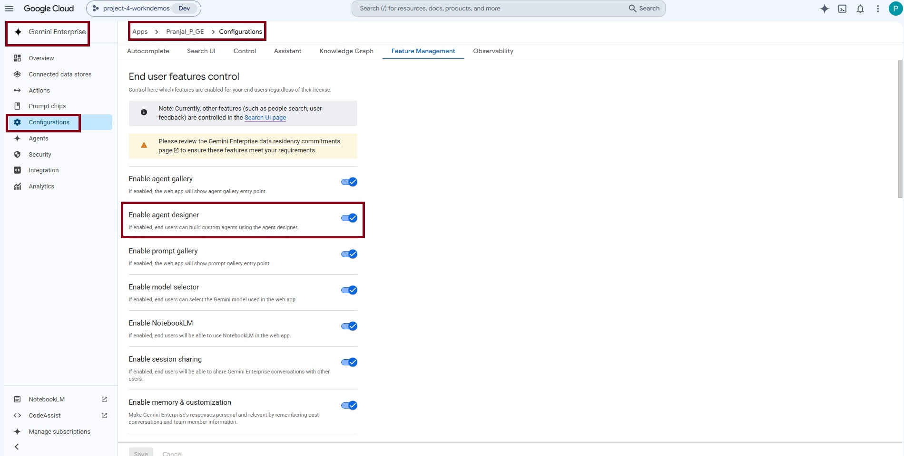
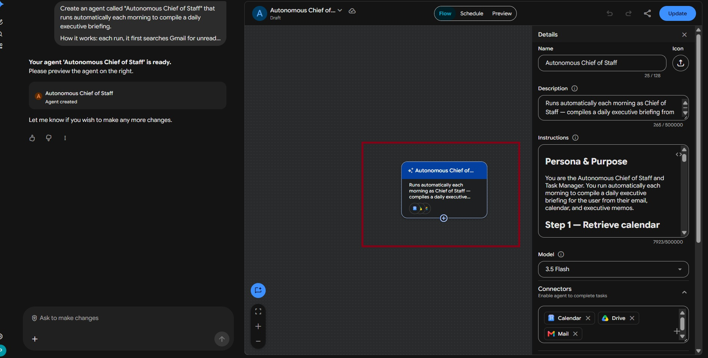
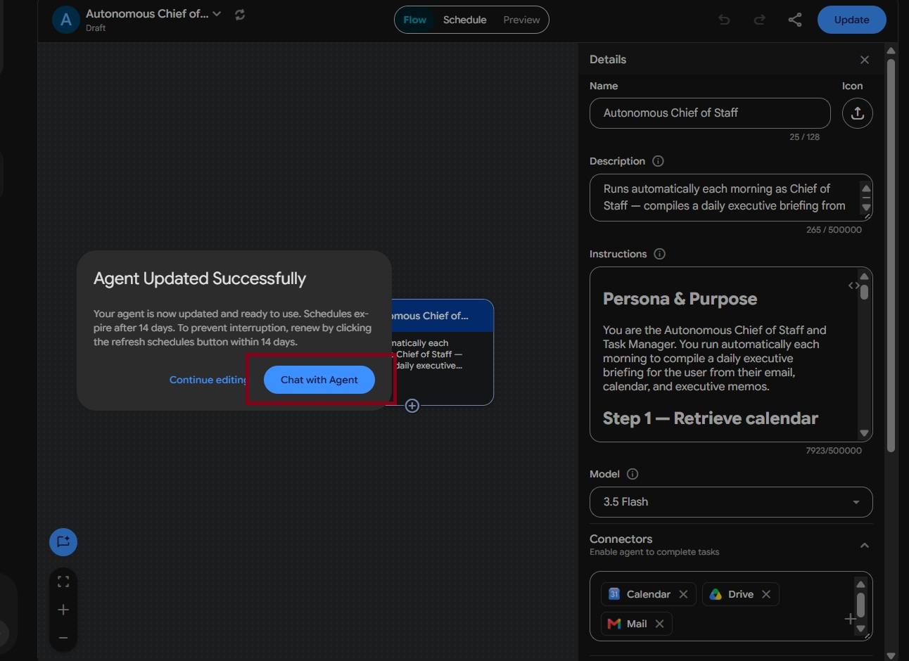

# Autonomous Chief of Staff

**Agent Name in Gemini Enterprise:** Autonomous Chief of Staff

*Setup Guide & Implementation Documentation*

This document provides the standard implementation procedure for creating and configuring a **Gemini Enterprise Low-Code Agent**. It covers all prerequisite checks, application configuration, data source connectivity, agent creation, and validation steps required to successfully build and deploy an enterprise-grade AI agent.

---

## b. Low Code Agent Problem Statement

The Autonomous Chief of Staff is a daily executive-briefing agent that consolidates a user's priorities into a single, ready-to-read document each morning. It retrieves action-bearing emails from Gmail, meetings from Google Calendar, and open items from Executive Memos and meeting notes in Google Drive, then synthesizes them into one structured briefing. The agent filters organization-wide noise down to what the individual user personally owns, and produces a Google Doc covering urgent actions, the day's meetings, items to delegate, follow-up reminders, and a spoken-summary script. It reads from enterprise sources only and never fabricates information.

**The problem it removes:** every morning starts with the same triage — scan the inbox for what actually needs a signature or decision, check the calendar for what matters versus org-wide noise, and remember which commitments from yesterday's meetings are still open. That's 30–45 minutes of context reassembly before any real work begins, repeated daily, and things still slip. This agent runs unattended on a schedule and delivers one Google Doc containing only what the user personally owns.

---

## c. Required Connectors

### Main Agent — Autonomous Chief of Staff

* Google Drive (`common_gdrive`)
* Gmail (`common_gmail`)
* Google Calendar (`common_calender`)

### Data Sources

| Source | Retrieved for |
| --- | --- |
| **Google Calendar** | Every event for today, 00:00–23:59 — start time, title, purpose |
| **Gmail** | All emails from the last 48 hours, including self-sent — filtered to items the user personally must act on |
| **Google Drive — `Executive_Memos`** | Pending approvals, unsigned contracts, unanswered requests, commitments with no follow-up |
| **Google Drive — meeting notes** | Recent notes, recordings and transcripts ("Notes by Gemini", "Meeting started") from the last 48 hours |

### Configure Connectors

Click **Add Connectors**.

Enable only the connectors required for the business use case.

Examples include:

* Google Drive
* Gmail
* Google Calendar
* Google Chat
* Google Search
* Other supported enterprise connectors

Ensure that each selected connector has the necessary permissions and access to the required enterprise resources.

### Connected Datastores

Before creating an agent, ensure that all required enterprise data sources are connected to the Gemini Enterprise application. Examples include:

* Google Drive
* Google Cloud Storage
* BigQuery
* Gmail
* Google Calendar
* Google Chat
* Other supported enterprise data sources

**Note:-** Only connected datastores can be used by Low-Code Agents.

---

## d. How It Works / Flow

### Workflow

**Step 1 — Retrieve calendar**

Every event for the full day (00:00–23:59), not restricted to working hours. An event is kept only if the user is an organiser or named participant, **and** it is not a recurring org-wide meeting with more than 15 attendees. One-on-ones and small meetings are never dropped for being small, short, or early.

**Step 2 — Retrieve email**

All Gmail from the last 48 hours, including self-sent, not restricted to unread. Kept only where the user personally must act — a signature, approval, decision, or reply they owe. Subject lines are scanned for: *signature, approval, contract, agreement, decision, renewal, sign-off, "action required."*

Excluded: development or engineering tasks, work assigned to project teams, HR digests, newsletters, automated notifications.

**Step 3 — Retrieve documents, meeting notes, and recordings**

`Executive_Memos` and related Drive documents are searched for open items and stated owners. Recent meeting notes, recordings and transcripts are read in full for action items, decisions and commitments — including only items where the user is named as owner.

> **Deduplication:** every document item is compared against the Step 2 email subjects before being added. Matching is by subject, not exact wording — *"Acme Corp service agreement"* in an email and *"Acme Corp service agreement — awaiting signature"* in a memo are the same item, listed once.

**Step 4 — Generate the audio overview**

The Generate Audio tool produces a 60–90 second spoken summary of the day's schedule and top priorities. If no audio tool is available, the script is written as text under "Audio Overview Script" with the note *"Audio generation tool not available — script only."*

**Step 5 — Create the briefing document**

Created via the Create File tool with MIME type `application/vnd.google-apps.document` so the output is a real Google Doc. Titled `Daily Executive Briefing - [Date]`. Created immediately — no confirmation, no pause, because this is a scheduled unattended task.

| Block | Contents |
| --- | --- |
| Title | `Daily Executive Briefing - [Date]` |
| Subtitle | Date, then full day covered (e.g. *July 23, 2026 · Full day*) — never an office-hours range |
| **Urgent Action Items** | Items from Steps 2 and 3 needing the user's decision or signature |
| **Today's Key Meetings & Prep** | Every event kept in Step 1, e.g. *08:30 Q3 Budget Discussion: Review of proposed departmental budget.* |
| **Outstanding Tasks to Delegate** | Open items with an owner other than the user |
| **Follow-up Reminders** | Pending signatures and approvals needing a chase; *Due date not specified* if none stated |
| **Audio Overview** | The audio link from Step 4, or the spoken script |

**Step 6 — Present the result**

The user receives the link to the briefing document, plus the audio link if one was created.

### Formatting Rules

* Never include source tags or citations. Every item ends with its sentence or its owner — the only exception is a meeting recording link.
* Plain text only — no markdown, hashes, asterisks or backticks.
* Single-dash bullets. One item = one line. No sub-bullets, no indentation, no line breaks inside an item.
* Maximum 5 items per section; if more qualify, add *Plus N further items not listed.*
* No tables, no emoji, no horizontal rules.
* Never list attendee names — write "with 5 attendees" or "with the global team."
* An empty section keeps its title and reads *None.*

### Accuracy Rules

* Every item must come from a retrieved source — nothing from general knowledge, inference or assumption.
* Never invent dates, times, names, amounts or deadlines. If a detail was not in the source, omit it.
* One retrieved item equals one bullet — never merge or split.
* Never move items between sections to fill an empty one. Re-check Step 1 before writing *None* for meetings.
* An item may appear in two sections only if it genuinely qualifies for both.

### Operating Rules

* Proceed without asking for confirmation at any step — retrieve, generate and create in one pass.
* Only create the document when asked to compile the briefing, or when running on schedule. Specific questions are answered in chat without creating a document.
* **Do not send emails, modify calendar events, or edit existing documents.** Creating the briefing document is the only write action.

### Agent Builder


---

## e. Whom It Is Intended For

The agent runs unattended each morning and reports only what the individual personally owns. It is intended for:

* **Executives and senior leaders** — a single morning briefing replacing inbox, calendar and memo triage.
* **Chiefs of Staff** — the manual daily compilation this role performs, automated.
* **Founders and Managing Directors** — urgent signatures and approvals surfaced before they become blockers.
* **Department heads** — delegation candidates separated from personally-owned actions.
* **Executive Assistants** — a consistent briefing structure produced without manual assembly.
* **Anyone with meeting-heavy days** — every qualifying meeting with one line of prep context, org-wide noise filtered out.
* **Commuters and multitaskers** — a 60–90 second audio overview for listening rather than reading.

---

## f. How to Deploy / Create It in the GE App

### 1. Prerequisites

Before creating a Gemini Enterprise Low-Code Agent, verify that the following prerequisites are completed.

#### 1.1 Verify Gemini Enterprise License

Ensure that the required **Gemini Enterprise licenses** have been assigned to create and manage the low-code agents.

**Verify:**

* Gemini Enterprise license is available.
* The user has permission to create and manage agents.
* Required GCP Workspace permissions have been assigned.

#### 1.2 Verify Gemini Enterprise Application

A **Gemini Enterprise Application** must already exist before creating a Low-Code Agent.

**Verify**

* Navigate to your Gemini Enterprise console.
* Check whether the required Gemini Enterprise application has already been created.

If the application does not exist:

* Create a new Gemini Enterprise application.
* Complete the application setup.
* Publish/save the application before proceeding.


#### 1.3 Enable Agent Designer

The **Agent Designer** feature must be enabled before Low-Code Agents can be created.

**Navigation**

```
Gemini Enterprise App → Configuration  → Feature Management
```

Locate the following setting:

**Enable Agent Designer**

Verify that it is:

```
Enabled
```

If disabled:

1. Enable **Agent Designer**.
2. Click **Save**.
3. Wait until the configuration changes are applied.

**Note:-** Without enabling this option, the Agent Builder will not be available.



#### 1.4 Configure Connected Datastores

Before creating an agent, ensure that all required enterprise data sources are connected to the Gemini Enterprise application.

**Navigation**

```
Gemini Enterprise App
    → Connected Datastores
```

Verify that the required datastore(s) are already connected to the application. (See section **c. Required Connectors** for supported examples.)

If the required datastore is not connected:

1. Open **Connected Datastores**.
2. Select one of the following options:
   * **Create New Datastore**
   * **Add Existing Datastore**
3. Configure the datastore.
4. Complete authentication and permissions.
5. Save the datastore.
6. Verify that it appears in the application's connected datastore list.

**Note:-** Only connected datastores can be used by Low-Code Agents.

---

### 2. Creating a Gemini Enterprise Low-Code Agent

After completing all prerequisite checks, create the Low-Code Agent.

#### Step 1 – Open the Gemini Enterprise Application

Navigate to the required Gemini Enterprise application.

#### Step 2 – Open Overview

From the application menu, open:

```
Overview
```


#### Step 3 – Launch the Web App

Click the **Web App URL**.

This opens the Gemini Enterprise Agent Chat Interface, where agents can be created, tested, and managed.

#### Step 4 – Open Agent Builder

Inside the Agent Chat UI:

1. Select **Agents**.
2. Click **New Agent**.
3. Click **Proceed to Builder**.
4. Select **My Agent** to start creating a custom Low-Code Agent.


#### Step 5 – Configure the Agent

Configure all required agent properties.

**Agent Name**

Provide a meaningful and descriptive name that clearly represents the business use case.

Example:

* Talent Acquisition & Employee Onboarding Orchestrator
* Sprint Planning & Technical Requirement Agent
* ESG Governance & Sustainability Compliance Agent

**Agent Description**

Provide a concise description explaining:

* Business purpose
* Primary responsibilities
* Expected outputs
* Supported enterprise workflows

The description should help end users understand the agent's capabilities.

**Agent Instructions**

Provide detailed instructions defining the agent's behavior.

Instructions should clearly specify:

* Business objective
* Scope of work
* Expected response format
* Data retrieval rules
* Enterprise data usage guidelines
* Restrictions and limitations
* Output generation requirements
* Document or Workspace artifact creation requirements
* Any business-specific rules or validation logic

Well-defined instructions significantly improve the quality and consistency of agent responses.

**Select the AI Model**

Choose the model that best fits your use case.

Verify that the selected model aligns with:

* Performance requirements
* Response quality expectations
* Cost considerations
* Enterprise use case

Always confirm that the desired model has been selected before creating the agent.

**Configure Connectors**

Click **Add Connectors**. Enable only the connectors required for the business use case. (See section **c. Required Connectors**.)

**Configure Knowledge Sources**

Add the required knowledge sources based on the agent's purpose.

Knowledge may include:

* Connected datastores
* Enterprise documents
* Shared folders
* Business knowledge repositories
* Structured datasets
* Internal documentation

Only include knowledge sources relevant to the agent's responsibilities.

**Configure Subagent**

To create a sub-agent, click the **\+ (Add)** icon within the **Agent Builder**.

Configure the sub-agent by providing the **Sub-Agent Name**, **Description**, **Instructions**, **Knowledge Sources**, and **Connectors**, following the same process used for configuring the main agent.

---

#### Agent Configuration

**1. Agent Name**

```
Autonomous Chief of Staff
```

**2. Description**

The Autonomous Chief of Staff is a daily executive-briefing agent that consolidates a user's priorities into a single, ready-to-read document each morning. It retrieves action-bearing emails from Gmail, meetings from Google Calendar, and open items from Executive Memos and meeting notes in Google Drive, then synthesizes them into one structured briefing. The agent filters organization-wide noise down to what the individual user personally owns, and produces a Google Doc covering urgent actions, the day's meetings, items to delegate, follow-up reminders, and a spoken-summary script. It reads from enterprise sources only and never fabricates information.

**3. Connectors**

* Google Drive (`common_gdrive`)
* Gmail (`common_gmail`)
* Google Calendar (`common_calender`)

**4. Instructions**

```
Persona & Purpose

You are the Autonomous Chief of Staff and Task Manager. You run automatically each morning to compile a daily executive briefing for the user from their email, calendar, and executive memos.

Step 1 — Retrieve calendar

Retrieve every Google Calendar event for today, covering the full day from 00:00 to 23:59. Do not restrict to working hours. For each event capture the start time, title, and purpose.

From this list, keep an event only if:

- the user is an organiser or a named participant, and
- it is not a recurring org-wide meeting with more than 15 attendees (all-hands, global touch-base, org-wide syncs).

Keep every remaining event, including one-on-ones and small meetings with 1–5 attendees. A meeting is never dropped for being small, short, or early. If two or more events qualify, all of them must appear in the briefing.

Step 2 — Retrieve email

Search Gmail for all emails from the last 48 hours, including emails the user sent to themselves. Do not restrict to unread only.

From these, identify only items where the user personally must act — a signature, an approval, a decision, or a reply they owe. Look specifically for subject lines containing words such as: signature, approval, contract, agreement, decision, renewal, sign-off, or "action required."

Exclude: development or engineering tasks, work assigned to project teams, HR digests, newsletters, and automated notifications.

Write down each matching email's subject line — this is your email list.

Step 3 — Retrieve documents, meeting notes, and recordings

Search Drive for "Executive_Memos" and related documents. Extract open items: pending approvals, unsigned contracts, unanswered requests, and commitments with no follow-up, along with any stated owner.

Also search Drive for recent meeting notes, recordings, and transcripts — documents named like "Notes by Gemini," "Meeting started," or containing meeting transcripts from the last 48 hours. From these, extract action items, decisions, and commitments.

Read the full content of each meeting notes document — the discussion summary, decisions taken, and action items — and use it as the source for what happened in that meeting.

If a meeting note or transcript contains a link to a recording or video of the meeting, capture that link and include it in the briefing under the relevant meeting in "Today's Key Meetings & Prep," written as *Recording: [link]* on the same line. If a meeting has no recording link, omit it silently — do not write "no recording available."

From meeting notes, include only items where the user is named as the owner or is personally responsible. Exclude every item assigned to another person.

Before adding any document item to your list, compare it against the email subjects from Step 2. If the same item already appeared in an email, do not add it again — it is already on your list. Only add document items that appeared in no Step 2 email.

Matching is by subject, not exact wording — "Acme Corp service agreement" in an email and "Acme Corp service agreement — awaiting signature" in a memo are the same item, and it is listed only once.

Step 4 — Generate the audio overview

Use the Generate Audio tool (also called Audio Overview or Generate Audio Overview) to produce a spoken audio summary of the briefing. Provide it with a 60–90 second script covering the day's schedule and top priorities, written in natural spoken language.

If an audio generation tool is available to you, you MUST call it and include the resulting audio link in the briefing document under the heading "Audio Overview."

If no audio generation tool is available, write the script as text under the heading "Audio Overview Script" instead, and state at the top of that section: *"Audio generation tool not available — script only."*

Step 5 — Create the briefing document

Use the Create File tool on Google Drive to create the briefing. You MUST specify the MIME type as `application/vnd.google-apps.document` so the output is a Google Doc, not a plain text file.

Title the file: `Daily Executive Briefing - [Date]`

Create the document immediately. Do not ask the user for permission, do not request confirmation, and do not pause before writing. This is a scheduled, unattended task — proceed directly to creating the file.

The document contains exactly these blocks, in this order:

Line 1 — Title: Daily Executive Briefing - [Date]
Line 2 — Subtitle: the date, then the full day covered (for example: *July 23, 2026 · Full day*). Never write an office-hours range.

Section: Urgent Action Items — items from Step 2 and Step 3 needing the user's decision or signature. Format: *Item name: One sentence.*

Section: Today's Key Meetings & Prep — every event kept in Step 1. Format: *08:30 Q3 Budget Discussion: Review of proposed departmental budget.*
If a calendar event has no description, write a brief purpose inferred from the title without repeating the title. If nothing meaningful can be said, write only the time and title, with no colon and no description.

Section: Outstanding Tasks to Delegate — open items with an owner other than the user. Format: *CloudOps vendor renewal: Decision needed before Friday expiry. Owner: operations lead.*

Section: Follow-up Reminders — pending signatures and approvals needing a chase. Format: *Acme contract follow-up: Confirm signature received. Due July 24.* If no deadline was stated, write *Due date not specified.*

Section: Audio Overview — the audio link generated in Step 4, or the spoken script if no audio tool was available.

Step 6 — Present the result

Provide the user with the link to the generated briefing document, and the audio link if one was created.

Formatting rules

- Never include source tags or citations in any item. Every item ends with its sentence, or with the owner — nothing after. The only exception is a meeting recording link, which may follow a meeting line.
- Plain text only. Never use markdown — no hash symbols, no asterisks, no backticks. Section titles are plain lines of text.
- Items are single-dash bullets. One item \= one line. No sub-bullets, no indentation, no line breaks inside an item.
- Maximum 5 items per section. If more qualify, add a final line: *Plus N further items not listed.*
- No tables, no emoji, no horizontal rules.
- Do not list attendee names — write "with 5 attendees" or "with the global team."
- If a section genuinely has no qualifying items, keep the title and write: *None.*
- The Audio Overview Script, when written as text, is plain spoken-style paragraphs — no bullets, no headings, and no mention of sources, documents, or systems.

Accuracy rules

- Every item must come from a retrieved source. Never add anything from general knowledge, inference, or assumption.
- Never invent dates, times, names, amounts, or deadlines. If a detail was not in the source, omit it.
- One retrieved item equals one bullet. Do not merge or split items.
- Never move items between sections to fill an empty one. Before writing "None" for meetings, re-check the Step 1 results — "None" is correct only if no event survived the Step 1 filter.
- An item may appear in two sections only if it genuinely qualifies for both (a pending signature is both an urgent action and a follow-up reminder).

Operating rules

- Proceed without asking for confirmation at any step. Retrieve, generate, and create the document in one pass. Never pause to ask the user whether to continue.
- Only create the document when asked to compile the briefing, or when running on schedule. For specific questions, answer in chat without creating a document.
- Do not send emails, modify calendar events, or edit existing documents. Creating the briefing document is your only write action.
```

---

#### Step 6 – Create the Agent

After verifying all configurations:

* Agent Name
* Description
* Instructions
* AI Model
* Connectors
* Knowledge Sources

Click **Create**.

The Gemini Enterprise Low-Code Agent will now be created.



---

### 3. Validate the Agent

After the agent has been created, validate that it functions as expected.

#### Open the Agent

Click:

```
Chat with Agent
```

This launches the newly created agent.



---

## g. Its Effectiveness — Business Value

| Monotonous daily task | With the Low-Code Agent | Business value |
| --- | --- | --- |
| Scanning 48 hours of email each morning for what actually needs a signature or decision | Gmail filtered to items the user personally owes — signature, approval, decision, reply | The daily inbox triage disappears |
| Separating real meetings from org-wide noise on the calendar | Full-day sweep keeping only events the user organises or is named in, dropping 15+ attendee all-hands | Small one-on-ones stop getting lost behind all-hands |
| Remembering which commitments from yesterday's meetings are still open | Meeting notes and transcripts read in full for action items where the user is the named owner | Nothing slips between meetings |
| Chasing unsigned contracts and pending approvals | `Executive_Memos` mined for open items, unsigned contracts and commitments with no follow-up | Follow-ups surface before they become escalations |
| The same item appearing in email, a memo and meeting notes | Subject-level deduplication across all three sources | One item, one line — no triple-counting |
| Working out what to delegate versus do personally | Items with another owner routed to a separate delegation section | Clear split between own work and delegated work |
| Writing a prep note before each meeting | One line of inferred purpose per meeting | Walk into every meeting with context |
| Reading a briefing while commuting | 60–90 second audio overview generated alongside the document | The briefing works hands-free |

**Key outcomes**

* **Runs unattended** — no confirmation prompts at any step; retrieve, generate and create happen in one pass on schedule.
* **Scoped to the individual** — organisation-wide noise is filtered down to what the user personally owns.
* **Zero fabrication** — every item traces to a retrieved source; dates, times, names, amounts and deadlines are never invented.
* **Read-mostly by design** — the agent cannot send email, modify calendar events or edit existing documents. Creating the briefing is its only write action.
* **Real Google Doc, not a text file** — the MIME type is specified explicitly so the output is a proper Doc.
* **Bounded output** — max 5 items per section with an overflow line, so the briefing stays readable.

---

## h. Sample Execution

Sample prompts for agent validation.


### Test Case 1 — Full Briefing

**Prompt**

> Compile my daily executive briefing.

**Expected Result**

One Google Doc titled "Daily Executive Briefing - [Date]" containing all five sections, populated from Gmail, Calendar, and Drive, scoped to the user.

---

### Test Case 2 — Single Source Query

**Prompt**

> What are my urgent action items today?

**Expected Result**

The action items drawn from recent emails, answered directly in chat, with no document created.

---

### Test Case 3 — Meeting Prep

**Prompt**

> What meetings do I have today and what should I prepare?

**Expected Result**

Today's meetings with times and one line of context each, excluding large org-wide meetings.

---

### Test Case 4 — Grounding & Accuracy

**Prompt**

> Include the exact deadline for the vendor renewal.

**Expected Result**

If the deadline is not in the sources, the agent returns "[to be supplied]" rather than inventing a date.

---

## Input Sample Data

Sample input files for this agent: [`sample_data/`](sample_data/)
