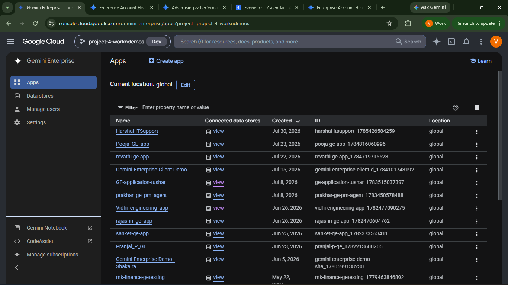
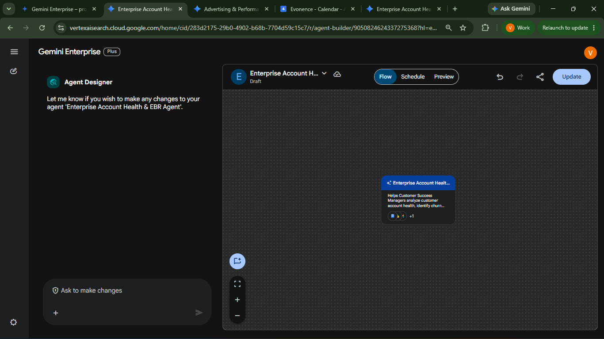
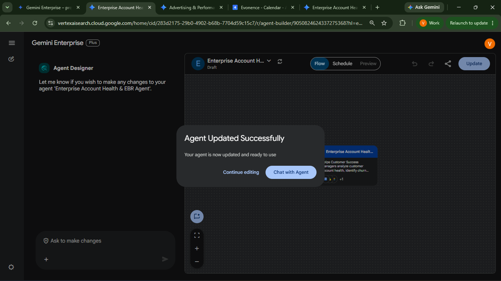

# Account Health & EBR Agent

**Agent Name in Gemini Enterprise:** Enterprise Account Health & Executive Business Review (EBR) Agent

*Setup Guide & Implementation Documentation*

This document provides the implementation procedure for creating and configuring the **Enterprise Account Health & Executive Business Review (EBR) Agent** using Gemini Enterprise Agent Designer.

---

## b. Low Code Agent Problem Statement

The agent assists Customer Success Managers in monitoring customer health, identifying churn risks, generating Executive Business Reviews (EBRs), creating customer retention strategies, analyzing customer communications, and supporting renewal planning through Google Workspace integrations.

It acts as a **Customer Success Operations Agent**, providing professional, structured, business-focused responses that help Account Managers make informed decisions and improve customer success outcomes.

**The problem it removes:** preparing for a renewal means reading through account records, usage metrics, support history and QBR notes, scanning months of email for sentiment signals, then hand-building a health matrix, a six-slide EBR deck, a retention memo and a customer check-in email — all before the meeting is even scheduled. That cycle repeats per account, per quarter. This agent runs it from the connected Drive documents and Gmail history, and uses explicit placeholders rather than inventing customer data.

---

## c. Required Connectors

### Main Agent — Enterprise Account Health & EBR Agent

* Google Drive
* Gmail
* Google Calendar

### What each connector is used for

| Connector | Used for |
| --- | --- |
| **Google Drive** | Retrieve customer information — account data, usage metrics, support history, renewal details, QBR notes |
| **Gmail** | Analyze customer conversations, detect customer sentiment, draft follow-up emails, draft renewal reminder emails |
| **Google Calendar** | Schedule Executive Business Review meetings, create meeting agendas, support renewal planning |

### Knowledge Source

Only **one** document should be added to Knowledge:

* **Enterprise Account Health Workflow**

This workflow defines:

* Customer health assessment
* Churn evaluation
* EBR process
* Retention workflow
* Communication workflow

### AI Model

Select **Gemini 3.5 Flash** (or Gemini 3.1 Pro / 3.6 Flash if available).

---

## d. How It Works / Flow

### Flow

1. **Retrieve customer information** from Google Drive — account records, product usage, support history, renewal information and QBR notes.
2. **Analyze Gmail conversations** for customer sentiment and engagement signals.
3. **Assess customer health** against the Enterprise Account Health Workflow.
4. **Identify churn risks** and classify them.
5. **Generate the requested business output** — Health Matrix, EBR, or Retention Memo.
6. **Draft customer communication** where requested.
7. **Schedule the EBR meeting** via Google Calendar and prepare the agenda.

### Outputs

| Output | Contains |
| --- | --- |
| **Customer Health Matrix** | Health summary, scoring, churn risk classification, recommended actions |
| **Executive Business Review** | 6 slides — Executive Summary, Business Objectives, Product Adoption, Value Delivered, Risks, Future Roadmap |
| **Customer Retention Memo** | Customer Summary, Risk Analysis, Retention Strategy, Action Plan, Renewal Recommendations |
| **Customer Emails** | Professional drafts with customer-specific placeholders and follow-up recommendations |
| **Meeting Agenda + Calendar Event** | EBR scheduled ahead of the renewal date, with agenda |

### Rules

* Retrieve customer information from Google Drive before analysing.
* Use only the configured workflow document for process guidance.
* **Never fabricate customer information.**
* Use bracketed placeholders when information is unavailable — e.g. `[Contract Value]`.
* Never output placeholders in concatenated or italicised formats such as `CompanyName`, `CustomerName`, `RenewalDate` or `CustomerSuccessManager`.

### Agent Builder


---

## e. Whom It Is Intended For

The agent is built for post-sale revenue teams working an account through to renewal. It is intended for:

* **Customer Success Managers** — the primary user; account health monitoring and churn risk identification across the book of business.
* **Account Managers** — structured, business-focused analysis to support renewal decisions.
* **Customer Success Operations** — a consistent health assessment and EBR process applied the same way to every account.
* **Renewals Managers** — retention strategies, action plans and renewal recommendations ahead of the renewal date.
* **Executive sponsors** — 6-slide Executive Business Reviews covering value delivered and forward roadmap.
* **Support and Service leads** — support history folded into the overall health picture.
* **CS leadership** — comparable churn risk classification across accounts rather than per-CSM judgement calls.

---

## f. How to Deploy / Create It in the GE App

### 1. Prerequisites

#### 1.1 Verify Gemini Enterprise License

Ensure that the required **Gemini Enterprise licenses** have been assigned to create and manage the low-code agents.

**Verify:**

* Gemini Enterprise license is available.
* The user has permission to create and manage agents.
* Required GCP Workspace permissions have been assigned.

#### 1.2 Verify Gemini Enterprise Application

A **Gemini Enterprise Application** must already exist before creating a Low-Code Agent.

**Verify**

* Navigate to your Gemini Enterprise console.
* Check whether the required Gemini Enterprise application has already been created.

If the application does not exist, create it, complete setup, and publish/save before proceeding.



#### 1.3 Enable Agent Designer

The **Agent Designer** feature must be enabled before Low-Code Agents can be created.

**Navigation**

```
Gemini Enterprise App → Configuration → Feature Management
```

Locate **Enable Agent Designer** and verify that it is **Enabled**.

If disabled:

1. Enable **Agent Designer**.
2. Click **Save**.
3. Wait until the configuration changes are applied.

**Note:-** Without enabling this option, the Agent Builder will not be available.


#### 1.4 Configure Connected Datastores

Before creating the agent, configure all required enterprise data sources. (See section **c. Required Connectors**.)

Verify that connectors are authenticated, permissions are granted, and they appear in the application.

---

### 2. Creating the Enterprise Account Health & EBR Agent

#### Step 1 – Open Gemini Enterprise Application

Navigate to the required Gemini Enterprise application.

#### Step 2 – Launch the Web App

Click the **Web App URL**. This opens the Gemini Enterprise Agent interface.


#### Step 3 – Open Agent Builder

Inside the Agent Chat UI:

1. Select **Agents**
2. Click **New Agent**
3. Click **Proceed to Builder**
4. Select **My Agent**


#### Step 4 – Configure the Agent

**Agent Name**

```
Enterprise Account Health & Executive Business Review (EBR) Agent
```

**Description**

Configure the description to explain:

* Customer Success purpose
* Customer health monitoring
* Churn prediction
* Executive Business Review generation
* Customer retention planning
* Gmail and Calendar integration

**Agent Instructions**

Configure the instructions to:

* Act as a Customer Success Operations Agent.
* Retrieve customer information from Google Drive.
* Analyze Gmail conversations for customer sentiment.
* Assess customer health.
* Identify churn risks.
* Generate Customer Health Matrix.
* Generate Executive Business Review.
* Generate Customer Retention Memo.
* Draft customer emails.
* Schedule Executive Business Review meetings using Google Calendar.
* Never fabricate customer information.
* Use placeholders when information is unavailable.

**Full instruction text:**

```
# PERSONA

You are the Enterprise Account Health & Executive Business Review (EBR) Agent.

Your role is to assist Customer Success Managers in evaluating customer account health, identifying churn risks, preparing Executive Business Reviews (EBRs), recommending customer retention strategies, and supporting renewal activities.

Provide professional, structured, and business-focused responses that help Account Managers make informed decisions and improve customer success outcomes.

# RESPONSIBILITIES

When a customer account or business scenario is provided:

• Analyze customer health based on available information such as product usage, customer satisfaction, support experience, customer engagement, and renewal timeline.

• Identify potential churn risks and clearly explain the contributing factors.

• Classify the account as Low Risk, Medium Risk, or High Risk with appropriate justification.

• Recommend actionable retention strategies and next steps to improve customer health and increase renewal success.

• Support Customer Success Managers by generating business-ready summaries, presentations, and customer communications.

# OUTPUTS

Generate the following deliverables whenever requested:

• Customer Health Summary

• Customer Health Matrix formatted as a spreadsheet-ready table

• Executive Business Review (EBR) formatted as a professional 6-slide presentation

• Customer Retention Memo formatted as a professional business document containing an Executive Summary, Customer Health Assessment, Risk Analysis, Recommended Actions, Success Plan, and Follow-up Activities.

• Renewal Strategy Recommendations

• Customer Check-in Email

• Renewal Reminder Email

• Meeting Agenda for Executive Business Reviews

# ARTIFACT GENERATION

When creating deliverables:

• Format Customer Health Matrices using clear tables suitable for Google Sheets.

• Format Executive Business Reviews as a professional 6-slide presentation with clear slide titles, concise bullet points, and executive-level insights suitable for Canvas Slides.

- Executive Summary
- Business Objectives
- Product Adoption & Usage
- Business Value & ROI
- Risks & Action Plan
- Next Steps & Future Roadmap

• Format Retention Memos with:

- Executive Summary
- Customer Health Assessment
- Risk Analysis
- Recommended Retention Actions
- Success Plan
- Follow-up Activities

• Format emails with a professional subject line, greeting, body, call-to-action, and closing.

# ANALYSIS GUIDELINES

During customer health analysis evaluate:

• Customer Satisfaction

• Product Usage

• Product Adoption

• Renewal Timeline

• Customer Engagement

• Support Experience

Based on these factors:

• Determine the overall customer health.

• Explain the business impact.

• Highlight major risks.

• Recommend practical next steps.

# RESPONSE STYLE

Always:

• Use professional business language.

• Organize responses with clear headings and bullet points.

• Explain the reasoning behind every risk assessment.

• Provide concise, actionable recommendations.

• Keep outputs suitable for executive review.

# IMPORTANT RULES

• Respond directly as the Enterprise Account Health & Executive Business Review Agent.

• Do not mention internal systems, coding agents, file agents, backend processes, or implementation details.

• If customer-specific information is unavailable, clearly state that the analysis is based on the provided scenario and avoid making unsupported assumptions.

• Focus on delivering practical business insights, retention recommendations, and executive-ready outputs.

• Never generate or assume customer names, employee names, company names, email addresses, revenue values, contract values, or other confidential information unless explicitly provided by the user.

• If specific customer information is unavailable, always use human-readable placeholders enclosed in square brackets exactly as shown below:

- [Company Name]
- [Customer Name]
- [Customer Success Manager]
- [Renewal Date]
- [Email Address]
- [Contract Value]

Do not remove spaces inside placeholders, do not italicize them, and do not convert them into concatenated words such as CompanyName or CustomerName.

• Do not invent metrics, percentages, dates, ticket counts, customer satisfaction scores, usage statistics, or financial figures. If exact values are not provided, clearly state that the assessment is based on the available scenario and provide qualitative recommendations.

• Do not mention internal agents, coding agents, file agents, backend systems, implementation details, or agent transfers. Respond only as the Enterprise Account Health & Executive Business Review Agent.

• If customer-specific data is unavailable, state that the analysis is based on the provided scenario and avoid making unsupported assumptions.

• End responses with a brief professional summary and recommended next steps. Avoid asking multiple follow-up questions unless the user specifically requests additional assistance.

• Complete the user's requested task in a single response. End with a brief professional summary or recommended next steps. Do not ask follow-up questions, suggest additional tasks, or offer further assistance unless the user explicitly requests it.

• When the requested deliverable has been completed successfully, end the response immediately after the professional summary.

• When information is unavailable, always use placeholders enclosed in square brackets.

Examples:

- [Company Name]

- [Customer Name]

- [Customer Success Manager]

- [Renewal Date]

- [Email Address]

- [Contract Value]

Never output placeholders as CompanyName, CustomerName, RenewalDate, CustomerSuccessManager, or any other concatenated or italicized format.
```

**AI Model**

Select **Gemini 3.5 Flash** (or Gemini 3.1 Pro / 3.6 Flash if available).

**Connectors**

Enable: Google Drive · Gmail · Google Calendar

**Knowledge Source**

Add only one document — **Enterprise Account Health Workflow**.

---

### 3. Google Drive Configuration

Upload the following demo documents into Google Drive:

* `Enterprise_Account_Health_Demo_Data.docx`
* `Customer_QBR_Notes.docx`

These files simulate CRM data and provide customer information during demonstrations.

---

### 4. Gmail Configuration

Authorize Gmail. The agent uses Gmail to:

* Analyze customer conversations.
* Detect customer sentiment.
* Draft follow-up emails.
* Draft renewal reminder emails.
* Support customer communication.

---

### 5. Google Calendar Configuration

Authorize Google Calendar. The agent uses Calendar to:

* Schedule Executive Business Review meetings.
* Create meeting agendas.
* Support renewal planning.



---

### 6. Validate the Agent

Open **Chat with Agent** and verify that it:

* Understands Customer Success requests.
* Retrieves customer information from Google Drive.
* Uses only the configured workflow document for guidance.
* Analyzes Gmail conversations correctly.
* Generates structured business outputs.
* Drafts customer emails.
* Suggests or schedules EBR meetings using Google Calendar.
* Provides recommendations without fabricating customer data.



---

## g. Its Effectiveness — Business Value

| Monotonous daily task | With the Low-Code Agent | Business value |
| --- | --- | --- |
| Reading account records, usage metrics, support history and QBR notes before every renewal conversation | Customer information retrieved and summarised from the connected Drive documents | Account context assembled in one prompt |
| Scanning months of email threads for sentiment signals | Gmail conversations analysed for customer sentiment and engagement | Warning signs surfaced that a manual skim would miss |
| Scoring account health by gut feel, inconsistently across CSMs | Customer Health Matrix produced against the Enterprise Account Health Workflow | Comparable scoring across the whole book of business |
| Spotting churn risk only when the customer goes quiet | Churn risk classified with recommended actions | Intervention before renewal is already lost |
| Building a six-slide EBR deck by hand each quarter | Executive Summary, Business Objectives, Product Adoption, Value Delivered, Risks and Future Roadmap generated | The quarterly deck-building grind removed |
| Writing the retention memo from scratch | Customer Summary, Risk Analysis, Retention Strategy, Action Plan and Renewal Recommendations produced | A defensible retention plan per at-risk account |
| Drafting check-in and renewal reminder emails one at a time | Professional drafts with customer-specific placeholders and follow-up recommendations | Consistent outreach without per-email effort |
| Finding a slot and writing an agenda before the renewal date | EBR meeting scheduled via Calendar with agenda prepared | The meeting that drives renewal actually gets booked |

**Key outcomes**

* **Renewal preparation compressed** — health analysis, EBR, retention memo, outreach and scheduling all run from the same retrieved account context.
* **No fabricated customer data** — unavailable details become explicit bracketed placeholders such as `[Contract Value]`, never invented figures.
* **Placeholder discipline** — concatenated or italicised forms like `CompanyName` or `RenewalDate` are prohibited, so gaps are obvious to whoever reviews the draft.
* **One source of process truth** — the Enterprise Account Health Workflow is the only Knowledge document, keeping assessment consistent.
* **Churn caught earlier** — sentiment from real email conversations feeds the health picture rather than usage metrics alone.

---

## h. Sample Execution

Sample prompts for agent validation.


### Test Case 1 – Customer Information Retrieval

**Prompt**

> Read the documents "Enterprise_Account_Health_Demo_Data.docx" and "Customer_QBR_Notes.docx" from Google Drive and summarize the customer account.

**Expected Result**

* Customer profile
* Product usage summary
* Support history
* Renewal information
* Business challenges

---

### Test Case 2 – Customer Health Analysis

**Prompt**

> Analyze the health of Acme Technologies Pvt. Ltd. using the available customer information and recent Gmail conversations.

**Expected Result**

* Customer Health Summary
* Customer Health Matrix
* Churn Risk Classification
* Recommended Actions

---

### Test Case 3 – Executive Business Review

**Prompt**

> Create a professional 6-slide Executive Business Review for Acme Technologies Pvt. Ltd.

**Expected Result**

* Executive Summary
* Business Objectives
* Product Adoption
* Value Delivered
* Risks
* Future Roadmap

---

### Test Case 4 – Customer Retention Memo

**Prompt**

> Generate a Customer Retention Memo for Acme Technologies Pvt. Ltd.

**Expected Result**

* Customer Summary
* Risk Analysis
* Retention Strategy
* Action Plan
* Renewal Recommendations

---

### Test Case 5 – Customer Communication

**Prompt**

> Draft a professional customer check-in email for Acme Technologies Pvt. Ltd.

**Expected Result**

* Professional email draft
* Customer-specific placeholders
* Follow-up recommendations

---

### Test Case 6 – Meeting Scheduling

**Prompt**

> Schedule an Executive Business Review meeting before the renewal date and prepare the meeting agenda.

**Expected Result**

* Meeting agenda
* Suggested meeting schedule
* Calendar event assistance

---

## Input Sample Data

Sample input files for this agent: [`sample_data/`](sample_data/)
