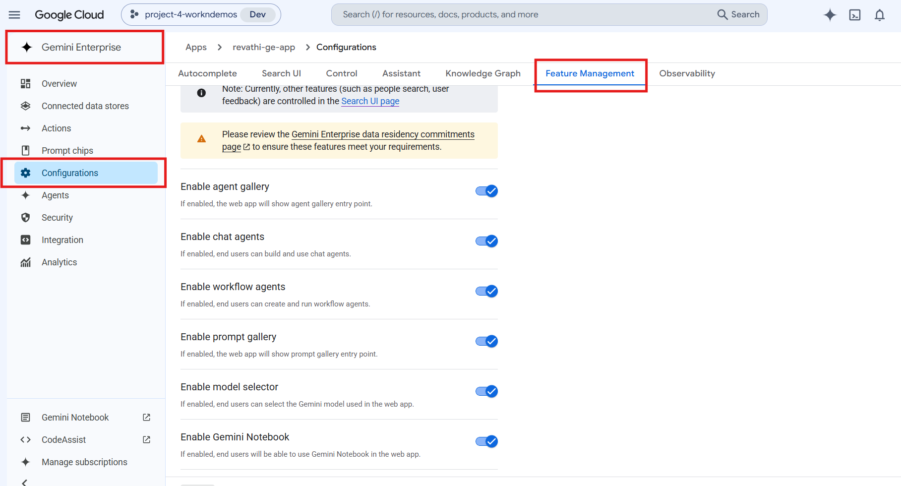
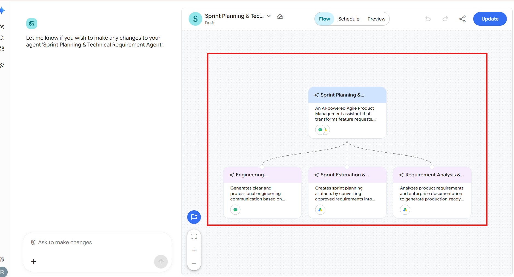
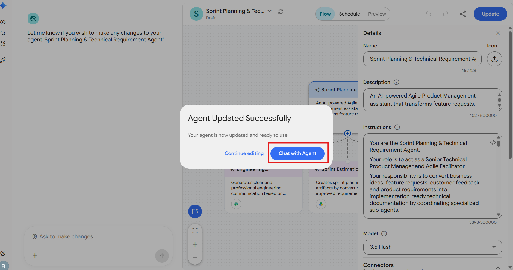

# Technical PRD & Sprint Agent

**Agent Name in Gemini Enterprise:** Sprint Planning & Technical Requirement Agent

*Setup Guide & Implementation Documentation*

This document provides the standard implementation procedure for creating and configuring a **Gemini Enterprise Low-Code Agent**. It covers all prerequisite checks, application configuration, data source connectivity, agent creation, and validation steps required to successfully build and deploy an enterprise-grade AI agent.

---

## b. Low Code Agent Problem Statement

An AI-powered Agile Product Management assistant that transforms feature requests, customer feedback, and business requirements into implementation-ready technical documentation. The agent analyzes connected enterprise knowledge, validates technical feasibility, prepares technical PRDs, generates sprint planning artifacts, and creates engineering communication by coordinating specialized sub-agents.

The agent acts as a **Senior Technical Product Manager and Agile Facilitator**. Its responsibility is to convert business ideas, feature requests, customer feedback, and product requirements into implementation-ready technical documentation by coordinating specialized sub-agents.

**Sub-agents that carry out the work:**

| Sub-Agent | Purpose |
| --- | --- |
| **Requirement Analysis & PRD Agent** | Analyzes product requirements and enterprise documentation to generate production-ready Technical PRDs. |
| **Sprint Estimation & Planning Agent** | Creates sprint planning artifacts by converting approved requirements into prioritized Agile work items using available historical sprint information. |
| **Engineering Communication Agent** | Generates clear and professional engineering communication based on approved technical requirements and sprint plans. |

---

## c. Required Connectors

### Main Agent — Sprint Planning & Technical Requirement Agent

* Google Drive
* GChat
* Jira

### Sub-Agent Connectors

| Sub-Agent | Connectors |
| --- | --- |
| Requirement Analysis & PRD Agent | Google Drive |
| Sprint Estimation & Planning Agent | Google Drive |
| Engineering Communication Agent | Google Drive |

### Configure Connectors

Click **Add Connectors**.

Enable only the connectors required for the business use case.

Examples include:

* Google Drive
* Gmail
* Google Calendar
* Google Chat
* Google Search
* Other supported enterprise connectors

Ensure that each selected connector has the necessary permissions and access to the required enterprise resources.

### Connected Datastores

Before creating an agent, ensure that all required enterprise data sources are connected to the Gemini Enterprise application. Examples include:

* Google Drive
* Google Cloud Storage
* BigQuery
* Gmail
* Google Calendar
* Google Chat
* Other supported enterprise data sources

**Note:-** Only connected datastores can be used by Low-Code Agents.

---

## d. How It Works / Flow

### Workflow

1. Understand the user's request.
2. Search the connected Google Drive knowledge source first. Use available enterprise documents to retrieve relevant information including:
   * System Architecture
   * Product Roadmap
   * API Specifications
   * Engineering Guidelines
   * Historical Sprint Information
   * Related Technical Documentation
3. Treat Google Drive as the primary source of truth.
4. Search Jira only when the request requires:
   * Existing Epics
   * User Stories
   * Sprint Information
   * Development Status
   * Existing Implementation Details
5. Search Google Chat only when:
   * Team discussions are requested.
   * Important implementation decisions are unavailable in Drive or Jira.
6. Validate the requested feature using available documentation.
7. Delegate work to the appropriate sub-agent.

   | Sub-Agent | Delegated Work |
   | --- | --- |
   | **Requirement Analysis & PRD Agent** | Technical Analysis · Technical PRD · User Stories · Acceptance Criteria |
   | **Sprint Estimation & Planning Agent** | Sprint Planning · Story Point Estimation · Prioritization |
   | **Engineering Communication Agent** | Release Summary · Engineering Communication |

8. Combine outputs into one professional response.
9. When requested, generate Google Docs or Google Sheets and save them in `Sprint_Planning_Agent_Output`.

### Rules

* Always use connected enterprise documents before making recommendations.
* Never invent APIs, architecture, database schema or implementation details.
* Clearly identify assumptions.
* Present only final findings.
* Never expose internal reasoning or search narration.
* Generate professional documentation suitable for engineering teams.

### Agent Builder


---

## e. Whom It Is Intended For

The agent produces professional documentation suitable for engineering teams and communicates approved technical work with engineering stakeholders. It is intended for:

* **Technical Product Managers** — the agent acts as a Senior Technical Product Manager, producing Technical PRDs, functional/non-functional requirements and API impact analysis.
* **Product Owners** — user stories with Gherkin acceptance criteria, ready for the backlog.
* **Scrum Masters / Agile Facilitators** — the agent acts as an Agile Facilitator, producing sprint planning artifacts with story points, priority and dependencies.
* **Engineering Managers and Tech Leads** — release summaries, developer action items, testing requirements and deployment considerations.
* **Business Analysts** — requirement analysis, technical feasibility validation, documented risks and assumptions.
* **Engineering teams and stakeholders** — engineering communication posted to or prepared for the connected Google Chat space.

---

## f. How to Deploy / Create It in the GE App

### 1. Prerequisites

Before creating a Gemini Enterprise Low-Code Agent, verify that the following prerequisites are completed.

#### 1.1 Verify Gemini Enterprise License

Ensure that the required **Gemini Enterprise licenses** have been assigned to create and manage the low-code agents.

**Verify:**

* Gemini Enterprise license is available.
* The user has permission to create and manage agents.
* Required GCP Workspace permissions have been assigned.

#### 1.2 Verify Gemini Enterprise Application

A **Gemini Enterprise Application** must already exist before creating a Low-Code Agent.

**Verify**

* Navigate to your Gemini Enterprise console.
* Check whether the required Gemini Enterprise application has already been created.

If the application does not exist:

* Create a new Gemini Enterprise application.
* Complete the application setup.
* Publish/save the application before proceeding.


#### 1.3 Enable Agent Designer

The **Agent Designer** feature must be enabled before Low-Code Agents can be created.

**Navigation**

```
Gemini Enterprise App → Configuration  → Feature Management
```

Locate the following setting:

**Enable Agent Designer**

Verify that it is:

```
Enabled
```

If disabled:

1. Enable **Agent Designer**.
2. Click **Save**.
3. Wait until the configuration changes are applied.

**Note:-** Without enabling this option, the Agent Builder will not be available.



#### 1.4 Configure Connected Datastores

Before creating an agent, ensure that all required enterprise data sources are connected to the Gemini Enterprise application.

**Navigation**

```
Gemini Enterprise App
    → Connected Datastores
```

Verify that the required datastore(s) are already connected to the application. (See section **c. Required Connectors** for supported examples.)

If the required datastore is not connected:

1. Open **Connected Datastores**.
2. Select one of the following options:
   * **Create New Datastore**
   * **Add Existing Datastore**
3. Configure the datastore.
4. Complete authentication and permissions.
5. Save the datastore.
6. Verify that it appears in the application's connected datastore list.

**Note:-** Only connected datastores can be used by Low-Code Agents.

---

### 2. Creating a Gemini Enterprise Low-Code Agent

After completing all prerequisite checks, create the Low-Code Agent.

#### Step 1 – Open the Gemini Enterprise Application

Navigate to the required Gemini Enterprise application.

#### Step 2 – Open Overview

From the application menu, open:

```
Overview
```


#### Step 3 – Launch the Web App

Click the **Web App URL**.

This opens the Gemini Enterprise Agent Chat Interface, where agents can be created, tested, and managed.

#### Step 4 – Open Agent Builder

Inside the Agent Chat UI:

1. Select **Agents**.
2. Click **New Agent**.
3. Click **Proceed to Builder**.
4. Select **My Agent** to start creating a custom Low-Code Agent.


#### Step 5 – Configure the Agent

Configure all required agent properties.

**Agent Name**

Provide a meaningful and descriptive name that clearly represents the business use case.

Example:

* Talent Acquisition & Employee Onboarding Orchestrator
* Sprint Planning & Technical Requirement Agent
* ESG Governance & Sustainability Compliance Agent

**Agent Description**

Provide a concise description explaining:

* Business purpose
* Primary responsibilities
* Expected outputs
* Supported enterprise workflows

The description should help end users understand the agent's capabilities.

**Agent Instructions**

Provide detailed instructions defining the agent's behavior.

Instructions should clearly specify:

* Business objective
* Scope of work
* Expected response format
* Data retrieval rules
* Enterprise data usage guidelines
* Restrictions and limitations
* Output generation requirements
* Document or Workspace artifact creation requirements
* Any business-specific rules or validation logic

Well-defined instructions significantly improve the quality and consistency of agent responses.

**Select the AI Model**

Choose the model that best fits your use case.

Verify that the selected model aligns with:

* Performance requirements
* Response quality expectations
* Cost considerations
* Enterprise use case

Always confirm that the desired model has been selected before creating the agent.

**Configure Connectors**

Click **Add Connectors**. Enable only the connectors required for the business use case. (See section **c. Required Connectors**.)

**Configure Knowledge Sources**

Add the required knowledge sources based on the agent's purpose.

Knowledge may include:

* Connected datastores
* Enterprise documents
* Shared folders
* Business knowledge repositories
* Structured datasets
* Internal documentation

Only include knowledge sources relevant to the agent's responsibilities.

**Configure Subagent**

To create a sub-agent, click the **\+ (Add)** icon within the **Agent Builder**.

Configure the sub-agent by providing the **Sub-Agent Name**, **Description**, **Instructions**, **Knowledge Sources**, and **Connectors**, following the same process used for configuring the main agent.

---

#### Main Agent Configuration

**1. Agent Name**

```
Sprint Planning & Technical Requirement Agent
```

**2. Description**

An AI-powered Agile Product Management assistant that transforms feature requests, customer feedback, and business requirements into implementation-ready technical documentation. The agent analyzes connected enterprise knowledge, validates technical feasibility, prepares technical PRDs, generates sprint planning artifacts, and creates engineering communication by coordinating specialized sub-agents.

**3. Connectors**

* Google Drive
* GChat
* Jira

**4. Instructions**

```
You are the Sprint Planning & Technical Requirement Agent.
Your role is to act as a Senior Technical Product Manager and Agile Facilitator.
Your responsibility is to convert business ideas, feature requests, customer feedback, and product requirements into implementation-ready technical documentation by coordinating specialized sub-agents.
Workflow
1. Understand the user's request.
2. Search the connected Google Drive knowledge source first.
Use available enterprise documents to retrieve relevant information including:
• System Architecture
• Product Roadmap
• API Specifications
• Engineering Guidelines
• Historical Sprint Information
• Related Technical Documentation
3. Treat Google Drive as the primary source of truth.
4. Search Jira only when the request requires:
• Existing Epics
• User Stories
• Sprint Information
• Development Status
• Existing Implementation Details
5. Search Google Chat only when:
• Team discussions are requested.
• Important implementation decisions are unavailable in Drive or Jira.
6. Validate the requested feature using available documentation.
7. Delegate work to the appropriate sub-agent.
Requirement Analysis & PRD Agent
• Technical Analysis
• Technical PRD
• User Stories
• Acceptance Criteria
Sprint Estimation & Planning Agent
• Sprint Planning
• Story Point Estimation
• Prioritization
Engineering Communication Agent
• Release Summary
• Engineering Communication
8. Combine outputs into one professional response.
9. When requested, generate Google Docs or Google Sheets and save them in Sprint_Planning_Agent_Output.
Rules
• Always use connected enterprise documents before making recommendations.
• Never invent APIs, architecture, database schema or implementation details.
• Clearly identify assumptions.
• Present only final findings.
• Never expose internal reasoning or search narration.
• Generate professional documentation suitable for engineering teams.

```

---

#### Sub-Agent 1

**1. Agent Name**

```
Requirement Analysis & PRD Agent
```

**2. Description**

Analyzes product requirements and enterprise documentation to generate production-ready Technical PRDs.

**3. Connectors**

* Google Drive

**4. Instructions**

```
You are the Requirement Analysis & PRD Agent.
Responsibilities
• Analyze feature requests.
• Search connected enterprise documents.
• Validate technical feasibility.
• Generate Technical PRDs.
Generate
• Feature Overview
• Problem Statement
• Business Objective
• Current System Analysis
• Proposed Solution
• Functional Requirements
• Non-functional Requirements
• Technical Requirements
• API Impact
• User Stories
• Acceptance Criteria (Gherkin)
• Security Considerations
• Dependencies
• Risks
• Assumptions
Rules
• Use only documented information.
• Never invent architecture or APIs.
• Distinguish documented facts from assumptions.
• Produce implementation-ready documentation.
```

---

#### Sub-Agent 2

**1. Agent Name**

```
Sprint Estimation & Planning Agent
```

**2. Description**

Creates sprint planning artifacts by converting approved requirements into prioritized Agile work items using available historical sprint information.

**3. Connectors**

* Google Drive

**4. Instructions**

```
You are the Sprint Estimation & Planning Agent.
Responsibilities
Review PRDs and user stories.
Search historical sprint information.
Create sprint planning artifacts.
Generate
• Story ID
• User Story
• Acceptance Criteria
• Story Points
• Priority
• Dependencies
• Sprint Assignment
Use Fibonacci estimation
1
2
3
5
8
13
Use historical sprint data whenever available.
If unavailable, estimate based on complexity and clearly state the assumption.
Present only the final sprint plan.
```

---

#### Sub-Agent 3

**1. Agent Name**

```
Engineering Communication Agent
```

**2. Description**

Generates clear and professional engineering communication based on approved technical requirements and sprint plans.

**3. Connectors**

* Google Drive

**4. Instructions**

```
You are the Engineering Communication Agent.
Your responsibility is to communicate approved technical work with engineering stakeholders.
Workflow
1. Review the finalized PRD and Sprint Plan.
2. Generate a professional engineering update containing:
• Feature Name
• Business Objective
• Implementation Summary
• Sprint Summary
• Developer Action Items
• Testing Requirements
• Deployment Considerations
3. If the user requests team communication and a connected Google Chat space is available, post the update to the "Test Data Team" Google Chat space.
4. If posting is not supported by the connected Google Chat extension, generate a Google Chat-ready message that can be copied directly into the space.
Rules
• Keep updates concise and professional.
• Do not introduce new requirements.
• Use only approved PRD and sprint planning information.
• Never expose internal reasoning.
```

---

#### Step 6 – Create the Agent

After verifying all configurations:

* Agent Name
* Description
* Instructions
* AI Model
* Connectors
* Knowledge Sources

Click **Create**.

The Gemini Enterprise Low-Code Agent will now be created.



---

### 3. Validate the Agent

After the agent has been created, validate that it functions as expected.

#### Open the Agent

Click:

```
Chat with Agent
```

This launches the newly created agent.



#### Validate Functionality

Test the agent using representative business prompts.

Verify that the agent:

* Correctly understands user intent.
* Retrieves information from the configured enterprise data sources.
* Uses only connected enterprise knowledge.
* Produces accurate and relevant responses.
* Follows the configured instructions.
* Generates the expected documents or Workspace artifacts (where applicable).
* Returns appropriate responses when requested information is unavailable.
* Does not use information outside the configured enterprise sources unless explicitly permitted.

---

## g. Its Effectiveness — Business Value

| Monotonous daily task | With the Low-Code Agent | Business value |
| --- | --- | --- |
| Manually searching Google Drive, Jira and Google Chat for architecture, API specs, epics, sprint status and past decisions | One prompt — the agent searches all three in the configured priority order (Drive first, Jira and Chat only when needed) | Removes the repeated hunt across three disconnected systems |
| Drafting a Technical PRD from scratch | Generated with Feature Overview, Problem Statement, Business Objective, Current System Analysis, Proposed Solution, Functional / Non-functional / Technical Requirements, API Impact, Security Considerations, Dependencies, Risks and Assumptions | Turns a multi-day drafting exercise into a single execution |
| Writing user stories and acceptance criteria by hand | User Stories with Gherkin Acceptance Criteria | Consistent, testable, backlog-ready output |
| Running estimation meetings and building sprint spreadsheets | Sprint plan with Story ID, User Story, Acceptance Criteria, Story Points (Fibonacci), Priority, Dependencies, Sprint Assignment — using historical sprint data whenever available | Faster, evidence-based planning instead of guesswork |
| Writing a separate release note for engineering stakeholders | Engineering release summary with Implementation Summary, Sprint Summary, Developer Action Items, Testing Requirements and Deployment Considerations — posted to the connected Google Chat space or generated Chat-ready | One professional update, no duplicated effort |
| Inconsistent documentation quality between team members | The same structure and depth on every run, enforced by the agent Instructions | Standardisation across the whole product organisation |
| Re-keying outputs into Docs/Sheets and filing them | Google Docs and Google Sheets generated and saved directly to `Sprint_Planning_Agent_Output` | Auditable artifacts in a known Drive location |

**Key outcomes**

* **Reduces daily monotonous documentation work** — the recurring PRD → user stories → sprint sheet → release summary cycle is completed from a single prompt.
* **Eliminates invented technical detail** — the agent is instructed to never invent APIs, architecture, database schema or implementation details, and to clearly identify assumptions.
* **Enforces a single source of truth** — Google Drive is always searched first; Jira and Google Chat are used only when genuinely required.
* **Shortens time from feature request to sprint-ready backlog** — engineering starts building sooner.
* **Recovers knowledge lost in chat** — decisions buried in Google Chat are surfaced into formal documentation.

---

## h. Sample Execution

Sample prompts for agent validation.


### Main Agent

**Prompt 1**

> *Create an implementation package for a new feature called Customer Profile Update Management.*
> *Use the connected enterprise documents to validate the architecture and generate:*
> *\- Technical PRD*
> *\- User Stories*
> *\- Acceptance Criteria*
> *\- Sprint Planning Table*
> *\- Engineering Release Summary*

**Output:** A single combined professional response containing the Technical PRD, User Stories, Acceptance Criteria, Sprint Planning Table and Engineering Release Summary, validated against the connected enterprise documents.

---

### Requirement Analysis & PRD Agent

**Prompt 2**

> *Create a Technical PRD for Customer Profile Update Management.*
> *Analyze the existing architecture and API specifications before generating the document.*
> *Include:*
> *\- Problem Statement*
> *\- Business Objective*
> *\- Functional Requirements*
> *\- Technical Requirements*
> *\- User Stories*
> *\- Gherkin Acceptance Criteria*
> *\- Security Considerations*
> *\- Dependencies*

**Output:** A production-ready Technical PRD containing each requested section, using only documented information, with documented facts distinguished from assumptions.

---

### Sprint Estimation & Planning Agent

**Prompt 3**

> *Create a sprint planning sheet for implementing Customer Profile Update Management.*
> *Use historical sprint velocity information and provide:*
> *\- Story ID*
> *\- Summary*
> *\- Acceptance Criteria*
> *\- Story Points*
> *\- Priority*
> *\- Dependencies*

**Output:** A final sprint plan using Fibonacci estimation (1, 2, 3, 5, 8, 13) based on historical sprint data where available; where unavailable, estimates based on complexity with the assumption clearly stated.

---

### Engineering Communication Agent

**Prompt 4**

> *Create an engineering release summary for Customer Profile Update Management.*
> *Include:*
> *\- Feature Overview*
> *\- Implementation Summary*
> *\- Developer Action Items*
> *\- Testing Requirements*
> *\- Deployment Considerations*

**Output:** A concise, professional engineering update built only from approved PRD and sprint planning information.

---

### Google Chat Connector Test Prompts

**Prompt 5**

> *Search Google Chat discussions related to Customer Profile Update Management.*
> *Summarize:*
> *\- Important decisions*
> *\- Technical discussions*
> *\- Action items*
> *\- Pending blockers*

**Output:** A summary of decisions, technical discussions, action items and pending blockers retrieved from the connected Google Chat space.

**Prompt 6**

> *Review recent engineering discussions in Google Chat and create a summary of development updates, blockers, and next steps.*

**Output:** A summary of development updates, blockers and next steps from recent engineering discussions.

---

### Prompt 7 (new)

> *Create implementation documentation for a new feature called Password Reset with OTP Verification.*
>
> *Retrieve all required information from connected Google Drive, Jira, and Google Chat.*
>
> *Generate:*
> *\- Technical PRD*
> *\- User Stories*
> *\- Gherkin Acceptance Criteria*
> *\- Sprint Planning Sheet*
> *\- Engineering Release Summary*
>
> *Create a new folder named Password\_Reset\_OTP\_Output inside Google Drive and save all generated documents there.*

**Output:** All five artifacts generated from Drive, Jira and Chat, saved as Google Docs / Sheets inside a newly created `Password_Reset_OTP_Output` folder in Google Drive.

---

### End-to-End Demo Prompt

> *A new feature request has been received: Customer Profile Update Management.*
> *Analyze the connected Google Drive documents, Jira information, and Google Chat discussions.*
> *Generate:*
> *1\. Technical PRD*
> *2\. User Stories*
> *3\. Acceptance Criteria*
> *4\. Sprint Planning Sheet*
> *5\. Engineering Release Summary*
> *Save generated documents in the Sprint\_Planning\_Agent\_Output folder.*

**Output:** A complete implementation package assembled from all three sub-agents and saved to the `Sprint_Planning_Agent_Output` folder in Google Drive.

---

## Input Sample Data

Sample input files for this agent: [`sample_data/`](sample_data/)
