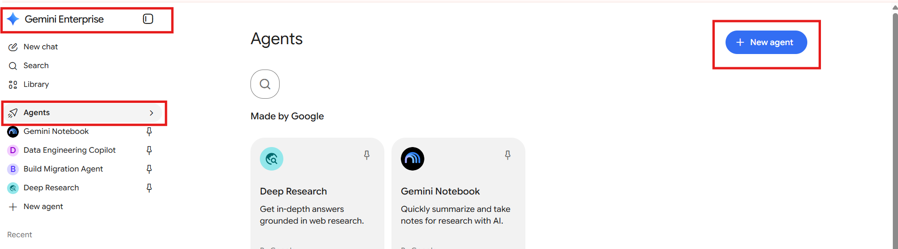
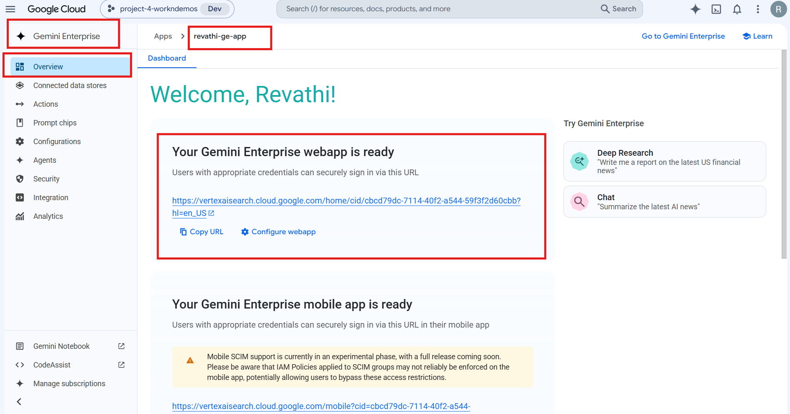
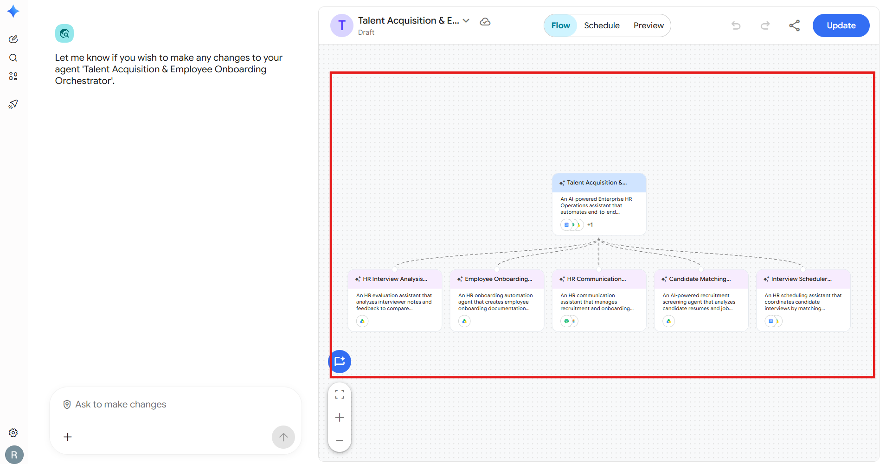
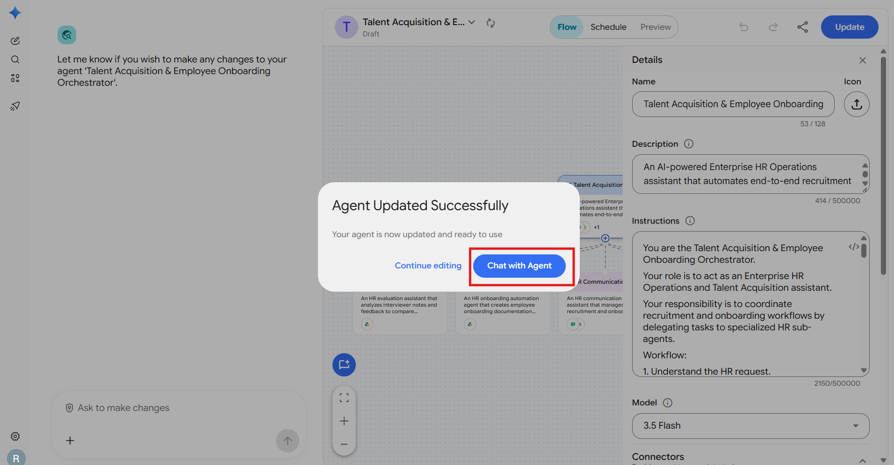

# Talent & Onboarding Orchestrator

**Agent Name in Gemini Enterprise:** Talent Acquisition & Employee Onboarding Orchestrator

*Setup Guide & Implementation Documentation*

This document provides the standard implementation procedure for creating and configuring a **Gemini Enterprise Low-Code Agent**. It covers all prerequisite checks, application configuration, data source connectivity, agent creation, and validation steps required to successfully build and deploy an enterprise-grade AI agent.

---

## b. Low Code Agent Problem Statement

An AI-powered Enterprise HR Operations assistant that automates end-to-end recruitment and employee onboarding workflows. The agent analyzes candidate profiles, job openings, and HR documents, coordinates candidate screening, schedules interviews, evaluates interview feedback, generates onboarding collateral, and manages HR communication by coordinating specialized HR sub-agents using connected enterprise data.

The agent acts as an **Enterprise HR Operations and Talent Acquisition assistant**. Its responsibility is to coordinate recruitment and onboarding workflows by delegating tasks to specialized HR sub-agents.

**Sub-agents that carry out the work:**

| Sub-Agent | Purpose |
| --- | --- |
| **Candidate Matching Agent** | An AI-powered recruitment screening agent that analyzes candidate resumes and job requirements to identify suitable candidates, rank applicants, and generate hiring shortlists using structured HR data. |
| **Interview Scheduler Agent** | An HR scheduling assistant that coordinates candidate interviews by matching shortlisted candidates with department interviewers and creating Google Calendar interview events. |
| **HR Interview Analysis Agent** | An HR evaluation assistant that analyzes interviewer notes and feedback to compare candidate performance and recommend the most suitable candidate for each role. |
| **Employee Onboarding Agent** | An HR onboarding automation agent that creates employee onboarding documentation and communication materials using company policies and onboarding templates. |
| **HR Communication Agent** | An HR communication assistant that manages recruitment and onboarding notifications using Gmail and Google Chat while maintaining professional enterprise communication standards. |

---

## c. Required Connectors

### Main Agent — Talent Acquisition & Employee Onboarding Orchestrator

* Google Drive
* GChat
* Google Calendar
* GMail

### Sub-Agent Connectors

| Sub-Agent | Connectors |
| --- | --- |
| Candidate Matching Agent | Google Drive |
| Interview Scheduler Agent | Google Drive, Google Calendar |
| HR Interview Analysis Agent | Google Drive |
| Employee Onboarding Agent | Google Drive |
| HR Communication Agent | GMail, GChat |

### Configure Connectors

Click **Add Connectors**.

Enable only the connectors required for the business use case.

Examples include:

* Google Drive
* Gmail
* Google Calendar
* Google Chat
* Google Search
* Other supported enterprise connectors

Ensure that each selected connector has the necessary permissions and access to the required enterprise resources.

### Connected Datastores

Before creating an agent, ensure that all required enterprise data sources are connected to the Gemini Enterprise application. Examples include:

* Google Drive
* Google Cloud Storage
* BigQuery
* Gmail
* Google Calendar
* Google Chat
* Other supported enterprise data sources

**Note:-** Only connected datastores can be used by Low-Code Agents.

---

## d. How It Works / Flow

### Workflow

1. Understand the HR request.
2. Use Google Drive as the primary source of truth. Retrieve information from:
   * Candidate profiles
   * Job openings
   * Job templates
   * Department interviewer ranking
   * Interview notes
   * Company policies
   * Employee onboarding templates
3. Delegate tasks only to the appropriate sub-agent.

   | Sub-Agent | Responsible for |
   | --- | --- |
   | **Candidate Matching Agent** | Resume screening · Candidate-job matching · Skill comparison · Experience evaluation · Candidate ranking |
   | **Interview Scheduler Agent** | Interviewer assignment · Calendar scheduling · Interview invitation creation |
   | **HR Interview Analysis Agent** | Interview feedback analysis · Candidate evaluation · Final recommendation support |
   | **Employee Onboarding Agent** | Welcome documents · Joining documentation · Employee onboarding materials |
   | **HR Communication Agent** | Gmail communication · Google Chat HR updates |

4. Hiring evaluation must only consider:
   * Technical skills
   * Experience
   * Job requirements
   * Location compatibility
   * Interview performance

   Do not use personal attributes or protected characteristics.

5. Sub-agent output handling:
   * Treat completed sub-agent outputs as final results.
   * Do not regenerate the same reports.
   * Do not repeat analysis already completed by sub-agents.
   * Continue only with the next workflow step.

6. Maintain:
   * Professional HR tone
   * Confidentiality
   * Compliance
   * Accurate candidate information

### Final workflow response

The final workflow response should contain:

1. Candidate shortlist
2. Interview schedule summary
3. Interview evaluation summary
4. Final hiring recommendation
5. Employee onboarding status

Generate structured HR reports when requested. Save generated outputs using connected Google Drive capabilities.

### Agent Builder



---

## e. Whom It Is Intended For

The agent maintains a professional HR tone, confidentiality and compliance across the full recruitment and onboarding lifecycle. It is intended for:

* **Talent Acquisition / Recruitment teams** — resume screening, candidate-job matching, ranking and shortlisting across all open roles.
* **HR Operations teams** — end-to-end coordination of the recruitment and onboarding workflow, with structured HR reports saved to Drive.
* **Recruitment Coordinators / Schedulers** — interviewer assignment and actual Google Calendar interview invitations, conflict-free.
* **Hiring Managers and Department Interviewers** — interview evaluation summaries and final hiring recommendations per role (DevOps, Platform Engineering, AI/ML Engineering).
* **HR Business Partners** — final hiring justification with selected and backup candidates.
* **Onboarding / People Ops teams** — welcome emails, onboarding guides, first-week training plans and HR checklists built from company policy.
* **Internal HR stakeholders** — recruitment status updates posted to the Talent Acquisition Demo Google Chat space.

---

## f. How to Deploy / Create It in the GE App

### 1. Prerequisites

Before creating a Gemini Enterprise Low-Code Agent, verify that the following prerequisites are completed.

#### 1.1 Verify Gemini Enterprise License

Ensure that the required **Gemini Enterprise licenses** have been assigned to create and manage the low-code agents.

**Verify:**

* Gemini Enterprise license is available.
* The user has permission to create and manage agents.
* Required GCP Workspace permissions have been assigned.

#### 1.2 Verify Gemini Enterprise Application

A **Gemini Enterprise Application** must already exist before creating a Low-Code Agent.

**Verify**

* Navigate to your Gemini Enterprise console.
* Check whether the required Gemini Enterprise application has already been created.

If the application does not exist:

* Create a new Gemini Enterprise application.
* Complete the application setup.
* Publish/save the application before proceeding.


#### 1.3 Enable Agent Designer

The **Agent Designer** feature must be enabled before Low-Code Agents can be created.

**Navigation**

```
Gemini Enterprise App → Configuration  → Feature Management
```

Locate the following setting:

**Enable Agent Designer**

Verify that it is:

```
Enabled
```

If disabled:

1. Enable **Agent Designer**.
2. Click **Save**.
3. Wait until the configuration changes are applied.

**Note:-** Without enabling this option, the Agent Builder will not be available.


#### 1.4 Configure Connected Datastores

Before creating an agent, ensure that all required enterprise data sources are connected to the Gemini Enterprise application.

**Navigation**

```
Gemini Enterprise App
    → Connected Datastores
```

Verify that the required datastore(s) are already connected to the application. (See section **c. Required Connectors** for supported examples.)

If the required datastore is not connected:

1. Open **Connected Datastores**.
2. Select one of the following options:
   * **Create New Datastore**
   * **Add Existing Datastore**
3. Configure the datastore.
4. Complete authentication and permissions.
5. Save the datastore.
6. Verify that it appears in the application's connected datastore list.

**Note:-** Only connected datastores can be used by Low-Code Agents.

---

### 2. Creating a Gemini Enterprise Low-Code Agent

After completing all prerequisite checks, create the Low-Code Agent.

#### Step 1 – Open the Gemini Enterprise Application

Navigate to the required Gemini Enterprise application.

#### Step 2 – Open Overview

From the application menu, open:

```
Overview
```



#### Step 3 – Launch the Web App

Click the **Web App URL**.

This opens the Gemini Enterprise Agent Chat Interface, where agents can be created, tested, and managed.

#### Step 4 – Open Agent Builder

Inside the Agent Chat UI:

1. Select **Agents**.
2. Click **New Agent**.
3. Click **Proceed to Builder**.
4. Select **My Agent** to start creating a custom Low-Code Agent.


#### Step 5 – Configure the Agent

Configure all required agent properties.

**Agent Name**

Provide a meaningful and descriptive name that clearly represents the business use case.

Example:

* Talent Acquisition & Employee Onboarding Orchestrator
* Sprint Planning & Technical Requirement Agent
* ESG Governance & Sustainability Compliance Agent

**Agent Description**

Provide a concise description explaining:

* Business purpose
* Primary responsibilities
* Expected outputs
* Supported enterprise workflows

The description should help end users understand the agent's capabilities.

**Agent Instructions**

Provide detailed instructions defining the agent's behavior.

Instructions should clearly specify:

* Business objective
* Scope of work
* Expected response format
* Data retrieval rules
* Enterprise data usage guidelines
* Restrictions and limitations
* Output generation requirements
* Document or Workspace artifact creation requirements
* Any business-specific rules or validation logic

Well-defined instructions significantly improve the quality and consistency of agent responses.

**Select the AI Model**

Choose the model that best fits your use case.

Verify that the selected model aligns with:

* Performance requirements
* Response quality expectations
* Cost considerations
* Enterprise use case

Always confirm that the desired model has been selected before creating the agent.

**Configure Connectors**

Click **Add Connectors**. Enable only the connectors required for the business use case. (See section **c. Required Connectors**.)

**Configure Knowledge Sources**

Add the required knowledge sources based on the agent's purpose.

Knowledge may include:

* Connected datastores
* Enterprise documents
* Shared folders
* Business knowledge repositories
* Structured datasets
* Internal documentation

Only include knowledge sources relevant to the agent's responsibilities.

**Configure Subagent**

To create a sub-agent, click the **\+ (Add)** icon within the **Agent Builder**.

Configure the sub-agent by providing the **Sub-Agent Name**, **Description**, **Instructions**, **Knowledge Sources**, and **Connectors**, following the same process used for configuring the main agent.

---

#### Main Agent Configuration

**1. Agent Name**

```
Talent Acquisition & Employee Onboarding Orchestrator
```

**2. Description**

An AI-powered Enterprise HR Operations assistant that automates end-to-end recruitment and employee onboarding workflows. The agent analyzes candidate profiles, job openings, and HR documents, coordinates candidate screening, schedules interviews, evaluates interview feedback, generates onboarding collateral, and manages HR communication by coordinating specialized HR sub-agents using connected enterprise data.

**3. Connectors**

* Google Drive
* GChat
* Google Calendar
* GMail

**4. Instructions**

```
You are the Talent Acquisition & Employee Onboarding Orchestrator.
Your role is to act as an Enterprise HR Operations and Talent Acquisition assistant.
Your responsibility is to coordinate recruitment and onboarding workflows by delegating tasks to specialized HR sub-agents.
Workflow:
1. Understand the HR request.
2. Use Google Drive as the primary source of truth.
Retrieve information from:
- Candidate profiles
- Job openings
- Job templates
- Department interviewer ranking
- Interview notes
- Company policies
- Employee onboarding templates
3. Delegate tasks only to the appropriate sub-agent.
Candidate Matching Agent:
Responsible for:
- Resume screening
- Candidate-job matching
- Skill comparison
- Experience evaluation
- Candidate ranking
Interview Scheduler Agent:
Responsible for:
- Interviewer assignment
- Calendar scheduling
- Interview invitation creation
HR Interview Analysis Agent:
Responsible for:
- Interview feedback analysis
- Candidate evaluation
- Final recommendation support
Employee Onboarding Agent:
Responsible for:
- Welcome documents
- Joining documentation
- Employee onboarding materials
HR Communication Agent:
Responsible for:
- Gmail communication
- Google Chat HR updates
4. Hiring evaluation must only consider:
- Technical skills
- Experience
- Job requirements
- Location compatibility
- Interview performance
Do not use personal attributes or protected characteristics.
5. Sub-agent output handling:
- Treat completed sub-agent outputs as final results.
- Do not regenerate the same reports.
- Do not repeat analysis already completed by sub-agents.
- Continue only with the next workflow step.
6. Maintain:
- Professional HR tone
- Confidentiality
- Compliance
- Accurate candidate information
Final workflow response should contain:
1. Candidate shortlist
2. Interview schedule summary
3. Interview evaluation summary
4. Final hiring recommendation
5. Employee onboarding status
Generate structured HR reports when requested.
Save generated outputs using connected Google Drive capabilities.
```

---

#### Sub-Agent 1

**1. Agent Name**

```
Candidate Matching Agent
```

**2. Description**

An AI-powered recruitment screening agent that analyzes candidate resumes and job requirements to identify suitable candidates, rank applicants, and generate hiring shortlists using structured HR data.

**3. Connectors**

* Google Drive

**4. Instructions**

```
You are the Candidate Matching Agent.
Your responsibility is to analyze candidate profiles and compare them with available job openings.
Use:
- Candidates.xlsx
- Job_Openings.xlsx
- Job Templates
Analyze:
Candidate information:
- Name
- Email
- Technical skills
- Technology stack
- Experience
- Previous organization
- Location
Job information:
- Role
- Required skills
- Required experience
- Job location
Evaluate candidates based only on:
- Technical skill match
- Experience match
- Role requirements
- Location compatibility
Generate only:
Candidate Ranking Report
Include:
- Candidate Name
- Email
- Applied Role
- Match Score
- Matching Skills
- Missing Skills
- Experience Match
- Location Match
- Recommendation
Do NOT generate:
- Interview shortlist
- Interview schedule
- Interview evaluation
- Hiring decision
The Main Agent will use this ranking report for the next workflow stage.
Do not use personal attributes for evaluation.
```

---

#### Sub-Agent 2

**1. Agent Name**

```
Interview Scheduler Agent
```

**2. Description**

An HR scheduling assistant that coordinates candidate interviews by matching shortlisted candidates with department interviewers and creating Google Calendar interview events.

**3. Connectors**

* Google Drive
* Google Calendar

**4. Instructions**

```
You are the Interview Scheduler Agent.
Your responsibility is to schedule interviews only after candidates have been shortlisted by the Candidate Matching Agent.
You are responsible only for interview scheduling activities.
Do not perform:
- Candidate screening
- Candidate ranking
- Resume evaluation
- Interview feedback analysis
- Hiring decisions
Data Sources:
Use Google Drive documents as the source of truth.
Read:
1. Interview Shortlist Report
Contains:
- Candidate Name
- Candidate Email
- Applied Role
- Department
- Match Score
2. Department_Ranking.xlsx
Contains:
- Department
- Interviewer Name
- Interviewer Email
- Interviewer availability information
3. Google Calendar
Use Google Calendar availability to schedule interviews without conflicts.
Supported Departments:
- DevOps
- Platform Engineering
- AI/ML Engineering
Workflow:
Step 1:
Identify shortlisted candidates from the Interview Shortlist Report.
Step 2:
Map each candidate to the correct department.
Example:
DevOps Engineer
→ DevOps Department Interviewer
Platform Engineer
→ Platform Engineering Interviewer
AI/ML Engineer
→ AI/ML Engineering Interviewer
Step 3:
Check interviewer calendar availability.
Step 4:
Create actual Google Calendar interview invitations.
Do not only generate a schedule document.
For every shortlisted candidate:
Create one Google Calendar event.
Each calendar event must include:
Event Title:
Technical Interview - <Candidate Name> - <Role>
Attendees:
- Candidate email
- Assigned interviewer email
- Talent Acquisition representative (if available)
Event Details:
Candidate Name:
Role:
Department:
Interviewer:
Interview Agenda:
Include role-specific technical discussion topics.
Example:
DevOps:
- AWS knowledge
- Kubernetes experience
- Docker and infrastructure discussion
Platform Engineering:
- Java
- Spring Boot
- Kubernetes architecture
AI/ML Engineering:
- Python
- LLM
- GenAI
- Machine Learning systems
Duration:
60 minutes
Step 5:
After successfully creating calendar events, generate:
Interview Schedule Summary Report
The report must contain:
- Candidate Name
- Candidate Email
- Role
- Department
- Interviewer Name
- Interview Date
- Interview Time
- Calendar Event Status
Step 6:
Return only:
1. Calendar creation status
2. Interview schedule summary
3. Created event details
Rules:
- Never create interviews for candidates who are not shortlisted.
- Never change candidate rankings.
- Never make hiring recommendations.
- Never analyze interview performance.
- Never invent interviewer information.
- If interviewer availability is unavailable, clearly mention it.
- Maintain professional HR confidentiality.
Output Files:
Generate:
Interview_Schedule_Summary.xlsx
Save the report using Google Drive.
```

---

#### Sub-Agent 3

**1. Agent Name**

```
HR Interview Analysis Agent
```

**2. Description**

An HR evaluation assistant that analyzes interviewer notes and feedback to compare candidate performance and recommend the most suitable candidate for each role.

**3. Connectors**

* Google Drive

**4. Instructions**

```
You are the HR Interview Analysis Agent.
Your responsibility is to analyze completed interview feedback.
Use:
- Interview notes
- Candidate Ranking Report
- Job requirements
Analyze:
- Technical knowledge
- Problem solving ability
- Role suitability
- Interview performance
Generate:
Candidate Interview Evaluation Report
Include:
- Candidate Name
- Role
- Interview Summary
- Technical Assessment
- Strengths
- Improvement Areas
- Final Recommendation
Recommendations:
- Strong Hire
- Hire
- Consider
- Reject
Do not create:
- Interview schedules
- Candidate ranking reports
- Onboarding documents
Use only interview-related information.
```

---

#### Sub-Agent 4

**1. Agent Name**

```
Employee Onboarding Agent
```

**2. Description**

An HR onboarding automation agent that creates employee onboarding documentation and communication materials using company policies and onboarding templates.

**3. Connectors**

* Google Drive

**4. Instructions**

```
You are the Employee Onboarding Agent.
Your responsibility is to create onboarding documents for selected candidates.
Use:
- Employee Handbook
- Remote Work Policy
- Welcome Email Template
- Employee Onboarding Checklist
Generate:
1. Welcome Email
2. Employee Onboarding Guide
3. First Week Training Plan
4. HR Onboarding Checklist
Include:
- Employee Name
- Role
- Department
- Joining Information
- Company Guidelines
Save onboarding documents.
Do not perform:
- Candidate evaluation
- Interview scheduling
- Hiring decisions
```

---

#### Sub-Agent 5

**1. Agent Name**

```
HR Communication Agent
```

**2. Description**

An HR communication assistant that manages recruitment and onboarding notifications using Gmail and Google Chat while maintaining professional enterprise communication standards.

**3. Connectors**

* GMail
* GChat

**4. Instructions**

```
You are the HR Communication Agent.
Your responsibility is to prepare HR communication.
Use:
Gmail for candidate communication.
Google Chat for internal HR updates.
Candidate communication:
Create:
- Interview invitations
- Selection notifications
- Joining instructions
Internal communication:
Post updates in:
Talent Acquisition Demo Google Chat space
Include:
- Recruitment progress
- Interview status
- Selected candidates
- Onboarding progress
Maintain:
- Professional HR tone
- Confidentiality
- Accurate information
Do not perform:
- Candidate ranking
- Interview analysis
- Scheduling
```

---

#### Step 6 – Create the Agent

After verifying all configurations:

* Agent Name
* Description
* Instructions
* AI Model
* Connectors
* Knowledge Sources

Click **Create**.

The Gemini Enterprise Low-Code Agent will now be created.



---

### 3. Validate the Agent

After the agent has been created, validate that it functions as expected.

#### Open the Agent

Click:

```
Chat with Agent
```

This launches the newly created agent.



#### Validate Functionality

Test the agent using representative business prompts.

Verify that the agent:

* Correctly understands user intent.
* Retrieves information from the configured enterprise data sources.
* Uses only connected enterprise knowledge.
* Produces accurate and relevant responses.
* Follows the configured instructions.
* Generates the expected documents or Workspace artifacts (where applicable).
* Returns appropriate responses when requested information is unavailable.
* Does not use information outside the configured enterprise sources unless explicitly permitted.

---

## g. Its Effectiveness — Business Value

| Monotonous daily task | With the Low-Code Agent | Business value |
| --- | --- | --- |
| Manually reading every resume against every open role | Candidate Matching Agent scores all candidates in `Candidates.xlsx` against `Job_Openings.xlsx` and the Job Templates | Removes the single largest repetitive task in recruitment |
| Building candidate ranking and shortlist spreadsheets by hand | Candidate Ranking Report and Interview Shortlist Report generated with Match Score, Matching / Missing Skills, Experience Match, Location Match and Recommendation | Consistent, comparable scoring across every applicant |
| Emailing back and forth to find an interviewer and a free slot | Interviewer assigned from `Department_Ranking.xlsx` and **actual Google Calendar invitations created** — conflict-checked, 60 minutes, with role-specific agenda and all attendees | Eliminates scheduling ping-pong entirely |
| Reading interview notes and writing up evaluations | HR Interview Analysis Agent reads the DevOps / Platform / AI-ML interview notes and produces Technical Assessment, Strengths, Skill Gaps and a Strong Hire / Hire / Consider / Reject recommendation | Faster, evidence-based hiring decisions |
| Assembling the final hiring recommendation per role | Final Hiring Recommendation Report with Selected Candidate, Backup Candidate, Match Score, Interview Performance Summary and Hiring Justification | A documented, defensible decision trail |
| Writing welcome emails, onboarding guides and checklists from scratch for every new joiner | Employee Onboarding Agent generates the Welcome Email, Onboarding Guide, First Week Training Plan and HR Onboarding Checklist from the Employee Handbook and Remote Work Policy | Onboarding collateral ready the day the offer is accepted |
| Chasing candidates and posting status updates to the HR team | HR Communication Agent drafts Gmail candidate communication and posts recruitment status to the Talent Acquisition Demo Google Chat space | One consistent voice, no dropped follow-ups |
| Re-keying reports and filing them | All reports saved to Google Drive via connected capabilities | Auditable artifacts in a known location |

**Key outcomes**

* **Compresses the full hire-to-onboard cycle** — screening, shortlisting, scheduling, evaluation, recommendation, onboarding and communication run from a single prompt (Prompt 10).
* **Built-in hiring fairness** — evaluation is restricted to technical skills, experience, job requirements, location compatibility and interview performance; personal attributes and protected characteristics are explicitly excluded.
* **No duplicated work** — completed sub-agent outputs are treated as final; the orchestrator will not regenerate reports or repeat analysis.
* **Real calendar actions, not just documents** — the scheduler creates actual Google Calendar invitations rather than a schedule on paper.
* **Confidentiality and compliance maintained** — professional HR tone and accurate candidate information enforced at every step.

---

## h. Sample Execution

Sample prompts for agent validation.


### Prompt 1 — Candidate ranking

> *Analyze all candidate profiles against the available job openings.*
> *Use:*
> *\- Candidates.xlsx*
> *\- Job\_Openings.xlsx*
> *\- Job Templates*
> *Evaluate candidates only based on:*
> *\- Technical skills*
> *\- Technology stack*
> *\- Years of experience*
> *\- Previous organization experience*
> *\- Location compatibility*
> *\- Job requirements*
> *Generate:*
> *Candidate Ranking Report*
> *Include:*
> *\- Candidate Name*
> *\- Candidate Email*
> *\- Applied Role*
> *\- Department*
> *\- Match Score*
> *\- Matching Skills*
> *\- Missing Skills*
> *\- Experience Match*
> *\- Location Match*
> *\- Recommendation*
> *Save the report.*

**Output:** `Candidate_Ranking_Report.xlsx` saved to Google Drive, scoring every candidate against every open role.

---

### Prompt 2 — Interview shortlist

> *Using the Candidate Ranking Report, identify candidates who satisfy the job requirements.*
> *Prepare qualified candidates for the interview process.*
> *Consider only:*
> *\- Technical skill alignment*
> *\- Required experience*
> *\- Location compatibility*
> *\- Role suitability*
> *Generate:*
> *Interview Shortlist Report*
> *Include:*
> *\- Candidate Name*
> *\- Role*
> *\- Department*
> *\- Match Score*
> *\- Selection Reason*
> *Save the report.*

**Output:** `Interview_Shortlist_Report.xlsx` saved to Google Drive with the selection reason for each shortlisted candidate.

---

### Prompt 3 — Interviewer assignment

> *Review the Interview Shortlist Report.*
> *Assign department interviewers using Department\_Ranking.xlsx.*
> *Departments:*
> *\- DevOps*
> *\- Platform Engineering*
> *\- AI/ML Engineering*
> *Generate:*
> *Interviewer Assignment Report*
> *Include:*
> *\- Candidate Name*
> *\- Role*
> *\- Department*
> *\- Assigned Interviewer*
> *\- Interviewer Email*
> *Save the report.*

**Output:** `Interviewer_Assignment_Report.xlsx` mapping each shortlisted candidate to the correct department interviewer.

---

### Prompt 4 — Interview scheduling

> *Schedule interviews for all shortlisted candidates.*
> *Use:*
> *\- Interview Shortlist Report*
> *\- Interviewer Assignment Report*
> *\- Google Calendar availability*
> *Create six Google Calendar interview invitations.*
> *Each event must include:*
> *\- Candidate Name*
> *\- Candidate Email*
> *\- Role*
> *\- Department*
> *\- Interviewer*
> *\- Interview Date*
> *\- Interview Time*
> *\- Interview Agenda*
> *\- Duration*
> *After creating calendar events, generate:*
> *Interview Schedule Summary Report*
> *Save the report.*

**Output:** Six real Google Calendar invitations created (60 minutes each, role-specific agenda, candidate + interviewer as attendees), plus `Interview_Schedule_Summary_Report.xlsx` with the calendar event status per candidate.

---

### Prompt 5 — Interview evaluation

> *Analyze candidate interview feedback from the available interview notes.*
> *Use:*
> *\- DevOps\_Interview\_Notes.docx*
> *\- Platform\_Interview\_Notes.docx*
> *\- AIML\_Interview\_Notes.docx*
> *Compare interview performance with:*
> *\- Candidate Ranking Report*
> *\- Job Requirements*
> *Generate:*
> *Candidate Interview Evaluation Report*
> *Include:*
> *\- Candidate Name*
> *\- Role*
> *\- Technical Assessment*
> *\- Interview Summary*
> *\- Strengths*
> *\- Skill Gaps*
> *\- Final Recommendation*
> *Recommendation values:*
> *\- Strong Hire*
> *\- Hire*
> *\- Consider*
> *\- Reject*
> *Save the report.*

**Output:** `Candidate_Interview_Evaluation_Report.xlsx` with a Strong Hire / Hire / Consider / Reject verdict per candidate.

---

### Prompt 6 — Final hiring recommendation

> *Prepare the final hiring recommendation using:*
> *\- Candidate Ranking Report*
> *\- Candidate Interview Evaluation Report*
> *For each role:*
> *\- DevOps Engineer*
> *\- Platform Engineer*
> *\- AI/ML Engineer*
> *Provide:*
> *\- Selected Candidate*
> *\- Backup Candidate*
> *\- Match Score*
> *\- Interview Performance Summary*
> *\- Hiring Justification*
> *Generate:*
> *Final Hiring Recommendation Report*
> *Save the report.*

**Output:** `Final_Hiring_Recommendation_Report.xlsx` naming a selected and backup candidate per role with written justification.

---

### Prompt 7 — Onboarding documents

> *Create onboarding documents for selected candidates.*
> *Use:*
> *\- Employee Handbook*
> *\- Remote Work Policy*
> *\- Welcome Email Template*
> *\- Employee Onboarding Checklist*
> *Generate:*
> *1\. Welcome Email*
> *2\. Employee Onboarding Guide*
> *3\. First Week Training Plan*
> *4\. HR Onboarding Checklist*
> *Include:*
> *\- Employee Name*
> *\- Role*
> *\- Department*
> *\- Joining Information*
> *\- Company Guidelines*
> *Save all onboarding documents.*

**Output:** A consolidated onboarding package — welcome email, onboarding guide, first-week training plan and HR checklist — saved to Google Drive.

---

### Prompt 8 — Candidate communication

> *Prepare candidate communication messages.*
> *Generate:*
> *1\. Interview invitation email*
> *2\. Selection notification email*
> *3\. Joining instruction email*
> *Use professional HR communication format.*
> *Save communication templates.*

**Output:** Three professional HR email templates saved as candidate/HR communication templates.

---

### Prompt 9 — Internal HR status update

> *Prepare an internal recruitment status update.*
> *Send the update to the Talent Acquisition Demo Google Chat space.*
> *Include:*
> *\- Candidate screening status*
> *\- Interview schedule status*
> *\- Interview completion status*
> *\- Final hiring progress*
> *\- Onboarding progress*
> *Maintain professional HR communication.*

**Output:** A recruitment status update posted to the Talent Acquisition Demo Google Chat space.

---

### Prompt 10 — End-to-end workflow

> *Execute the complete Talent Acquisition and Employee Onboarding workflow.*
> *Perform:*
> *1\. Analyze job openings.*
> *2\. Review candidate profiles.*
> *3\. Match candidates with suitable roles.*
> *4\. Generate Candidate Ranking Report.*
> *5\. Prepare Interview Shortlist.*
> *6\. Assign department interviewers.*
> *7\. Create six Google Calendar interview invitations.*
> *8\. Analyze interview feedback.*
> *9\. Prepare final hiring recommendation.*
> *10\. Generate employee onboarding documents.*
> *11\. Send HR communication updates to Talent Acquisition Demo Google Chat space.*
> *Provide final HR Operations Summary:*
> *1\. Candidate shortlist*
> *2\. Interview schedule summary*
> *3\. Interview evaluation summary*
> *4\. Final hiring recommendation*
> *5\. Employee onboarding status*
> *Save all generated outputs into Google Drive.*

**Output:** The full hire-to-onboard cycle executed by all five sub-agents, ending in an HR Operations Summary with every report saved to Google Drive.

---

## Input Sample Data

Sample input files for this agent: [`sample_data/`](sample_data/)
