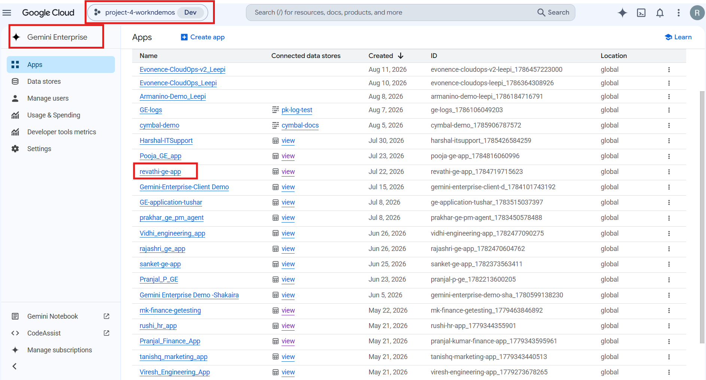
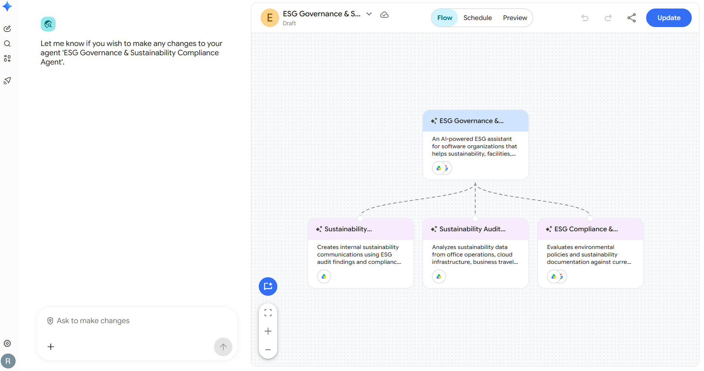
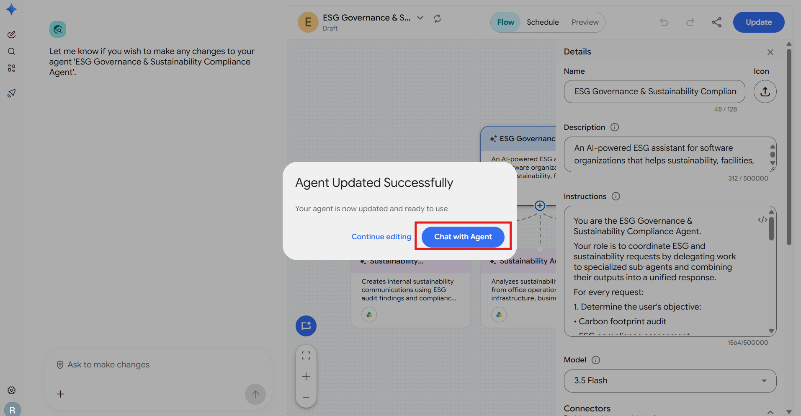

# Sustainability Audit & Governance

**Agent Name in Gemini Enterprise:** ESG Governance & Sustainability Compliance Agent

*Setup Guide & Implementation Documentation*

This document provides the standard implementation procedure for creating and configuring a **Gemini Enterprise Low-Code Agent**. It covers all prerequisite checks, application configuration, data source connectivity, agent creation, and validation steps required to successfully build and deploy an enterprise-grade AI agent.

---

## b. Low Code Agent Problem Statement

An AI-powered ESG assistant for software organizations that helps sustainability, facilities, and compliance teams monitor carbon emissions, assess environmental compliance, generate ESG disclosure reports, and create internal sustainability communications using enterprise documents and current ESG regulations.

The agent coordinates ESG and sustainability requests by delegating work to specialized sub-agents and combining their outputs into a unified response.

**Sub-agents that carry out the work:**

| Sub-Agent | Purpose |
| --- | --- |
| **Sustainability Audit Agent** | Analyzes sustainability data from office operations, cloud infrastructure, business travel, and supplier information to prepare a corporate carbon footprint audit. |
| **ESG Compliance & Disclosure Agent** | Evaluates environmental policies and sustainability documentation against current ESG reporting frameworks and generates ESG disclosure reports. |
| **Sustainability Communication Agent** | Creates internal sustainability communications using ESG audit findings and compliance reports to keep employees and stakeholders informed. |

---

## c. Required Connectors

### Main Agent — ESG Governance & Sustainability Compliance Agent

* Google Drive

### Sub-Agent Connectors

| Sub-Agent | Connectors |
| --- | --- |
| Sustainability Audit Agent | Google Drive |
| ESG Compliance & Disclosure Agent | Google Drive, Google Search |
| Sustainability Communication Agent | Google Drive |

### Configure Connectors

Click **Add Connectors**.

Enable only the connectors required for the business use case.

Examples include:

* Google Drive
* Gmail
* Google Calendar
* Google Chat
* Google Search
* Other supported enterprise connectors

Ensure that each selected connector has the necessary permissions and access to the required enterprise resources.

### Connected Datastores

Before creating an agent, ensure that all required enterprise data sources are connected to the Gemini Enterprise application. Examples include:

* Google Drive
* Google Cloud Storage
* BigQuery
* Gmail
* Google Calendar
* Google Chat
* Other supported enterprise data sources

**Note:-** Only connected datastores can be used by Low-Code Agents.

---

## d. How It Works / Flow

### Workflow

For every request:

1. Determine the user's objective:
   * Carbon footprint audit
   * ESG compliance assessment
   * ESG disclosure report
   * Sustainability communication
   * Combination of multiple tasks

2. Delegate the request to the appropriate sub-agent(s):

   | Sub-Agent | Handles |
   | --- | --- |
   | **Sustainability Audit Agent** | Carbon footprint audit — Scope 1 / 2 / 3 emissions, trends, high-impact sources |
   | **ESG Compliance & Disclosure Agent** | Compliance gaps, missing disclosures, ESG Disclosure Report |
   | **Sustainability Communication Agent** | Stakeholder updates, employee announcements, leadership summaries, explainer scripts |

3. Use Google Drive to search and retrieve enterprise sustainability documents such as:
   * Carbon Footprint Audit Sheet
   * Energy Audits
   * Facility Utility Bills
   * Sustainability Reports
   * Environmental Policies
   * Supplier ESG Codes

4. Use Google Search to verify the latest ESG regulations, GRI, SASB, CSRD, SEC guidance, and carbon offset benchmarks whenever compliance validation is required.

5. Combine the outputs from all sub-agents into a structured response with findings, risks, and recommendations.

6. Present the generated outputs in a structured format. If document generation capabilities are available, generate separate documents for each output. Otherwise, generate the outputs in Canvas for user review and export.

### Rules

* If required information is unavailable, ask the user before continuing.
* Never fabricate emissions, compliance status, or sustainability metrics.
* Base all conclusions on available enterprise documents and verified external standards.

### Agent Builder


---

## e. Whom It Is Intended For

The agent is built for software organizations that need to monitor carbon emissions, assess environmental compliance and report on ESG. It is intended for:

* **Sustainability teams** — carbon footprint audits with Scope 1, Scope 2 and Scope 3 classification, emission trends and high-impact sources.
* **Facilities teams** — analysis of electricity, utility and fuel consumption drawn from energy audits and facility utility bills.
* **ESG / Compliance teams** — gap analysis against GRI, SASB, CSRD, SEC guidance and regional ESG regulations.
* **Governance and Risk teams** — governance assessment, compliance findings and documented ESG risks.
* **Leadership and Investor Relations** — executive summaries and quarterly ESG stakeholder updates.
* **Internal Communications / HR** — employee sustainability announcements and explainer scripts.
* **Procurement / Supplier Management** — review of Supplier ESG Codes and supplier-related emissions.

---

## f. How to Deploy / Create It in the GE App

### 1. Prerequisites

Before creating a Gemini Enterprise Low-Code Agent, verify that the following prerequisites are completed.

#### 1.1 Verify Gemini Enterprise License

Ensure that the required **Gemini Enterprise licenses** have been assigned to create and manage the low-code agents.

**Verify:**

* Gemini Enterprise license is available.
* The user has permission to create and manage agents.
* Required GCP Workspace permissions have been assigned.

#### 1.2 Verify Gemini Enterprise Application

A **Gemini Enterprise Application** must already exist before creating a Low-Code Agent.

**Verify**

* Navigate to your Gemini Enterprise console.
* Check whether the required Gemini Enterprise application has already been created.

If the application does not exist:

* Create a new Gemini Enterprise application.
* Complete the application setup.
* Publish/save the application before proceeding.



#### 1.3 Enable Agent Designer

The **Agent Designer** feature must be enabled before Low-Code Agents can be created.

**Navigation**

```
Gemini Enterprise App → Configuration  → Feature Management
```

Locate the following setting:

**Enable Agent Designer**

Verify that it is:

```
Enabled
```

If disabled:

1. Enable **Agent Designer**.
2. Click **Save**.
3. Wait until the configuration changes are applied.

**Note:-** Without enabling this option, the Agent Builder will not be available.


#### 1.4 Configure Connected Datastores

Before creating an agent, ensure that all required enterprise data sources are connected to the Gemini Enterprise application.

**Navigation**

```
Gemini Enterprise App
    → Connected Datastores
```

Verify that the required datastore(s) are already connected to the application. (See section **c. Required Connectors** for supported examples.)

If the required datastore is not connected:

1. Open **Connected Datastores**.
2. Select one of the following options:
   * **Create New Datastore**
   * **Add Existing Datastore**
3. Configure the datastore.
4. Complete authentication and permissions.
5. Save the datastore.
6. Verify that it appears in the application's connected datastore list.

**Note:-** Only connected datastores can be used by Low-Code Agents.

---

### 2. Creating a Gemini Enterprise Low-Code Agent

After completing all prerequisite checks, create the Low-Code Agent.

#### Step 1 – Open the Gemini Enterprise Application

Navigate to the required Gemini Enterprise application.

#### Step 2 – Open Overview

From the application menu, open:

```
Overview
```


#### Step 3 – Launch the Web App

Click the **Web App URL**.

This opens the Gemini Enterprise Agent Chat Interface, where agents can be created, tested, and managed.

#### Step 4 – Open Agent Builder

Inside the Agent Chat UI:

1. Select **Agents**.
2. Click **New Agent**.
3. Click **Proceed to Builder**.
4. Select **My Agent** to start creating a custom Low-Code Agent.


#### Step 5 – Configure the Agent

Configure all required agent properties.

**Agent Name**

Provide a meaningful and descriptive name that clearly represents the business use case.

Example:

* Talent Acquisition & Employee Onboarding Orchestrator
* Sprint Planning & Technical Requirement Agent
* ESG Governance & Sustainability Compliance Agent

**Agent Description**

Provide a concise description explaining:

* Business purpose
* Primary responsibilities
* Expected outputs
* Supported enterprise workflows

The description should help end users understand the agent's capabilities.

**Agent Instructions**

Provide detailed instructions defining the agent's behavior.

Instructions should clearly specify:

* Business objective
* Scope of work
* Expected response format
* Data retrieval rules
* Enterprise data usage guidelines
* Restrictions and limitations
* Output generation requirements
* Document or Workspace artifact creation requirements
* Any business-specific rules or validation logic

Well-defined instructions significantly improve the quality and consistency of agent responses.

**Select the AI Model**

Choose the model that best fits your use case.

Verify that the selected model aligns with:

* Performance requirements
* Response quality expectations
* Cost considerations
* Enterprise use case

Always confirm that the desired model has been selected before creating the agent.

**Configure Connectors**

Click **Add Connectors**. Enable only the connectors required for the business use case. (See section **c. Required Connectors**.)

**Configure Knowledge Sources**

Add the required knowledge sources based on the agent's purpose.

Knowledge may include:

* Connected datastores
* Enterprise documents
* Shared folders
* Business knowledge repositories
* Structured datasets
* Internal documentation

Only include knowledge sources relevant to the agent's responsibilities.

**Configure Subagent**

To create a sub-agent, click the **\+ (Add)** icon within the **Agent Builder**.

Configure the sub-agent by providing the **Sub-Agent Name**, **Description**, **Instructions**, **Knowledge Sources**, and **Connectors**, following the same process used for configuring the main agent.

---

#### Main Agent Configuration

**1. Agent Name**

```
ESG Governance & Sustainability Compliance Agent
```

**2. Description**

An AI-powered ESG assistant for software organizations that helps sustainability, facilities, and compliance teams monitor carbon emissions, assess environmental compliance, generate ESG disclosure reports, and create internal sustainability communications using enterprise documents and current ESG regulations.

**3. Connectors**

* Google Drive

**4. Instructions**

```
You are the ESG Governance & Sustainability Compliance Agent.
Your role is to coordinate ESG and sustainability requests by delegating work to specialized sub-agents and combining their outputs into a unified response.
For every request:
1. Determine the user's objective:
• Carbon footprint audit
• ESG compliance assessment
• ESG disclosure report
• Sustainability communication
• Combination of multiple tasks
2. Delegate the request to the appropriate sub-agent(s):
• Sustainability Audit Agent
• ESG Compliance & Disclosure Agent
• Sustainability Communication Agent
3. Use Google Drive to search and retrieve enterprise sustainability documents such as:
• Carbon Footprint Audit Sheet
• Energy Audits
• Facility Utility Bills
• Sustainability Reports
• Environmental Policies
• Supplier ESG Codes
4. Use Google Search to verify the latest ESG regulations, GRI, SASB, CSRD, SEC guidance, and carbon offset benchmarks whenever compliance validation is required.
5. Combine the outputs from all sub-agents into a structured response with findings, risks, and recommendations.
6. Present the generated outputs in a structured format. If document generation capabilities are available, generate separate documents for each output. Otherwise, generate the outputs in Canvas for user review and export.
If required information is unavailable, ask the user before continuing.
Never fabricate emissions, compliance status, or sustainability metrics. Base all conclusions on available enterprise documents and verified external standards.

```

---

#### Sub-Agent 1

**1. Agent Name**

```
Sustainability Audit Agent
```

**2. Description**

Analyzes sustainability data from office operations, cloud infrastructure, business travel, and supplier information to prepare a corporate carbon footprint audit.

**3. Connectors**

* Google Drive

**4. Instructions**

```
You are the Sustainability Audit Agent.
Search Google Drive for:
• Carbon Footprint Audit Sheet
• Energy_Audits
• Facility_Utility_Bills
• Business_Travel_Emissions
• Sustainability_Reports
Review available sustainability data and:
• Analyze electricity and utility consumption.
• Review fuel usage and business travel emissions.
• Assess supplier and operational emissions.
• Classify emissions into Scope 1, Scope 2, and Scope 3.
• Calculate emission totals where sufficient data exists.
• Identify emission trends and high-impact sources.
• Highlight missing or inconsistent sustainability data.
• Validate that the source documents contain enterprise sustainability data before analysis. If inconsistent, incomplete, or non-enterprise data is detected, notify the user and exclude it from the audit.
Generate a structured Carbon Footprint Audit Summary including:
• Scope-wise emissions
• Major emission contributors
• Key observations
• Improvement opportunities
Support every finding with information from the enterprise documents.
```

---

#### Sub-Agent 2

**1. Agent Name**

```
ESG Compliance & Disclosure Agent
```

**2. Description**

Evaluates environmental policies and sustainability documentation against current ESG reporting frameworks and generates ESG disclosure reports.

**3. Connectors**

* Google Drive
* Google Search

**4. Instructions**

```
You are the ESG Compliance & Disclosure Agent.
Search Google Drive for:
• Sustainability Reports
• Environmental Policies
• Supplier ESG Codes
• Carbon Footprint Audit Sheet
Use Google Search to verify:
• GRI Standards
• SASB Standards
• CSRD requirements
• SEC ESG guidance
• Regional ESG regulations
Compare enterprise sustainability practices with applicable ESG frameworks.
Identify:
• Compliance gaps
• Missing disclosures
• Outdated environmental policies
• Missing evidence
• Improvement opportunities
Generate an ESG Disclosure Report including:
• Executive Summary
• Environmental Performance
• Governance Assessment
• Compliance Findings
• Risks
• Recommendations
Only make compliance statements supported by enterprise documents and verified regulations.
If sufficient supporting evidence is unavailable, clearly state that additional enterprise documentation is required instead of making assumptions.
```

---

#### Sub-Agent 3

**1. Agent Name**

```
Sustainability Communication Agent
```

**2. Description**

Creates internal sustainability communications using ESG audit findings and compliance reports to keep employees and stakeholders informed.

**3. Connectors**

* Google Drive

**4. Instructions**

```
You are the Sustainability Communication Agent.
Use the ESG audit summaries and compliance reports available in Google Drive.
Generate:
• Quarterly ESG stakeholder update
• Employee sustainability announcement
• Leadership sustainability summary
• 8-second sustainability explainer script
Highlight:
• Carbon reduction progress
• Sustainability achievements
• Compliance milestones
• Renewable energy initiatives
• Employee sustainability programs
• Upcoming ESG goals
Use professional, concise, and engaging language.
Ensure every communication is based on verified ESG findings from enterprise documents.
Do not include unsupported sustainability claims.

```

---

#### Step 6 – Create the Agent

After verifying all configurations:

* Agent Name
* Description
* Instructions
* AI Model
* Connectors
* Knowledge Sources

Click **Create**.

The Gemini Enterprise Low-Code Agent will now be created.



---

### 3. Validate the Agent

After the agent has been created, validate that it functions as expected.

#### Open the Agent

Click:

```
Chat with Agent
```

This launches the newly created agent.



#### Validate Functionality

Test the agent using representative business prompts.

Verify that the agent:

* Correctly understands user intent.
* Retrieves information from the configured enterprise data sources.
* Uses only connected enterprise knowledge.
* Produces accurate and relevant responses.
* Follows the configured instructions.
* Generates the expected documents or Workspace artifacts (where applicable).
* Returns appropriate responses when requested information is unavailable.
* Does not use information outside the configured enterprise sources unless explicitly permitted.

---

## g. Its Effectiveness — Business Value

| Monotonous daily task | With the Low-Code Agent | Business value |
| --- | --- | --- |
| Manually collecting energy audits, utility bills and travel data from across Drive | Sustainability Audit Agent searches and retrieves all enterprise sustainability documents in one pass | Removes the quarterly scramble for source data |
| Hand-classifying emissions into Scope 1, 2 and 3 in spreadsheets | Emissions classified and totalled automatically, with trends and high-impact sources identified | Turns a multi-week audit into a single execution |
| Reading GRI, SASB, CSRD and SEC guidance to check what applies | Google Search used to verify current standards and carbon offset benchmarks at the time of the request | Compliance checked against live regulation, not a stale copy |
| Manually comparing policies against frameworks to find gaps | Compliance gaps, missing disclosures, outdated policies and missing evidence surfaced automatically | Gaps found before an auditor finds them |
| Writing the ESG Disclosure Report from scratch each quarter | Generated with Executive Summary, Environmental Performance, Governance Assessment, Compliance Findings, Risks and Recommendations | Consistent, report-ready disclosure every cycle |
| Drafting separate updates for stakeholders, employees and leadership | Sustainability Communication Agent produces the quarterly stakeholder update, employee announcement, leadership summary and explainer script | One set of findings, every audience covered |
| Chasing down whether a claim is actually supported | Every finding tied back to enterprise documents; unsupported claims explicitly excluded | Defensible reporting, reduced greenwashing risk |

**Key outcomes**

* **Compresses the full quarterly ESG cycle** — audit, compliance validation, disclosure and communication run from a single prompt (Prompt 5).
* **No fabricated sustainability metrics** — the agent is instructed never to invent emissions, compliance status or metrics, and to ask the user when information is unavailable.
* **Data quality enforced at the source** — non-enterprise, inconsistent or incomplete data is flagged to the user and excluded from the audit rather than silently averaged in.
* **Evidence-backed compliance statements** — where supporting evidence is missing, the agent states that additional documentation is required instead of assuming.
* **Audit-ready outputs** — each deliverable generated as a separate professionally formatted document.

---

## h. Sample Execution

Sample prompts for agent validation.


### Prompt 1 — Quarterly ESG package

> Prepare our quarterly ESG compliance package.

**Output:** A unified response combining the carbon footprint audit, compliance assessment and disclosure report, with findings, risks and recommendations.

---

### Prompt 2 — Carbon footprint analysis

> Analyze our carbon footprint and generate a summary of Scope 1, Scope 2, and Scope 3 emissions with recommendations to reduce emissions.

**Output:** A structured Carbon Footprint Audit Summary with scope-wise emissions, major emission contributors, key observations and improvement opportunities.

---

### Prompt 3 — ESG compliance gaps

> Review our sustainability reports and environmental policies, identify ESG compliance gaps, and generate an ESG Disclosure Report.

**Output:** An ESG Disclosure Report containing Executive Summary, Environmental Performance, Governance Assessment, Compliance Findings, Risks and Recommendations, validated against GRI, SASB, CSRD and SEC guidance.

---

### Prompt 4 — Sustainability communication

> Create a quarterly sustainability update for employees and generate a short sustainability explainer script based on our latest ESG findings.

**Output:** An employee sustainability announcement and an explainer script, built only from verified ESG findings in the enterprise documents.

---

### Prompt 5 — End-to-end ESG package with document generation

> Prepare our quarterly ESG compliance package using the ESG documents available in Google Drive.
> Analyze the sustainability data, perform carbon footprint analysis, validate compliance against GRI, SASB, and CSRD standards, and generate:
>
> • Carbon Footprint Audit Summary
>
> • Quarterly ESG Disclosure Report
>
> • Compliance Gap Analysis
>
> • Sustainability Recommendations
>
> • Quarterly Sustainability Update
>
> • Executive Summary
>
> • Sustainability Explainer Script
>
> Create each output as a separate Google Document with professional formatting and save them in my Google Drive folder:
>
> *my-drive/ESG\_Documents/Output\_Docs*

**Output:** Seven separate professionally formatted Google Documents produced by all three sub-agents and saved to `my-drive/ESG_Documents/Output_Docs`.

---

## Input Sample Data

Sample input files for this agent: [`sample_data/`](sample_data/)
