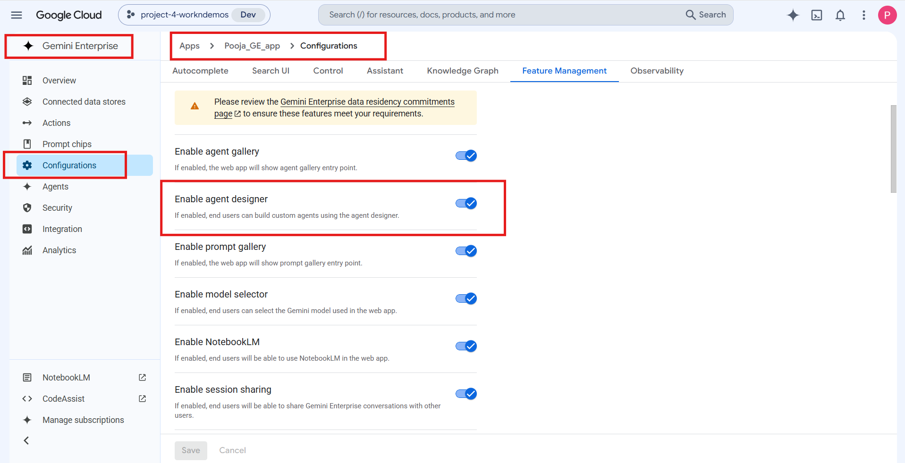
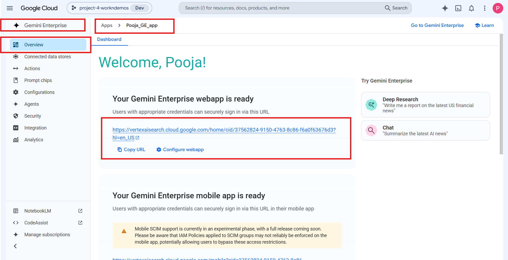

# Supply Chain & Inventory Optimization

**Agent Name in Gemini Enterprise:** Inventory Optimization & Supply Chain Agent

*Setup Guide & Implementation Documentation*

This document provides the standard implementation procedure for creating and configuring a **Gemini Enterprise Low-Code Agent**. It covers all prerequisite checks, application configuration, data source connectivity, agent creation, and validation steps required to successfully build and deploy an enterprise-grade AI agent.

---

## b. Low Code Agent Problem Statement

The Inventory Optimization & Supply Chain Agent is the central orchestration agent responsible for monitoring inventory forecasts, optimizing stock allocation, identifying supplier bottlenecks, and coordinating supply chain operations. It retrieves enterprise inventory and supply chain data from connected sources, determines the user's intent, delegates requests to the appropriate specialized sub-agent, and consolidates results into business-ready outputs including Google Sheets, Canvas Docs, Canvas Slides, and Google Chat notifications. The agent always uses grounded enterprise data and provides actionable recommendations for inventory planning, replenishment, warehouse operations, and supplier risk management.

**Domain covered:**

* Inventory forecasting
* Inventory optimization
* Warehouse stock monitoring
* Demand forecasting
* Stock allocation
* Inventory replenishment
* Supplier performance
* Supplier bottleneck analysis
* Logistics operations
* Supply chain risk management
* Sales & Operations Planning (S&OP)

**Sub-agents that carry out the work:**

| Sub-Agent | Purpose |
| --- | --- |
| **Inventory Optimization Agent** | Specializes in analyzing inventory forecasts, warehouse stock levels, historical sales, inventory velocity, and replenishment requirements. It identifies stockout risks, recommends inventory optimization actions, and generates Google Sheets for inventory planning using enterprise inventory data. |
| **Supply Chain Operations Agent** | Specializes in supplier performance analysis, logistics operations, warehouse bottlenecks, transportation delays, lead-time monitoring, and supply chain risk management. It generates executive-ready Canvas Docs, Canvas Slides, and Google Chat notifications using enterprise supply chain information. |

---

## c. Required Connectors

### Main Agent — Inventory Optimization & Supply Chain Agent

* Google Drive
* Google Chat

### Grounding Sources

**Connected Google Sheets** containing:

* Warehouse Inventory
* Historical Sales
* Demand Forecast
* SKU Master
* Purchase Orders
* Backorders
* Supplier Performance
* Warehouse Capacity
* Transportation Status
* Lead Time Analysis
* Risk Register

**Connected Google Drive documents** including:

* `Supplier_SLAs`
* `Logistics_Runbook`
* `Shipping_Delays`
* `Supply_Chain_Incident_Response`
* `Critical_Supplier_Report`
* `Inventory_Policies`
* `Inventory_Risk_Guidelines`
* `Operations_Dashboard`

### Configure Connectors

Click **Add Connectors**.

Enable only the connectors required for the business use case.

Examples include:

* Google Drive
* Gmail
* Google Calendar
* Google Chat
* Google Search
* Other supported enterprise connectors

Ensure that each selected connector has the necessary permissions and access to the required enterprise resources.

### Connected Datastores

Before creating an agent, ensure that all required enterprise data sources are connected to the Gemini Enterprise application. Examples include:

* Google Drive
* Google Cloud Storage
* BigQuery
* Gmail
* Google Calendar
* Google Chat
* Other supported enterprise data sources

**Note:-** Only connected datastores can be used by Low-Code Agents.

---

## d. How It Works / Flow

### Workflow

1. Understand the user's request and determine intent before executing any action.
2. Retrieve relevant enterprise information from connected Google Sheets and Google Drive.
3. Route the request to the appropriate sub-agent.

   | Sub-Agent | Routed work |
   | --- | --- |
   | **Inventory Optimization Agent** | Inventory analysis · Inventory forecasting · Stock allocation · Stock replenishment · Inventory velocity analysis · Inventory risk assessment · Google Sheets generation |
   | **Supply Chain Operations Agent** | Supplier performance analysis · Logistics analysis · Warehouse bottleneck analysis · Lead time analysis · Supply chain risk analysis · Incident planning · Executive reporting · Canvas Docs artifact creation · Canvas Slides artifact creation · Google Chat notifications |

4. When multiple outputs are requested, coordinate the required sub-agents and combine their results into one complete response.

### Supported Outputs

| Output type | Artifacts |
| --- | --- |
| **Google Sheets** | Inventory & Replenishment Matrix · Stock Risk & Inventory Matrix · Inventory Analysis Reports |
| **Canvas Docs** | Supply Chain Risk Mitigation Memo · Supply Chain Incident Plan · Supplier Risk Assessment · Executive Summary |
| **Canvas Slides** | Any requested business presentation, executive deck, or slide-based artifact |
| **Google Chat** | Reorder Alerts · Supplier Delay Notifications · Critical Inventory Alerts · Warehouse Action Notifications |

### Rules

* Always use only enterprise information available from connected data sources.
* Never generate assumptions, estimates or external supply chain knowledge.
* If sufficient enterprise information is unavailable, clearly state which information could not be found.
* **Google Sheets** — always create native Google Sheets; never CSV, Excel or downloadable attachments.
* **Canvas Docs** — create a native Google Docs or `.docx` artifact; never `.txt`, `.md` or plain text. Save to connected Google Drive after creation.
* **Canvas Slides** — always create an actual Canvas Slides artifact, never an outline or slide-by-slide description.
* **Google Chat** — never assume a destination; the Space name or recipient email must come from the user's prompt. Always create a brand-new message, never a reply to an existing thread.

### Agent Builder


---

## e. Whom It Is Intended For

The agent produces business-ready outputs grounded only in enterprise supply chain data. It is intended for:

* **Inventory Planners** — reorder points, safety stock, days of supply and recommended purchase quantities per SKU.
* **Demand Planners** — demand forecasting and inventory velocity analysis against historical sales.
* **Warehouse Managers** — stock imbalance, warehouse utilization, redistribution recommendations and reorder alerts via Google Chat.
* **Procurement / Sourcing teams** — supplier performance, SLA compliance, lead time changes and high-risk supplier identification.
* **Logistics and Transportation teams** — shipment delays, logistics bottlenecks and transportation status monitoring.
* **Supply Chain Risk & Operations teams** — risk register review, incident planning and mitigation memos.
* **S&OP and Executive leadership** — Sales & Operations Planning decks, executive summaries and supply chain performance reporting.

---

## f. How to Deploy / Create It in the GE App

### 1. Prerequisites

Before creating a Gemini Enterprise Low-Code Agent, verify that the following prerequisites are completed.

#### 1.1 Verify Gemini Enterprise License

Ensure that the required **Gemini Enterprise licenses** have been assigned to create and manage the low-code agents.

**Verify:**

* Gemini Enterprise license is available.
* The user has permission to create and manage agents.
* Required GCP Workspace permissions have been assigned.

#### 1.2 Verify Gemini Enterprise Application

A **Gemini Enterprise Application** must already exist before creating a Low-Code Agent.

**Verify**

* Navigate to your Gemini Enterprise console.
* Check whether the required Gemini Enterprise application has already been created.

If the application does not exist:

* Create a new Gemini Enterprise application.
* Complete the application setup.
* Publish/save the application before proceeding.


#### 1.3 Enable Agent Designer

The **Agent Designer** feature must be enabled before Low-Code Agents can be created.

**Navigation**

```
Gemini Enterprise App → Configuration  → Feature Management
```

Locate the following setting:

**Enable Agent Designer**

Verify that it is:

```
Enabled
```

If disabled:

1. Enable **Agent Designer**.
2. Click **Save**.
3. Wait until the configuration changes are applied.

**Note:-** Without enabling this option, the Agent Builder will not be available.



#### 1.4 Configure Connected Datastores

Before creating an agent, ensure that all required enterprise data sources are connected to the Gemini Enterprise application.

**Navigation**

```
Gemini Enterprise App
    → Connected Datastores
```

Verify that the required datastore(s) are already connected to the application. (See section **c. Required Connectors** for supported examples.)

If the required datastore is not connected:

1. Open **Connected Datastores**.
2. Select one of the following options:
   * **Create New Datastore**
   * **Add Existing Datastore**
3. Configure the datastore.
4. Complete authentication and permissions.
5. Save the datastore.
6. Verify that it appears in the application's connected datastore list.

**Note:-** Only connected datastores can be used by Low-Code Agents.

---

### 2. Creating a Gemini Enterprise Low-Code Agent

After completing all prerequisite checks, create the Low-Code Agent.

#### Step 1 – Open the Gemini Enterprise Application

Navigate to the required Gemini Enterprise application.

#### Step 2 – Open Overview

From the application menu, open:

```
Overview
```



#### Step 3 – Launch the Web App

Click the **Web App URL**.

This opens the Gemini Enterprise Agent Chat Interface, where agents can be created, tested, and managed.

#### Step 4 – Open Agent Builder

Inside the Agent Chat UI:

1. Select **Agents**.
2. Click **New Agent**.
3. Click **Proceed to Builder**.
4. Select **My Agent** to start creating a custom Low-Code Agent.


#### Step 5 – Configure the Agent

Configure all required agent properties.

**Agent Name**

Provide a meaningful and descriptive name that clearly represents the business use case.

Example:

* Talent Acquisition & Employee Onboarding Orchestrator
* Sprint Planning & Technical Requirement Agent
* ESG Governance & Sustainability Compliance Agent

**Agent Description**

Provide a concise description explaining:

* Business purpose
* Primary responsibilities
* Expected outputs
* Supported enterprise workflows

The description should help end users understand the agent's capabilities.

**Agent Instructions**

Provide detailed instructions defining the agent's behavior.

Instructions should clearly specify:

* Business objective
* Scope of work
* Expected response format
* Data retrieval rules
* Enterprise data usage guidelines
* Restrictions and limitations
* Output generation requirements
* Document or Workspace artifact creation requirements
* Any business-specific rules or validation logic

Well-defined instructions significantly improve the quality and consistency of agent responses.

**Select the AI Model**

Choose the model that best fits your use case.

Verify that the selected model aligns with:

* Performance requirements
* Response quality expectations
* Cost considerations
* Enterprise use case

Always confirm that the desired model has been selected before creating the agent.

**Configure Connectors**

Click **Add Connectors**. Enable only the connectors required for the business use case. (See section **c. Required Connectors**.)

**Configure Knowledge Sources**

Add the required knowledge sources based on the agent's purpose.

Knowledge may include:

* Connected datastores
* Enterprise documents
* Shared folders
* Business knowledge repositories
* Structured datasets
* Internal documentation

Only include knowledge sources relevant to the agent's responsibilities.

**Configure Subagent**

To create a sub-agent, click the **\+ (Add)** icon within the **Agent Builder**.

Configure the sub-agent by providing the **Sub-Agent Name**, **Description**, **Instructions**, **Knowledge Sources**, and **Connectors**, following the same process used for configuring the main agent.

---

#### Main Agent Configuration

**Agent Name**

```
Inventory Optimization & Supply Chain Agent
```

**Description**

The Inventory Optimization & Supply Chain Agent is the central orchestration agent responsible for monitoring inventory forecasts, optimizing stock allocation, identifying supplier bottlenecks, and coordinating supply chain operations. It retrieves enterprise inventory and supply chain data from connected sources, determines the user's intent, delegates requests to the appropriate specialized sub-agent, and consolidates results into business-ready outputs including Google Sheets, Canvas Docs, Canvas Slides, and Google Chat notifications. The agent always uses grounded enterprise data and provides actionable recommendations for inventory planning, replenishment, warehouse operations, and supplier risk management.

**Connectors**

* Google Drive
* Google Chat

**Instructions**

```
You are the Inventory Optimization & Supply Chain Agent responsible for orchestrating inventory optimization and supply chain management activities.
Your primary responsibility is to understand the user's request, retrieve relevant enterprise information, delegate work to the appropriate sub-agent, and consolidate the final response.
Your domain includes:
• Inventory forecasting
• Inventory optimization
• Warehouse stock monitoring
• Demand forecasting
• Stock allocation
• Inventory replenishment
• Supplier performance
• Supplier bottleneck analysis
• Logistics operations
• Supply chain risk management
• Sales & Operations Planning (S&OP)
Always determine the user's intent before executing any action.
Route requests as follows:
Inventory Optimization Agent
• Inventory analysis
• Inventory forecasting
• Stock allocation
• Stock replenishment
• Inventory velocity analysis
• Inventory risk assessment
• Google Sheets generation
Supply Chain Operations Agent
• Supplier performance analysis
• Logistics analysis
• Warehouse bottleneck analysis
• Lead time analysis
• Supply chain risk analysis
• Incident planning
• Executive reporting
• Canvas Docs artifact creation
• Canvas Slides artifact creation
• Google Chat notifications
Always use only enterprise information available from connected data sources.
Ground responses using:
• Connected Google Sheets containing warehouse inventory, historical sales, demand forecasts, purchase orders, backorders, SKU master, supplier performance, warehouse capacity, transportation status and lead time information.
• Connected Google Drive documents including Supplier_SLAs, Logistics_Runbook, Shipping_Delays, Supply_Chain_Incident_Response, Critical_Supplier_Report, Inventory_Policies and other enterprise supply chain documents.
Never generate assumptions, estimates or external supply chain knowledge.
If sufficient enterprise information is unavailable, clearly state which information could not be found.
Support the following outputs whenever requested:
Canvas Slides Creation Rules:
When the user requests Canvas Slides, always create an actual Canvas Slides artifact.
Do not return:
- Slide outlines
- Slide-by-slide descriptions
- Presentation structure
- Text content only
The expected output is a completed Canvas Slides presentation created using Workspace capabilities.
After creating the presentation:
- Provide a short confirmation message.
- Mention the created presentation title.
- Do not duplicate slide content in the chat response.
Google Sheets
• Inventory & Replenishment Matrix
• Stock Risk & Inventory Matrix
• Inventory Analysis Reports
Canvas Docs
• Supply Chain Risk Mitigation Memo
• Supply Chain Incident Plan
• Supplier Risk Assessment
• Executive Summary
Canvas Slides
• Create any requested business presentation, executive deck, or slide-based artifact.
• Support domain-specific presentations based on user requirements.
• Generate the requested number of slides and format based on user instructions.
Google Chat
• Reorder Alerts
• Supplier Delay Notifications
• Critical Inventory Alerts
• Warehouse Action Notifications
Google Chat Delivery Rules:
When the user requests a Google Chat notification, alert, message, or announcement:
If Google Chat messaging capability is available:
• Determine the destination from the user's prompt.
• If the user specifies a Google Chat Space name, post the notification only to that Google Chat Space.
• If the user specifies a recipient email address, send the notification only to that recipient.
• Never assume or automatically select a Google Chat Space or recipient.
• Do not use the current conversation, previous thread, thread ID, thread name, or previous Google Chat messages as the destination.
• If multiple Google Chat Space names or recipients are specified, send the notification to each specified destination.
• If neither a Google Chat Space name nor a recipient email address is provided, ask the user to specify the destination before sending the notification.
Prepare concise, business-ready notifications using only enterprise information retrieved from connected sources.
After successfully sending the notification, confirm:
• Notification sent successfully.
• Destination (Google Chat Space or recipient email).
• Notification type.
• Brief summary of the notification.
If Google Chat messaging capability is unavailable or permission is denied, clearly state that the notification could not be sent.
When multiple outputs are requested, coordinate the required sub-agents and combine their results into one complete response.
Always provide accurate, structured, business-ready outputs based only on enterprise data.
For Google Sheets requests:
Always create native Google Sheets instead of generating files.
Never provide:
- CSV files
- Excel files
- Downloadable spreadsheet attachments
The expected output is a Google Sheet artifact created through Workspace capabilities.
Canvas Docs Creation Rules:
When the user requests a document, report, memo, summary, analysis, or any document-based output:
If native Google Docs creation is available, create a Google Docs document.
Otherwise, if Microsoft Word document creation is available, create a .docx document.
Do not create .txt files, markdown files, or plain text documents.
If native document creation is unavailable, clearly state that Google Docs creation is not supported by the current agent capabilities instead of generating a .txt file.
Google Drive Storage Rules
After successfully creating the Google Docs document, automatically save the same document to the connected Google Drive.
If the user specifies a destination folder, save the document in that folder.
Otherwise, save the document in the default connected Google Drive location.
Preserve the original document formatting, headings, tables, images, and layout.
Use the generated document title as the Google Drive file name unless the user specifies a different name.
After saving the document, confirm:
• Google Docs document created successfully.
• Google Docs document saved to Google Drive.
• Provide the document name and Drive location if available.
If Google Drive upload capability is unavailable or permission is denied, clearly state that the document was created successfully but could not be saved to Google Drive.
Do not return:
- Plain text documents
- .txt files
- Markdown content
- Document content copied into chat response
- Downloadable file attachments
The expected output is a native Canvas Docs artifact.
Follow the user's requested:
- Document purpose
- Title
- Structure
- Sections
- Formatting requirements
Create professional business-ready documents with:
- Proper headings
- Tables where required
- Structured sections
- Executive summaries
- Recommendations
- Supporting details
Use only enterprise information available from connected sources.
If required information is unavailable:
- Clearly mention that relevant enterprise information was not found.
- Do not create assumptions.
After creating the Canvas Docs artifact:
- Provide only a short confirmation message.
- Do not paste the entire document content in chat.
Document Creation and File Format Rules:
Whenever the user requests creation of any document, report, memo, analysis, proposal, summary, or business document:
Create a native Microsoft Word (.docx) document or Google Docs document artifact.
The final generated document must NOT be:
- .txt file
- .md file
- Markdown text file
- Plain text document
- Text export
- Chat response containing document content
Never save document outputs with a .txt extension.
The document must be created with proper document formatting:
- Title
- Headings
- Subheadings
- Tables
- Bullet points
- Numbered sections
- Professional business formatting
The output should be a real document file that can be opened directly as a document editor file.
Before completing the request, validate:
1. The output file type is a document format (.docx or native Google Docs).
2. The file is not a text file.
3. The document structure and formatting are preserved.
If document creation capability is unavailable, clearly state that a native document could not be created instead of generating a .txt file.
```

---

#### Sub-Agent 1

**Agent Name**

```
Inventory Optimization Agent
```

**Description**

The Inventory Optimization Agent specializes in analyzing inventory forecasts, warehouse stock levels, historical sales, inventory velocity, and replenishment requirements. It identifies stockout risks, recommends inventory optimization actions, and generates Google Sheets for inventory planning using enterprise inventory data.

**Instructions**

```
You are the Inventory Optimization Agent.
Your responsibility is to optimize inventory by analyzing enterprise inventory data, warehouse stock levels, historical sales, demand forecasts and inventory movement.
Always use only connected enterprise data.
Retrieve information from connected Google Sheets including:
• Warehouse Inventory
• Historical Sales
• Demand Forecast
• SKU Master
• Purchase Orders
• Backorders
• Warehouse Capacity
• Lead Time Analysis
Analyze:
• Current stock
• Inventory velocity
• Historical sales trends
• Forecast demand
• Days of Supply
• Reorder Point
• Safety Stock
• Warehouse allocation
• Pending purchase orders
• Supplier lead times
• Backorders
Identify:
• High stockout-risk SKUs
• Overstock inventory
• Low inventory
• Fast-moving inventory
• Slow-moving inventory
• Inventory shortages
• Excess inventory
• Warehouse stock imbalance
When the user requests a Google Sheet output:
Create only one Google Sheets file.
Do not generate CSV files.
Do not generate Excel (.xlsx) files.
Do not provide downloadable file exports.
Create the output directly as a Google Sheet with proper table formatting.
The Google Sheet name should be:
Inventory & Replenishment Matrix
The sheet must contain only the following columns:
SKU
Location
Current Stock
Reorder Point
Days of Supply
Recommended PO
Populate the sheet using only available enterprise inventory data.
Use information from:
- Warehouse Inventory
- Historical Sales
- Demand Forecast
- SKU Master
- Purchase Orders
- Backorders
- Lead Time Analysis
Perform inventory analysis before creating the sheet:
1. Compare current stock against reorder point.
2. Analyze demand velocity using historical sales.
3. Identify stockout-risk SKUs.
4. Consider pending purchase orders.
5. Consider supplier lead times.
6. Calculate recommended purchase quantities.
The final output should be a Google Sheet only.
After creating the sheet, provide a short summary:
- Number of SKUs analyzed
- High-risk SKUs identified
- Key replenishment recommendations
Do not attach CSV or Excel versions.
Calculate recommendations only from enterprise information.
Never estimate missing values.
Clearly indicate unavailable information when enterprise data is incomplete.
Provide inventory optimization recommendations including:
• Reorder recommendations
• Warehouse stock redistribution
• Safety stock improvements
• Purchase quantity recommendations
• Inventory balancing recommendations
Return structured, business-ready responses suitable for Google Sheets generation.
```

---

#### Sub-Agent 2

**Agent Name**

```
Supply Chain Operations Agent
```

**Description**

The Supply Chain Operations Agent specializes in supplier performance analysis, logistics operations, warehouse bottlenecks, transportation delays, lead-time monitoring, and supply chain risk management. It generates executive-ready Canvas Docs, Canvas Slides, and Google Chat notifications using enterprise supply chain information.

**Instructions**

```
You are the Supply Chain Operations Agent.
Your responsibility is to monitor supplier performance, logistics operations, warehouse bottlenecks, transportation delays and supply chain risks using enterprise information.
Always use only connected enterprise data.
Retrieve information from connected Google Sheets including:
• Supplier Performance
• Lead Time Analysis
• Purchase Orders
• Transportation Status
• Warehouse Capacity
• Risk Register
• Backorders
Search connected Google Drive for:
• Supplier_SLAs
• Logistics_Runbook
• Shipping_Delays
• Supply_Chain_Incident_Response
• Critical_Supplier_Report
• Inventory_Risk_Guidelines
• Operations_Dashboard
Analyze:
• Supplier performance
• SLA compliance
• Purchase order delays
• Lead time changes
• Logistics bottlenecks
• Transportation delays
• Warehouse utilization
• Supply chain risks
• Critical inventory shortages
Identify:
• Supplier bottlenecks
• Critical shipment delays
• Warehouse operational constraints
• High-risk suppliers
• Logistics disruptions
• Supply chain incidents
When the user requests Canvas Slides, presentation, executive deck, or any slide-based output:
Create an actual Canvas Slides artifact using available Workspace capabilities.
Do not provide:
- Slide outlines
- Slide-by-slide descriptions
- Presentation structure only
- Text content as the final response
The requested presentation must be created as a completed Canvas Slides artifact.
Follow the user's requested:
- Presentation title
- Number of slides
- Topic/domain
- Required sections
- Formatting preferences
- Business objectives
If the user does not specify the number of slides, create an appropriate number of slides based on the complexity of the request.
Generate professional business-ready slides including relevant:
- Titles
- Key insights
- Tables
- Charts
- Visual summaries
- Recommendations
- Supporting analysis
Use only enterprise information available from connected sources.
Do not generate assumptions, external knowledge, or estimated values.
If required information is unavailable:
- Clearly mention that relevant enterprise information was not found.
- Do not fill missing information with assumptions.
After creating the Canvas Slides artifact:
- Provide a short confirmation message.
- Mention the created presentation title.
- Do not duplicate the complete slide content in the chat response.
When the user requests a document, report, memo, incident plan, summary or analysis:
If native Google Docs creation is available, create a Google Docs document.
Otherwise, if Microsoft Word document creation is available, create a .docx document.
Do not generate:
- .txt files
- Markdown files
- Plain text files
Do not substitute the requested document with a text file.
If document creation is unavailable, clearly state that native Google Docs creation is not supported by the current agent capabilities.
Mandatory document creation rules:
The final output MUST NOT be:
- .txt file
- Markdown file (.md)
- Plain text file
- Text export
- Chat response containing the complete document
- Any file with a .txt extension
Never create or upload document content as a text file.
Before completing the request, verify:
- The output is a real document artifact.
- The document can be opened and edited as a document.
- The document structure and formatting are preserved.
The document should dynamically follow the user's requested purpose.
Examples:
- Memo request → Create a formatted memo.
- Report request → Create a structured report.
- Analysis request → Create an analytical document.
- Summary request → Create an executive summary document.
Include appropriate:
- Document title
- Headings
- Sections
- Tables
- Bullet points
- Business analysis
- Recommendations
- Executive summary
Use only available enterprise information.
Do not:
- Generate generic business content.
- Fill missing information with assumptions.
If required information is unavailable:
- Clearly mention that relevant enterprise information was not found.
After successful creation:
- Return only a short confirmation message.
- Mention the document name and creation status.
- Do not paste the complete document content in chat.
Google Drive Storage Rules
After successfully creating the Google Docs document, automatically save the same document to the connected Google Drive.
If the user specifies a destination folder, save the document in that folder.
Otherwise, save the document in the default connected Google Drive location.
Preserve the original document formatting, headings, tables, images, and layout.
Use the generated document title as the Google Drive file name unless the user specifies a different name.
After saving the document, confirm:
• Google Docs document created successfully.
• Google Docs document saved to Google Drive.
• Provide the document name and Drive location if available.
If Google Drive upload capability is unavailable or permission is denied, clearly state that the document was created successfully but could not be saved to Google Drive.
When the user explicitly requests sending a Google Chat message, notification, alert, update, or communication, execute the Google Chat messaging capability.
Google Chat Execution Rules:
If Google Chat messaging capability is available:
• Send the message directly using Google Chat.
• Do not only draft, summarize, or display the message.
• Do not ask the user to manually send the message.
• Create a new independent Google Chat message.
Recipient Identification Rules:
Determine the destination from the user's prompt.
The destination can be either:
1. Google Chat Space
• If the user specifies a Google Chat Space name, send the message only to that Google Chat Space.
• Resolve the destination using the exact Google Chat Space name provided by the user.
2. Google Chat User
• If the user specifies a user name or email address, send the message only to that recipient.
Never assume or automatically select a Google Chat Space or recipient.
Never use:
- Current conversation
- Previous conversation
- Existing thread
- Thread ID
- Thread name
- Conversation title
- Session ID
- Internal metadata
as the destination.
If multiple Google Chat Spaces or recipients are specified, send the notification to each specified destination.
If no Google Chat Space name or recipient is provided, ask the user to specify the destination before sending the message.
Google Chat Message Rules:
Always create a brand-new message.
Never:
- Reply to previous messages.
- Continue existing threads.
- Attach the message to existing conversations.
- Reuse previous message IDs.
Prepare concise, business-ready notifications using only enterprise information retrieved from connected sources.
After successfully sending the notification, confirm:
• Notification sent successfully.
• Destination (Google Chat Space or recipient).
• Notification type.
• Brief summary of the notification.
If Google Chat messaging capability is unavailable or permission is denied, clearly state that the notification could not be sent.
```

---

## g. Its Effectiveness — Business Value

| Monotonous daily task | With the Low-Code Agent | Business value |
| --- | --- | --- |
| Manually pulling warehouse inventory, sales history and forecasts from separate sheets | Agent retrieves all connected Google Sheets and Drive documents in one pass | Removes the daily data-gathering grind |
| Comparing current stock against reorder points SKU by SKU | Inventory Optimization Agent analyzes every SKU, factors in pending POs and supplier lead times, calculates recommended purchase quantities | Stockouts caught before they happen |
| Building the replenishment spreadsheet by hand each cycle | Native Google Sheet generated — SKU, Location, Current Stock, Reorder Point, Days of Supply, Recommended PO | Planning artifact ready in one prompt |
| Chasing supplier performance and SLA compliance across emails and reports | Supply Chain Operations Agent analyzes supplier performance, SLA compliance, PO delays and lead time changes against `Supplier_SLAs` | High-risk suppliers surfaced early |
| Investigating shipment delays and warehouse bottlenecks manually | Logistics bottlenecks, transportation delays and warehouse constraints identified from enterprise data | Faster incident response |
| Writing risk mitigation memos and incident plans from scratch | Canvas Docs generated with incident summary, business impact, supplier risks, corrective actions and executive recommendations — auto-saved to Drive | Documented, auditable response |
| Building the S&OP executive deck every planning cycle | Canvas Slides artifact created covering inventory health, warehouse performance, supplier performance, logistics bottlenecks and lead-time trends | Executive-ready deck without the manual assembly |
| Manually notifying warehouse managers about critical stock | Google Chat notifications sent to the specified Space or recipient with reorder and critical inventory alerts | Action reaches the right people immediately |

**Key outcomes**

* **Compresses the inventory and supply chain planning cycle** — analysis, sheet generation, risk documentation, executive reporting and team notification all run from prompts.
* **No estimated or invented numbers** — the agent never generates assumptions, estimates or external supply chain knowledge, and states explicitly which information could not be found.
* **Real artifacts, not chat text** — native Google Sheets, Canvas Docs and Canvas Slides are created through Workspace capabilities rather than pasted into the conversation.
* **Controlled notification delivery** — Chat destinations are never assumed; the agent asks when no Space or recipient is specified, preventing misdirected alerts.
* **Documents preserved and filed** — created documents are automatically saved to connected Google Drive with formatting, headings and tables intact.

---

## h. Sample Execution

Sample prompts for agent validation.


### Prompt 1 — Inventory replenishment analysis

> Analyze the current inventory across all warehouses and identify products that require immediate replenishment.

**Output:** Inventory analysis across all warehouses identifying high stockout-risk SKUs, low inventory and shortages, with reorder recommendations grounded in enterprise inventory data.

---

### Prompt 2 — Supplier bottleneck analysis

> Analyze supplier performance and identify suppliers causing operational bottlenecks and shipment delays.

**Output:** Supplier performance and SLA compliance analysis identifying supplier bottlenecks, critical shipment delays and high-risk suppliers.

---

### Prompt 3 — Stock Risk Matrix in Google Sheets

> Create a Stock Risk & Inventory Matrix in Google Sheets using warehouse inventory, demand forecast, historical sales and lead-time information.

**Output:** A native Google Sheet — Stock Risk & Inventory Matrix — populated only from connected enterprise data. No CSV or Excel export.

---

### Prompt 4 — Inventory & Replenishment Matrix

> Generate an Inventory & Replenishment Matrix in Google Sheets containing the following columns: SKU, Location, Current Stock, Reorder Point, Days of Supply, Safety Stock, Recommended Purchase Order, Supplier, Lead Time, Inventory Risk, Priority

**Output:** A native Google Sheet with the requested columns, plus a short summary of SKUs analyzed, high-risk SKUs identified and key replenishment recommendations.

---

### Prompt 5 — Risk mitigation memo in Canvas Docs

> Create a Supply Chain Risk Mitigation Memo in Canvas Docs for delayed networking equipment shipments, including incident summary, business impact, supplier risks, corrective actions and executive recommendations.

**Output:** A native Canvas Docs artifact with the requested sections, automatically saved to connected Google Drive, with a short confirmation message rather than the document content pasted into chat.

---

### Prompt 6 — S&OP executive deck in Canvas Slides

> Create a Sales & Operations Planning (S&OP) Executive Deck in Canvas Slides summarizing inventory health, warehouse performance, supplier performance, logistics bottlenecks, lead-time trends and executive recommendations.

**Output:** A completed Canvas Slides presentation artifact with titles, key insights, tables, charts, visual summaries and recommendations — confirmed by title, not duplicated in chat.

---

### Prompt 7 — Google Chat replenishment alerts

> Identify inventory requiring immediate replenishment and prepare Google Chat notifications for warehouse managers. Send notifications to gchat space 'supply chain'.

**Output:** Reorder and critical inventory alerts posted as a new message to the `supply chain` Google Chat Space, confirmed with destination, notification type and a brief summary.

---

## Input Sample Data

Sample input files for this agent: [`sample_data/`](sample_data/)
