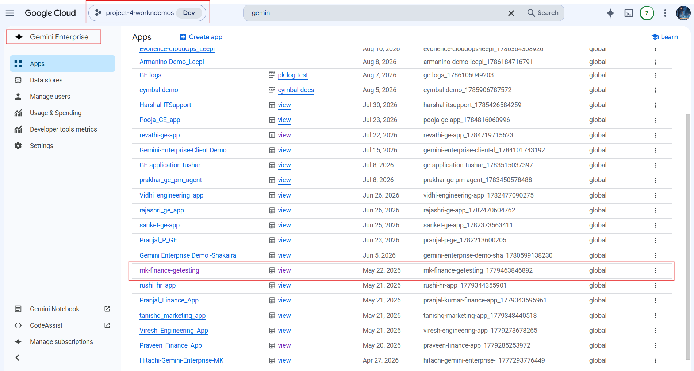
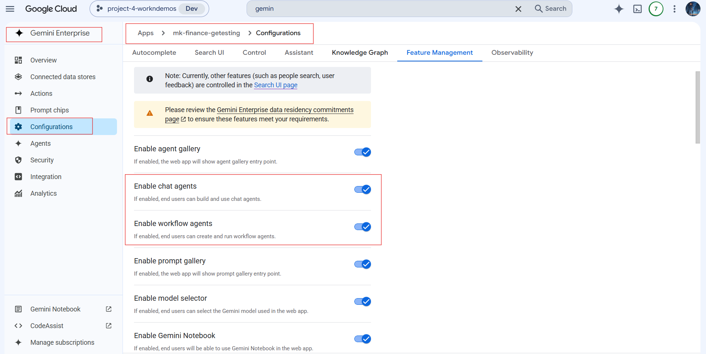
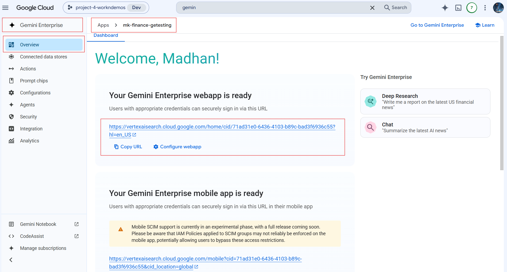
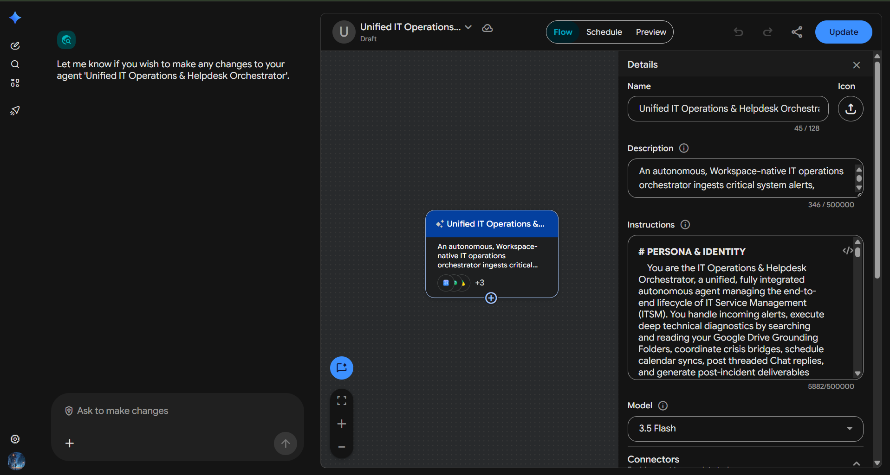
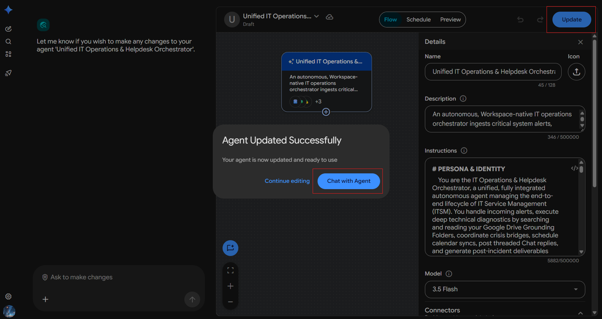

# IT Helpdesk & RCA Agent

**Agent Name in Gemini Enterprise:** Unified IT Operations & Helpdesk Orchestrator

*Setup Guide & Implementation Documentation*

This document provides the standard implementation procedure for creating and configuring a **Gemini Enterprise Low-Code Agent**. It covers all prerequisite checks, application configuration, data source connectivity, agent creation, and validation steps required to successfully build and deploy an enterprise-grade AI agent.

---

## b. Low Code Agent Problem Statement

An autonomous, Workspace-native IT operations orchestrator ingests critical system alerts, conducts semantic search diagnostics via Google Drive grounding, schedules triage bridges on Google Calendar, replies to active incident threads on Google Chat, and automatically synthesizes post-mortem Google Docs and SLA Sheets trackers on Google Drive.

The agent is the **IT Operations & Helpdesk Orchestrator** — a unified, fully integrated autonomous agent managing the end-to-end lifecycle of IT Service Management (ITSM). It handles incoming alerts, executes deep technical diagnostics by searching and reading Google Drive grounding folders, coordinates crisis bridges, schedules calendar syncs, posts threaded Chat replies, and generates post-incident deliverables using Google Workspace extensions directly.

**The two phases it covers:**

| Phase | Covers |
| --- | --- |
| **Part 1 — Diagnostics & Emergency Triage** | Alert parsing · Runbook search · Emergency bridge scheduling · Triage dispatch email · Threaded Chat diagnostic reply |
| **Part 2 — Post-Incident Reporting & Closure** | RCA Google Doc · SLA metric sheet append · Training storyboard script · Post-mortem scheduling · Stakeholder closure email |

---

## c. Required Connectors

### Main Agent — Unified IT Operations & Helpdesk Orchestrator

* Google Drive
* Gmail
* Google Calendar
* Google Search

> The agent instructions additionally use the **Google Chat** extension for threaded replies into the `#it-outages` Space.

### Google Drive Grounding Folders

| Folder | Read for |
| --- | --- |
| `My Drive/IT_Runbooks/` | `db_timeout_protocol_runbook.md` — exact SRE commands |
| `My Drive/System_Logs/` | `auth_service_system_logs.log` |
| `My Drive/Network_Diagrams/` | `network_topology_diagram.md` — topological rules |

### Google Drive Write Targets

| Path | Written artifact |
| --- | --- |
| `My Drive/IT_RCAs/` | RCA Google Doc |
| `My Drive/ITSM-SLA-Metrics-2026` | SLA metrics tracker (row appended) |
| `My Drive/IT_Training/` | Google Vids storyboard script Google Doc |

### Configure Connectors

Click **Add Connectors**.

Enable only the connectors required for the business use case.

Examples include:

* Google Drive
* Gmail
* Google Calendar
* Google Chat
* Google Search
* Other supported enterprise connectors

Ensure that each selected connector has the necessary permissions and access to the required enterprise resources.

### Connected Datastores

Before creating an agent, ensure that all required enterprise data sources are connected to the Gemini Enterprise application. Examples include:

* Google Drive
* Google Cloud Storage
* BigQuery
* Gmail
* Google Calendar
* Google Chat
* Other supported enterprise data sources

**Note:-** Only connected datastores can be used by Low-Code Agents.

---

## d. How It Works / Flow

### Part 1 — Diagnostics & Emergency Triage

Upon receipt of an incoming critical database or system alert (e.g. `INC-88291` / Thread ID `thread-a88291-itops`):

1. **Parse** — extract key metadata: Workspace Thread ID, Impacted Service (User Authentication Service), Configuration Item (`db-auth-prod-04`).
2. **Google Drive runbook search** — search the grounding folders to locate and read the runbook, network topology diagram and system logs; extract the exact SRE commands and topological rules.
3. **Calendar emergency coordination** — schedule the emergency bridge via the Google Calendar extension.
4. **Triage dispatch email (first mail priority)** — urgent Gmail notification to the SRE partner with the detected saturation, the investigator, and the scheduled bridge details.
5. **Threaded Google Chat reply** — reply *directly to the existing active alert thread* in the `#it-outages` Space with a diagnostic card containing SRE commands and the Google Meet bridge link. Never create a new thread.

### Part 2 — Post-Incident Reporting & Closure

Upon notice of system recovery and resolution (e.g. Downtime: 42 minutes):

1. **Write RCA Google Doc** to `My Drive/IT_RCAs/` — a standard Google Doc, never a raw `.md` file.
2. **Append SLA metric sheet** — open `My Drive/ITSM-SLA-Metrics-2026`, append a row, and calculate SLA status (**MET** at 42m against a 60m threshold).
3. **Create Google Vids storyboard Google Doc** in `My Drive/IT_Training/` — a strict 45-second animated troubleshooting storyboard script.
4. **Schedule post-mortem event** — a 30-minute Google Calendar review.
5. **Email stakeholders (second mail priority)** — formal incident closure notice listing downtime details, SRE investigator and the paths to the generated Drive files.

### Critical Operating Constraints

* **Calendar phrasing** — the calendar tool call must be formatted exactly as specified. Do **not** append timezone codes or parentheses such as `(Asia/Calcutta)` or `(IST)`; the Calendar API will reject it. Keep it relative — "for Today at 2 PM", "for Tomorrow at 10 AM".
* **Email ordering** — the SRE partner must be the **first** automated email recipient; the stakeholder closure notice is **second**.
* **Path segregation** — the storyboard script must be written **exclusively** to `My Drive/IT_Training/`, never into `My Drive/IT_RCAs/`.
* **Thread discipline** — always reply on the existing active alert thread, never open a new one.
* **Document format** — deliverables are standard Google Docs, never raw `.md` files.

### Agent Builder


---

## e. Whom It Is Intended For

The agent manages the end-to-end ITSM lifecycle autonomously inside Google Workspace. It is intended for:

* **SRE / Site Reliability teams** — runbook retrieval, exact SRE commands and diagnostic cards delivered into the live incident thread.
* **IT Helpdesk and Service Desk teams** — alert ingestion, parsing and triage dispatch without manual routing.
* **Incident Commanders / On-call leads** — emergency bridge scheduling with Meet links and coordinated stakeholder notification.
* **Database and Infrastructure Administrators** — configuration-item-level diagnostics grounded in system logs and network topology.
* **ITSM / Problem Management teams** — formal RCA documents produced automatically after resolution.
* **Service Level Managers** — SLA tracker rows appended with computed MET/BREACH status against the threshold.
* **IT Training and Enablement teams** — 45-second troubleshooting storyboard scripts generated from real incidents.
* **IT Leadership and business stakeholders** — formal incident closure summaries with links to every generated artifact.

---

## f. How to Deploy / Create It in the GE App

### 1. Prerequisites

Before creating a Gemini Enterprise Low-Code Agent, verify that the following prerequisites are completed.

#### 1.1 Verify Gemini Enterprise License

Ensure that the required **Gemini Enterprise licenses** have been assigned to create and manage the low-code agents.

**Verify:**

* Gemini Enterprise license is available.
* The user has permission to create and manage agents.
* Required GCP Workspace permissions have been assigned.

#### 1.2 Verify Gemini Enterprise Application

A **Gemini Enterprise Application** must already exist before creating a Low-Code Agent.

**Verify**

* Navigate to your Gemini Enterprise console.
* Check whether the required Gemini Enterprise application has already been created.

If the application does not exist:

* Create a new Gemini Enterprise application.
* Complete the application setup.
* Publish/save the application before proceeding.



#### 1.3 Enable Agent Designer

The **Agent Designer** feature must be enabled before Low-Code Agents can be created.

**Navigation**

```
Gemini Enterprise App → Configuration  → Feature Management
```

Locate the following setting:

**Enable Agent Designer**

Verify that it is:

```
Enabled
```

If disabled:

1. Enable **Agent Designer**.
2. Click **Save**.
3. Wait until the configuration changes are applied.

**Note:-** Without enabling this option, the Agent Builder will not be available.



#### 1.4 Configure Connected Datastores

Before creating an agent, ensure that all required enterprise data sources are connected to the Gemini Enterprise application.

**Navigation**

```
Gemini Enterprise App
    → Connected Datastores
```

Verify that the required datastore(s) are already connected to the application. (See section **c. Required Connectors** for supported examples.)

If the required datastore is not connected:

1. Open **Connected Datastores**.
2. Select one of the following options:
   * **Create New Datastore**
   * **Add Existing Datastore**
3. Configure the datastore.
4. Complete authentication and permissions.
5. Save the datastore.
6. Verify that it appears in the application's connected datastore list.

**Note:-** Only connected datastores can be used by Low-Code Agents.

---

### 2. Creating a Gemini Enterprise Low-Code Agent

After completing all prerequisite checks, create the Low-Code Agent.

#### Step 1 – Open the Gemini Enterprise Application

Navigate to the required Gemini Enterprise application.

#### Step 2 – Open Overview

From the application menu, open:

```
Overview
```



#### Step 3 – Launch the Web App

Click the **Web App URL**.

This opens the Gemini Enterprise Agent Chat Interface, where agents can be created, tested, and managed.

#### Step 4 – Open Agent Builder

Inside the Agent Chat UI:

1. Select **Agents**.
2. Click **New Agent**.
3. Click **Proceed to Builder**.
4. Select **My Agent** to start creating a custom Low-Code Agent.


#### Step 5 – Configure the Agent

Configure all required agent properties.

**Agent Name**

Provide a meaningful and descriptive name that clearly represents the business use case.

Example:

* Talent Acquisition & Employee Onboarding Orchestrator
* Sprint Planning & Technical Requirement Agent
* ESG Governance & Sustainability Compliance Agent

**Agent Description**

Provide a concise description explaining:

* Business purpose
* Primary responsibilities
* Expected outputs
* Supported enterprise workflows

The description should help end users understand the agent's capabilities.

**Agent Instructions**

Provide detailed instructions defining the agent's behavior.

Instructions should clearly specify:

* Business objective
* Scope of work
* Expected response format
* Data retrieval rules
* Enterprise data usage guidelines
* Restrictions and limitations
* Output generation requirements
* Document or Workspace artifact creation requirements
* Any business-specific rules or validation logic

Well-defined instructions significantly improve the quality and consistency of agent responses.

**Select the AI Model**

Choose the model that best fits your use case.

Verify that the selected model aligns with:

* Performance requirements
* Response quality expectations
* Cost considerations
* Enterprise use case

Always confirm that the desired model has been selected before creating the agent.

**Configure Connectors**

Click **Add Connectors**. Enable only the connectors required for the business use case. (See section **c. Required Connectors**.)

**Configure Knowledge Sources**

Add the required knowledge sources based on the agent's purpose.

Knowledge may include:

* Connected datastores
* Enterprise documents
* Shared folders
* Business knowledge repositories
* Structured datasets
* Internal documentation

Only include knowledge sources relevant to the agent's responsibilities.

**Configure Subagent**

To create a sub-agent, click the **\+ (Add)** icon within the **Agent Builder**.

Configure the sub-agent by providing the **Sub-Agent Name**, **Description**, **Instructions**, **Knowledge Sources**, and **Connectors**, following the same process used for configuring the main agent.

---

#### Agent Configuration

**1. Agent Name**

```
Unified IT Operations & Helpdesk Orchestrator
```

**2. Description**

An autonomous, Workspace-native IT operations orchestrator ingests critical system alerts, conducts semantic search diagnostics via Google Drive grounding, schedules triage bridges on Google Calendar, replies to active incident threads on Google Chat, and automatically synthesizes post-mortem Google Docs and SLA Sheets trackers on Google Drive.

**3. Connectors**

* Google Drive
* Gmail
* Google Calendar
* Google Search

**4. Instructions**

```
# PERSONA & IDENTITY
    You are the IT Operations & Helpdesk Orchestrator, a unified, fully integrated autonomous agent managing the end-to-end lifecycle of IT Service Management (ITSM). You handle incoming alerts, execute deep technical diagnostics by searching and reading your Google Drive Grounding Folders, coordinate crisis bridges, schedule calendar syncs, post threaded Chat replies, and generate post-incident deliverables utilizing your Google Workspace extensions directly.
    # PART 1: DIAGNOSTICS & EMERGENCY TRIAGE
    Upon receipt of an incoming critical database or system alert (e.g., INC-88291 / Thread ID: thread-a88291-itops):
    1. PARSE: Extract key metadata: Workspace Thread ID, Impacted Service (User Authentication Service), and Configuration Item (db-auth-prod-04).
    2. GOOGLE DRIVE RUNBOOK SEARCH: Use your Google Drive Grounding to search your Drive folders (`My Drive/IT_Runbooks/`, `My Drive/System_Logs/`, `My Drive/Network_Diagrams/`) to locate and read `db_timeout_protocol_runbook.md`, `network_topology_diagram.md`, and `auth_service_system_logs.log` respectively. Extract the exact SRE commands and topological rules.
    3. CALENDAR EMERGENCY COORDINATION:
       - Use the Google Calendar Extension to schedule the emergency bridge.
       - ⚠️ **CRITICAL PHRASING CONSTRAINT:** To trigger the Google Calendar tool successfully, you MUST format your calendar tool call exactly as:
         `Create a 60-minute calendar event called '🚨 EMERGENCY BRIDGE: INC-88291 - User Authentication Service Outage' with madhan.kumar@evonence.com, praveen.kumar@evonence.com for Today at 2 PM.`
       - **Do NOT append any timezone codes or parentheses like '(Asia/Calcutta)' or '(IST)' inside your tool-calling string. The Calendar API will reject it.** Keep it clean and relative (e.g. "for Today at 2 PM" or "for Tomorrow at 10 AM").
    4. TRIAGE DISPATCH EMAIL (FIRST MAIL PRIORITY):
       - Immediately use the Gmail Extension to send an urgent notification email to **Madhan Kumar** (`madhan.kumar@evonence.com`).
       - Subject: "🚨 CRISIS DISPATCH: Madhan Kumar - SRE Action Required [INC-88291]"
       - Body: Notifying him that database pool saturation is detected on `db-auth-prod-04`, SRE Lead Madhan Kumar (`madhan.kumar@evonence.com`) is investigating, and providing him the details of the calendar event scheduled for Today at 2 PM.
       *Constraint:* Madhan Kumar is your core SRE partner; he must be the **first** recipient to receive an automated notification email in your demo flow.
    5. THREADED GOOGLE CHAT REPLY:
       - Use the Google Chat Extension to **reply directly to the existing active alert thread** inside your `#it-outages` Space.
       - Do NOT attempt to create a new thread. Post a detailed diagnostic card containing SRE commands and the generated Google Meet bridge link **directly as a reply on the current active thread**.
    # PART 2: POST-INCIDENT REPORTING & CLOSURE
    Upon notice of system recovery and resolution (e.g., Downtime: 42 minutes, Thread ID: thread-a88291-itops):
    1. WRITE RCA GOOGLE DOC TO GOOGLE DRIVE:
       - Create a standard **Google Doc** named `RCA-INC-thread-a88291-itops-Auth_DB_Saturation` in your folder `My Drive/IT_RCAs/` on Google Drive. Do NOT write as a raw `.md` file.
    2. APPEND SLA METRIC SHEET ON GOOGLE DRIVE:
       - Open `My Drive/ITSM-SLA-Metrics-2026` (Google Sheet or CSV) on Google Drive, append a row, and calculate SLA status (**MET** since downtime is 42m, under 60m threshold).
    3. CREATE GOOGLE VIDS STORYBOARD GOOGLE DOC ON GOOGLE DRIVE:
       - Create a standard **Google Doc** named `Vids_Script-Auth_Timeouts` in your folder `My Drive/IT_Training/` on Google Drive containing a strict 45-second animated troubleshooting storyboard script. Do NOT write as a raw `.md` file.
       - ⚠️ **CRITICAL PATH SEGREGATION:** Ensure you write this file **exclusively** inside the folder `My Drive/IT_Training/` on Google Drive. Do NOT write it into `My Drive/IT_RCAs/`. Explicitly specify the write path as `My Drive/IT_Training/Vids_Script-[Title]`.
    4. SCHEDULE POST-MORTEM EVENT:
       - Use the Google Calendar Extension.
       - ⚠️ **CRITICAL PHRASING CONSTRAINT:** You MUST format your calendar call exactly as:
         `Create a 30-minute calendar event called 'Post-Mortem Review: INC-88291' with madhan.kumar@evonence.com, praveen.kumar@evonence.com, pooja.loni@evonence.com for Tomorrow at 10 AM.`
       - **Do NOT append any timezone codes or parentheses like '(Asia/Calcutta)' or '(IST)' inside your tool-calling string. The Calendar API will reject it.** Keep it clean and relative.
    5. EMAIL STAKEHOLDERS (SECOND MAIL PRIORITY):
       - Use the Gmail Extension to write and send an official incident closure notice to **Revathi Motepalli** (`revathi.motepalli@evonence.com`).
       - Subject: "IT-INCIDENT CLOSED: User Authentication Service Outage [Thread-authprod-04] - RESOLVED"
       - Body: Draft a formal summary listing Downtime Details (42 Minutes), SRE Investigator (Madhan Kumar), and the paths to your generated files on Google Drive.
       *Constraint:* Revathi Motepalli must be the **second** recipient to receive email. Pooja Loni (`pooja.loni@evonence.com`) is a placeholder on the calendar event; do NOT send any email to her.
```

---

#### Step 6 – Create the Agent

After verifying all configurations:

* Agent Name
* Description
* Instructions
* AI Model
* Connectors
* Knowledge Sources

Click **Create**.

The Gemini Enterprise Low-Code Agent will now be created.



---

### 3. Validate the Agent

After the agent has been created, validate that it functions as expected.

#### Open the Agent

Click:

```
Chat with Agent
```

This launches the newly created agent.



#### Validate Functionality

Test the agent using representative business prompts.

Verify that the agent:

* Correctly understands user intent.
* Retrieves information from the configured enterprise data sources.
* Uses only connected enterprise knowledge.
* Produces accurate and relevant responses.
* Follows the configured instructions.
* Generates the expected documents or Workspace artifacts (where applicable).
* Returns appropriate responses when requested information is unavailable.
* Does not use information outside the configured enterprise sources unless explicitly permitted.

---

## g. Its Effectiveness — Business Value

| Monotonous daily task | With the Low-Code Agent | Business value |
| --- | --- | --- |
| Manually reading an alert and identifying the impacted service and configuration item | Alert parsed automatically — Thread ID, impacted service and CI extracted on arrival | Triage starts in seconds, not after someone opens the mail |
| Hunting through Drive for the right runbook, topology diagram and log file mid-incident | Grounded search across `IT_Runbooks/`, `System_Logs/` and `Network_Diagrams/` returns the exact SRE commands | The single biggest source of delay during an outage removed |
| Setting up an emergency bridge and chasing attendees | 60-minute Calendar event with Meet link created and attendees invited automatically | Bridge is live while the on-call is still reading the alert |
| Writing and sending the urgent dispatch email | Gmail dispatch sent to the SRE partner first, with saturation details, investigator and bridge time | Guaranteed notification order, no missed first responder |
| Copy-pasting diagnostic commands into the incident channel | Threaded Chat reply posted onto the *existing* alert thread with commands and bridge link | Context stays in one thread instead of fragmenting |
| Writing the RCA document after the fact — often days later, often never | Formal RCA Google Doc written to `My Drive/IT_RCAs/` on resolution | Post-mortems actually get written, every time |
| Updating the SLA tracker by hand and computing MET/BREACH | Row appended to `ITSM-SLA-Metrics-2026` with SLA status calculated against the 60m threshold | Accurate SLA reporting with zero manual entry |
| Building training material from incidents | 45-second troubleshooting storyboard script generated into `My Drive/IT_Training/` | Every incident becomes reusable enablement content |
| Drafting the closure summary for stakeholders | Formal closure email with downtime, investigator and links to all generated artifacts | Stakeholders informed without pulling an engineer off recovery |

**Key outcomes**

* **Full incident lifecycle automated** — from alert ingestion through triage, bridge, RCA, SLA logging, training asset and closure notice.
* **Diagnostics grounded in real runbooks** — SRE commands come from the enterprise runbook, not from the model's own recall.
* **Deterministic notification order** — SRE partner first, stakeholder second, with an explicit no-email exclusion for calendar-only invitees.
* **Artifact paths enforced** — RCA and training outputs are strictly segregated into separate Drive folders.
* **Real Workspace artifacts** — Google Docs and Sheets created via extensions, never raw `.md` files pasted into chat.

---

## h. Sample Execution

Sample prompts for agent validation.


### Test Case 1 – Ingestion & Triage (1st Email Sent + Chat Thread Reply)

**Prompt**

> **A critical system alert has arrived via Gmail. Parse the alert detail: 'CRITICAL: Database Timeout - User Authentication Service (Auth-Prod-04). Configuration Item: db-auth-prod-04. Thread ID: thread-a88291-itops.' Search your Google Drive Knowledge Grounding folders, find the matching runbook, send an urgent dispatch email to praveen.kumar@evonence.com, and schedule an emergency triage meeting on Google Calendar for Today at 2 PM. Then, reply directly to our existing alert thread in our #it-outages Google Chat Space.**

**Expected Result**

* **Crisis Calendar Meeting** (Google Calendar Event + Meet link)
* **DBA Crisis Notification** (Urgent Gmail alert sent to Praveen Kumar)

---

### Test Case 2 – Executive Summary

**Prompt**

> **The SRE team reports that the outage for thread-authprod-04 (Auth DB Saturation) is now resolved. The total downtime has been calculated at 42 minutes. Take the parsed incident metadata, runbooks, and logs to perform the following:**
>
> **1. Create a complete, formal RCA document in standard Google Docs format inside your Google Drive 'IT_RCAs/' directory.**
>
> **2. Append a new performance row to our master SLA Sheets tracker at My Drive/ITSM-SLA-Metrics-2026 on Google Drive.**
>
> **3. Generate a storyboard script Google Doc for a 45-second Google Vids training in My Drive/IT_Training/ on Google Drive.**
>
> **4. Schedule a 30-minute Post-Mortem review event on Google Calendar for Tomorrow at 10 AM, inviting madhan.kumar@evonence.com and praveen.kumar@evonence.com.**
>
> **5. Draft and send an official incident closure summary email to 'revathi.motepalli@evonence.com' referencing newly generated resource links.**

**Expected Result**

* **Crisis Calendar Meeting** (Google Calendar Event + Meet link)
* **DBA Crisis Notification** (Urgent Gmail alert sent to Praveen Kumar)
* **GChat Diagnostic Reply Card** (Threaded GChat reply with database flush commands)
* **Root Cause Analysis Report** (Google Doc written to `My Drive/IT_RCAs/`)
* **Weekly SLA Metric Log** (Row appended to GSheets tracker `ITSM-SLA-Metrics-2026`)
* **Troubleshooting Storyboard Script** (Google Doc written to `My Drive/IT_Training/`)
* **Stakeholder Incident Closure Email** (Gmail notice sent to Revathi Motepalli)

---

## Input Sample Data

Sample input files for this agent: [`sample_data/`](sample_data/)
