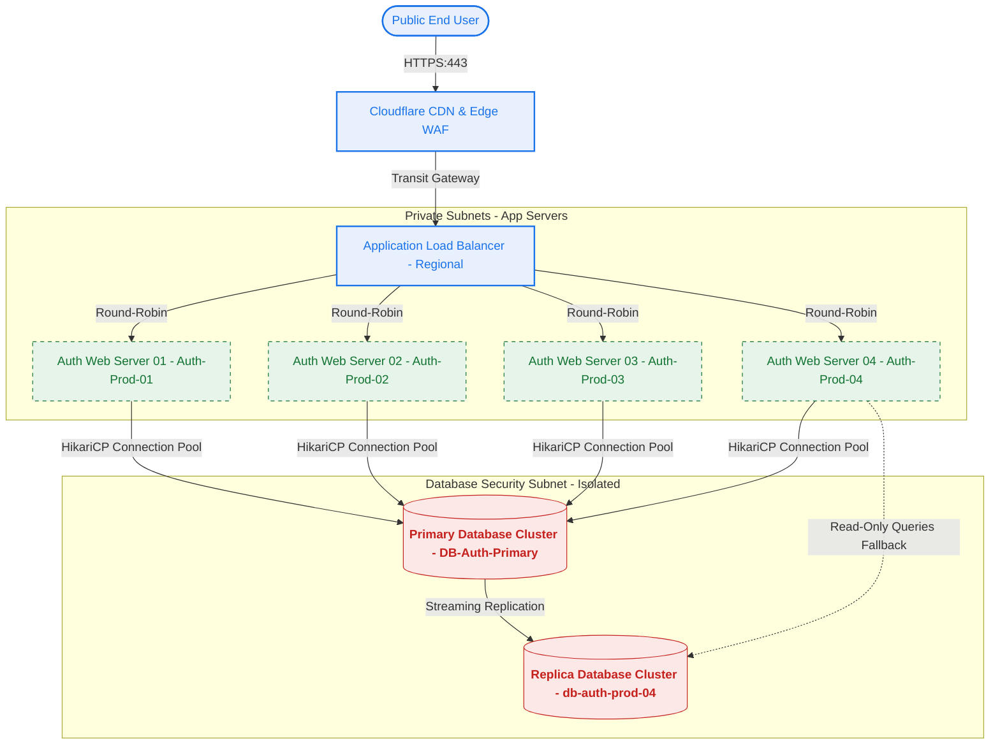

# Enterprise Network Topology Blueprint: Auth & Database Cluster

**Document ID:** NT-DIAG-009  
**Target Architecture:** Multi-Region Secure User Authentication System  
**Owner:** Network Engineering & Enterprise Security Architecture  
**Classification:** Internal Restricted  
**Last Updated:** 2026-05-02  
**Version:** 2.1.0  

---

## 1. Architectural Overview
The enterprise user authentication infrastructure is hosted within a multi-availability-zone Virtual Private Cloud (VPC) with layers of isolation. Public entrypoints are secured via Cloudflare Web Application Firewall (WAF) and routed through regional Application Load Balancers (ALBs) into private subnets. Databases are sequestered in high-security, isolated DB-only subnets.

---

## 2. Mermaid Network Topology Diagram


---

## 3. Subnet Allocation & Port Matrix
| Subnet / Host | IP CIDR Range | Security Group | Permitted Inbound | Permitted Outbound |
| :--- | :--- | :--- | :--- | :--- |
| **Public DMZ** | `10.100.1.0/24` | `sg-public-alb` | `0.0.0.0/0` (TCP/443) | `10.100.10.0/24` (TCP/8080) |
| **Private Web App** | `10.100.10.0/24` | `sg-auth-servers` | `10.100.1.0/24` (TCP/8080) | `10.100.50.0/24` (TCP/5432) |
| **Secure DB Subnet** | `10.100.50.0/24` | `sg-postgres-auth` | `10.100.10.0/24` (TCP/5432) | `10.100.50.0/24` (TCP/5432 replication) |

### Infrastructure Hardware & Mapping:
- **`Auth-Prod-04` (App Instance):** Private IP `10.100.10.14`. Houses the user-authentication node running Node.js / Express microservice. It communicates directly with the database via a Hikari Connection Pool.
- **`db-auth-prod-04` (Database Instance):** Private IP `10.100.50.4`. A PostgreSQL read-replica. Under normal conditions, handles analytical queries and read fallbacks. Connection limits are configured strictly to prevent query lockouts.

---

## 4. Network Triage and Troubleshooting Steps
If connectivity alerts between the App Subnet (`10.100.10.0/24`) and DB Subnet (`10.100.50.0/24`) trigger, perform these checks:
1. **Security Group Rule Check:** Ensure `sg-postgres-auth` allows inbound TCP port `5432` from `sg-auth-servers`.
2. **Telnet Testing:** From an active app shell, run:
   ```bash
   nc -zv db-replica-04.enterprise.com 5432
   ```
3. **Routing Table Validation:** Verify AWS Transit Gateway routing tables show active routes between private availability zones `us-east-1a` and `us-east-1b`.
4. **VPC Flow Log Inspection:** Search Amazon CloudWatch for any `REJECT` logs originating from IP `10.100.10.14` targeting `10.100.50.4`.
