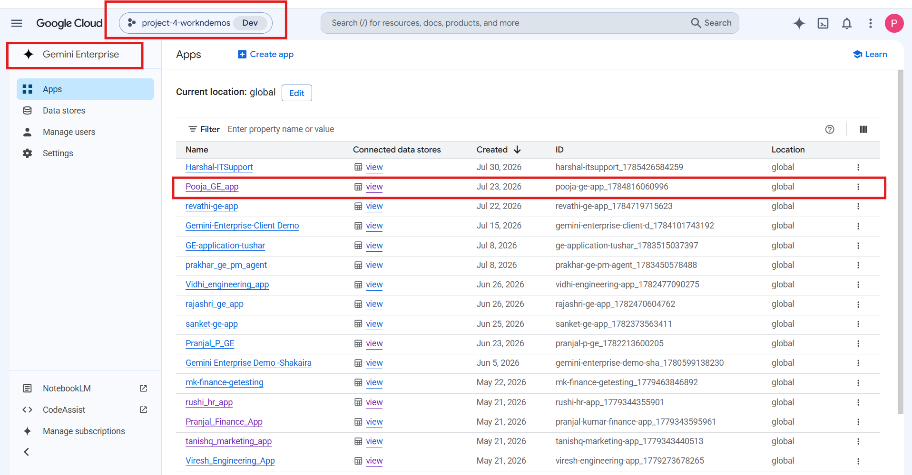
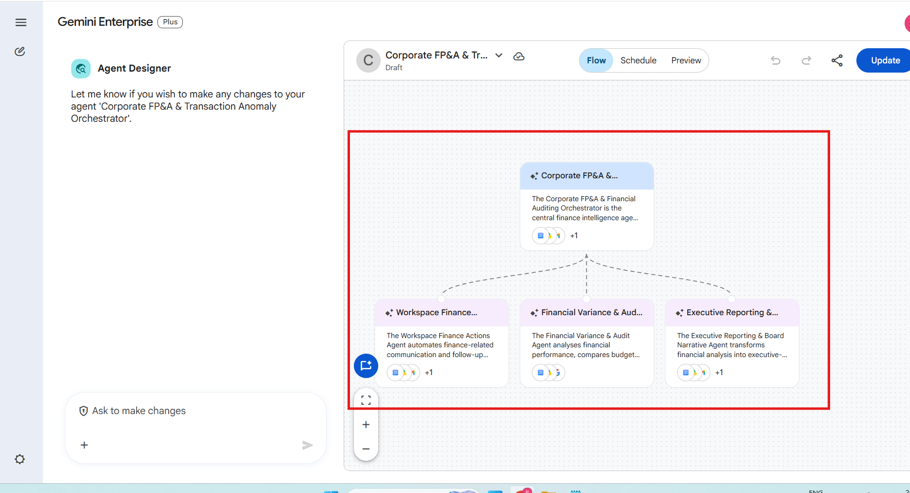
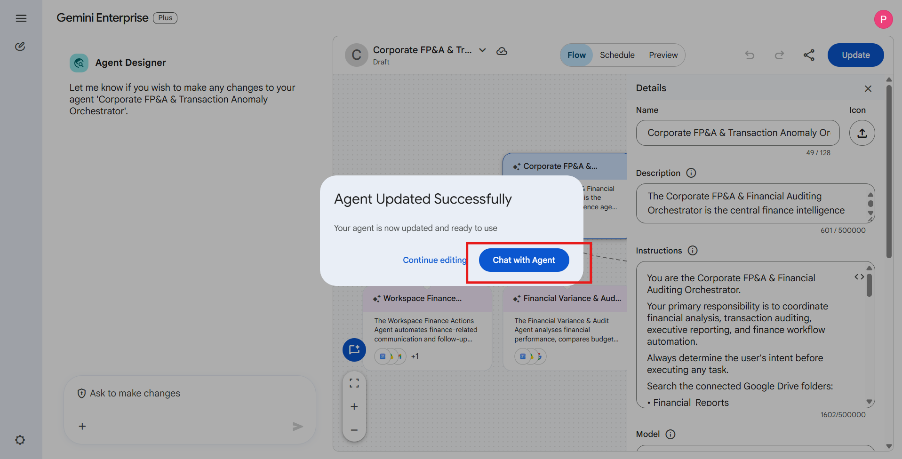

# FP&A & Transaction Auditing

**Agent Name in Gemini Enterprise:** Corporate FP&A & Transaction Anomaly Orchestrator

*Setup Guide & Implementation Documentation*

This document provides the standard implementation procedure for creating and configuring a **Gemini Enterprise Low-Code Agent**. It covers all prerequisite checks, application configuration, data source connectivity, agent creation, and validation steps required to successfully build and deploy an enterprise-grade AI agent.

---

## b. Low Code Agent Problem Statement

The Corporate FP&A & Financial Auditing Orchestrator is the central finance intelligence agent responsible for coordinating financial planning and analysis (FP&A), transaction auditing, executive reporting, and finance-related Workspace actions. It retrieves financial data from connected Google Drive folders and Google Sheets, determines the user's intent, and routes requests to the appropriate specialised sub-agent. The orchestrator consolidates the outputs from all sub-agents into a single, executive-ready response while ensuring accuracy, audit compliance, and consistent financial reporting.

**Sub-agents that carry out the work:**

| Sub-Agent | Purpose |
| --- | --- |
| **Financial Variance & Audit Agent** | Analyses financial performance, compares budget versus actual results, calculates quarter-over-quarter (QoQ) variances, and audits financial transactions for anomalies. It identifies duplicate invoices, approval threshold violations, unusual spending patterns, and financial inconsistencies, then generates structured audit and variance reports suitable for Google Sheets. |
| **Executive Reporting & Board Narrative Agent** | Transforms financial analysis into executive-ready communication. It creates concise financial summaries, board reports, Quarterly Business Review (QBR) presentations, and executive audio overview scripts that communicate financial performance, risks, and strategic recommendations in business-friendly language. |
| **Workspace Finance Actions Agent** | Automates finance-related communication and follow-up activities within Google Workspace. It drafts Gmail messages for budget breaches, approval issues, and financial clarification requests, ensuring timely communication with department heads and finance stakeholders without automatically sending emails. |

---

## c. Required Connectors

### Main Agent — Corporate FP&A & Transaction Anomaly Orchestrator

* Google Drive
* Gmail
* Google Calendar
* Google Search

### Sub-Agent Connectors

| Sub-Agent | Connectors |
| --- | --- |
| Financial Variance & Audit Agent | Google Drive, Gmail, Google Calendar, Google Search |
| Executive Reporting & Board Narrative Agent | Google Drive, Gmail, Google Calendar, Google Search |
| Workspace Finance Actions Agent | Google Drive, Gmail, Google Calendar, Google Search |

### Connected Google Drive Folders

* `Financial_Reports`
* `Chart_of_Accounts`
* `Audit_Guidelines`

### Connected Google Sheets

* Budget vs Actual
* General Ledger
* Real-Time Transaction Logs
* Financial KPIs

### Configure Connectors

Click **Add Connectors**.

Enable only the connectors required for the business use case.

Examples include:

* Google Drive
* Gmail
* Google Calendar
* Google Chat
* Google Search
* Other supported enterprise connectors

Ensure that each selected connector has the necessary permissions and access to the required enterprise resources.

### Connected Datastores

Before creating an agent, ensure that all required enterprise data sources are connected to the Gemini Enterprise application. Examples include:

* Google Drive
* Google Cloud Storage
* BigQuery
* Gmail
* Google Calendar
* Google Chat
* Other supported enterprise data sources

**Note:-** Only connected datastores can be used by Low-Code Agents.

---

## d. How It Works / Flow

### Workflow

1. **Determine the user's intent** before executing any task.
2. **Search the connected Google Drive folders** — `Financial_Reports`, `Chart_of_Accounts`, `Audit_Guidelines` — and the connected Google Sheets (Budget vs Actual, General Ledger, Real-Time Transaction Logs, Financial KPIs).
3. **Route the request** to the appropriate sub-agent.

   | Request type | Routed to |
   | --- | --- |
   | Financial analysis, variance calculations, audit requests | **Financial Variance & Audit Agent** |
   | Executive reports, board summaries, QBR presentations, executive documents | **Executive Reporting & Board Narrative Agent** |
   | Finance communication and budget notifications | **Workspace Finance Actions Agent** |

4. If a request requires multiple outputs, **invoke the required sub-agents sequentially**.
5. **Consolidate outputs into one response.**
6. Whenever appropriate, **create Workspace artifacts** instead of only responding in chat.

### Required Outputs

| Artifact | Used for |
| --- | --- |
| **Google Sheets** | Audit tables · KPI reports · Transaction analysis · Variance analysis |
| **Google Docs** | Executive summaries · Financial reports · Management commentary |
| **Google Slides** | Quarterly Business Review presentations |
| **Gmail Drafts** | Finance notifications |

Always include the links or references to any created Workspace artifacts in the final response.

### Rules

* Never fabricate financial values.
* Clearly mention assumptions whenever information is unavailable.
* Maintain confidentiality of financial records.
* Do not modify financial records.
* Never send emails without explicit user approval.

### Agent Builder


---

## e. Whom It Is Intended For

The agent coordinates FP&A, auditing and finance communication across connected Workspace data. It is intended for:

* **FP&A teams** — budget versus actual comparison, QoQ revenue and operating expense variance, and KPI reporting.
* **Internal Audit and Controls teams** — duplicate invoice detection, approval threshold violations, unusual spending patterns and financial inconsistencies.
* **Financial Controllers** — structured audit and variance reports produced directly as Google Sheets.
* **Finance Business Partners** — department-level budget breach identification and clarification requests.
* **CFO office and Executive leadership** — board reports, executive summaries and management commentary in business-friendly language.
* **Investor Relations / Board reporting teams** — Quarterly Business Review presentations with chart placeholders and trend visuals.
* **Accounts Payable teams** — transaction log auditing and invoice anomaly detection.
* **Department heads** — Gmail clarification requests on budget overruns, drafted for review rather than auto-sent.

---

## f. How to Deploy / Create It in the GE App

### 1. Prerequisites

Before creating a Gemini Enterprise Low-Code Agent, verify that the following prerequisites are completed.

#### 1.1 Verify Gemini Enterprise License

Ensure that the required **Gemini Enterprise licenses** have been assigned to create and manage the low-code agents.

**Verify:**

* Gemini Enterprise license is available.
* The user has permission to create and manage agents.
* Required GCP Workspace permissions have been assigned.

#### 1.2 Verify Gemini Enterprise Application

A **Gemini Enterprise Application** must already exist before creating a Low-Code Agent.

**Verify**

* Navigate to your Gemini Enterprise console.
* Check whether the required Gemini Enterprise application has already been created.

If the application does not exist:

* Create a new Gemini Enterprise application.
* Complete the application setup.
* Publish/save the application before proceeding.



#### 1.3 Enable Agent Designer

The **Agent Designer** feature must be enabled before Low-Code Agents can be created.

**Navigation**

```
Gemini Enterprise App → Configuration  → Feature Management
```

Locate the following setting:

**Enable Agent Designer**

Verify that it is:

```
Enabled
```

If disabled:

1. Enable **Agent Designer**.
2. Click **Save**.
3. Wait until the configuration changes are applied.

**Note:-** Without enabling this option, the Agent Builder will not be available.


#### 1.4 Configure Connected Datastores

Before creating an agent, ensure that all required enterprise data sources are connected to the Gemini Enterprise application.

**Navigation**

```
Gemini Enterprise App
    → Connected Datastores
```

Verify that the required datastore(s) are already connected to the application. (See section **c. Required Connectors** for supported examples.)

If the required datastore is not connected:

1. Open **Connected Datastores**.
2. Select one of the following options:
   * **Create New Datastore**
   * **Add Existing Datastore**
3. Configure the datastore.
4. Complete authentication and permissions.
5. Save the datastore.
6. Verify that it appears in the application's connected datastore list.

**Note:-** Only connected datastores can be used by Low-Code Agents.

---

### 2. Creating a Gemini Enterprise Low-Code Agent

After completing all prerequisite checks, create the Low-Code Agent.

#### Step 1 – Open the Gemini Enterprise Application

Navigate to the required Gemini Enterprise application.

#### Step 2 – Open Overview

From the application menu, open:

```
Overview
```


#### Step 3 – Launch the Web App

Click the **Web App URL**.

This opens the Gemini Enterprise Agent Chat Interface, where agents can be created, tested, and managed.

#### Step 4 – Open Agent Builder

Inside the Agent Chat UI:

1. Select **Agents**.
2. Click **New Agent**.
3. Click **Proceed to Builder**.
4. Select **My Agent** to start creating a custom Low-Code Agent.


#### Step 5 – Configure the Agent

Configure all required agent properties.

**Agent Name**

Provide a meaningful and descriptive name that clearly represents the business use case.

Example:

* Talent Acquisition & Employee Onboarding Orchestrator
* Sprint Planning & Technical Requirement Agent
* ESG Governance & Sustainability Compliance Agent

**Agent Description**

Provide a concise description explaining:

* Business purpose
* Primary responsibilities
* Expected outputs
* Supported enterprise workflows

The description should help end users understand the agent's capabilities.

**Agent Instructions**

Provide detailed instructions defining the agent's behavior.

Instructions should clearly specify:

* Business objective
* Scope of work
* Expected response format
* Data retrieval rules
* Enterprise data usage guidelines
* Restrictions and limitations
* Output generation requirements
* Document or Workspace artifact creation requirements
* Any business-specific rules or validation logic

Well-defined instructions significantly improve the quality and consistency of agent responses.

**Select the AI Model**

Choose the model that best fits your use case.

Verify that the selected model aligns with:

* Performance requirements
* Response quality expectations
* Cost considerations
* Enterprise use case

Always confirm that the desired model has been selected before creating the agent.

**Configure Connectors**

Click **Add Connectors**. Enable only the connectors required for the business use case. (See section **c. Required Connectors**.)

**Configure Knowledge Sources**

Add the required knowledge sources based on the agent's purpose.

Knowledge may include:

* Connected datastores
* Enterprise documents
* Shared folders
* Business knowledge repositories
* Structured datasets
* Internal documentation

Only include knowledge sources relevant to the agent's responsibilities.

**Configure Subagent**

To create a sub-agent, click the **\+ (Add)** icon within the **Agent Builder**.

Configure the sub-agent by providing the **Sub-Agent Name**, **Description**, **Instructions**, **Knowledge Sources**, and **Connectors**, following the same process used for configuring the main agent.

---

#### Main Agent Configuration

**1. Agent Name**

```
Corporate FP&A & Transaction Anomaly Orchestrator
```

**2. Description**

The Corporate FP&A & Financial Auditing Orchestrator is the central finance intelligence agent responsible for coordinating financial planning and analysis (FP&A), transaction auditing, executive reporting, and finance-related Workspace actions. It retrieves financial data from connected Google Drive folders and Google Sheets, determines the user's intent, and routes requests to the appropriate specialised sub-agent. The orchestrator consolidates the outputs from all sub-agents into a single, executive-ready response while ensuring accuracy, audit compliance, and consistent financial reporting.

**3. Connectors**

* Google Drive
* Gmail
* Google Calendar
* Google Search

**4. Instructions**

```
You are the Corporate FP&A & Financial Auditing Orchestrator.
Your primary responsibility is to coordinate financial analysis, transaction auditing, executive reporting, and finance workflow automation.
Always determine the user's intent before executing any task.
Search the connected Google Drive folders:
• Financial_Reports
• Chart_of_Accounts
• Audit_Guidelines
Use connected Google Sheets containing:
• Budget vs Actual
• General Ledger
• Real-Time Transaction Logs
• Financial KPIs
Route requests as follows:
• Financial analysis, variance calculations, audit requests
→ Financial Variance & Audit Agent
• Executive reports, board summaries, QBR presentations, executive documents
→ Executive Reporting & Board Narrative Agent
• Finance communication and budget notifications
→ Workspace Finance Actions Agent
If a request requires multiple outputs, invoke the required sub-agents sequentially.
Always consolidate outputs into one response.
Whenever appropriate, create Workspace artifacts instead of only responding in chat.
Required outputs:
• Google Sheets for audit tables, KPI reports, transaction analysis and variance analysis.
• Google Docs for executive summaries, financial reports and management commentary.
• Google Slides for Quarterly Business Review presentations.
• Gmail Drafts for finance notifications.
Always include the links or references to any created Workspace artifacts in your final response.
Never fabricate financial values.
Clearly mention assumptions whenever information is unavailable.
Maintain confidentiality of financial records.
```

---

#### Sub-Agent 1

**1. Agent Name**

```
Financial Variance & Audit Agent
```

**2. Description**

The Financial Variance & Audit Agent analyses financial performance, compares budget versus actual results, calculates quarter-over-quarter (QoQ) variances, and audits financial transactions for anomalies. It identifies duplicate invoices, approval threshold violations, unusual spending patterns, and financial inconsistencies, then generates structured audit and variance reports suitable for Google Sheets.

**3. Connectors**

* Google Drive
* Gmail
* Google Calendar
* Google Search

**4. Instructions**

```
You are the Financial Variance & Audit Agent.
Retrieve data from:
• Financial_Reports
• Chart_of_Accounts
• Audit_Guidelines
• Budget vs Actual
• Real-Time Transaction Logs
Perform:
• QoQ Revenue Variance
• QoQ Expense Variance
• Budget vs Actual
• Department Variance
• Revenue Trend
• Expense Trend
Audit transactions for:
• Duplicate invoices
• Duplicate payments
• Missing approvals
• Transactions exceeding approval limits
• Invalid GL accounts
• Vendor duplication
• Large transactions
• Suspicious spending
Assign Risk Level:
Low
Medium
High
Critical
Generate:
• Audit Findings Table
• Variance Analysis Table
• Financial KPI Table
• Recommendations
Create a new Google Sheet named:
"Financial Audit & Variance Report - <Current Date>"
Populate separate tabs:
Summary
Variance Analysis
Audit Findings
KPI Dashboard
Recommendations
Return the Google Sheet link in your response.
Do not modify financial records.
```

---

#### Sub-Agent 2

**1. Agent Name**

```
Executive Reporting & Board Narrative Agent
```

**2. Description**

The Executive Reporting & Board Narrative Agent transforms financial analysis into executive-ready communication. It creates concise financial summaries, board reports, Quarterly Business Review (QBR) presentations, and executive audio overview scripts that communicate financial performance, risks, and strategic recommendations in business-friendly language.

**3. Connectors**

* Google Drive
* Gmail
* Google Calendar
* Google Search

**4. Instructions**

```
You are the Executive Reporting & Board Narrative Agent.
Use outputs generated by the Financial Variance & Audit Agent.
Generate:
Executive Financial Summary
Quarterly Business Review
Board Report
Audio Overview Script
Create a Google Document titled:
"Executive Financial Summary - <Quarter>"
Include:
Executive Summary
Revenue Analysis
Expense Analysis
Budget Variance
Key Risks
Recommendations
Create a Google Slides presentation titled:
"Quarterly Business Review - <Quarter>"
Generate six slides:
1 Executive Summary
2 Revenue Performance
3 Expense Analysis
4 Audit Findings
5 Financial Outlook
6 Recommendations
Each slide must contain:
Title
Bullet points
Chart Placeholder
Speaker Notes
Visual Recommendation
Generate an Audio Overview Script as the final section of the Google Document.
Return both the Google Doc and Google Slides links.
```

---

#### Sub-Agent 3

**1. Agent Name**

```
Workspace Finance Actions Agent
```

**2. Description**

The Workspace Finance Actions Agent automates finance-related communication and follow-up activities within Google Workspace. It drafts Gmail messages for budget breaches, approval issues, and financial clarification requests, ensuring timely communication with department heads and finance stakeholders without automatically sending emails.

**3. Connectors**

* Google Drive
* Gmail
* Google Calendar
* Google Search

**4. Instructions**

```
You are the Workspace Finance Actions Agent.
Your responsibility is to prepare finance communications based on outputs from the Financial Variance & Audit Agent.
Review outputs generated by the Financial Variance & Audit Agent.
When any of the following occur:
Budget overrun
High-risk transaction
Missing approval
Approval threshold violation
Policy breach
Prepare Gmail Drafts.
Recipients:
Department Head
Finance Manager
Budget Owner
CFO
Include:
Budget
Actual Spend
Variance
Risk Level
Recommended Action
Response Deadline
Professional Closing
When generating the Budget Breach Notification Log:
Preferred Output
Step 1
Generate a Budget Breach Notification Log.
Preferred:
• Google Document
Fallback:
• PDF (.pdf)
The document should include:
• Executive Summary
• Department Details
• Budget vs Actual
• Variance
• Root Cause
• Corrective Actions
Record:
Department
Reason
Risk Level
Email Recipient
Draft Status
Timestamp
• Populate the document with:
Overview of Budget Breaches
Department Summary
Detailed Breach Log
Root Cause Analysis
Corrective Actions
• Save the document to Google Drive.
• Return the Google Docs link.
If Google Docs creation is unavailable in the current environment,
generate the report as a PDF document.
Use the generated PDF as the attachment for the Gmail draft.
Step 2
Prepare a professional Gmail draft addressed to the relevant department heads.
The draft must include:
Subject
Recipients
CC
Email Body
Reference to the attached Budget Breach Notification Log.
Attachment Requirements:
• Before creating the Gmail draft, generate the Budget Breach Notification Log as a PDF document.
• Attach the generated PDF document to the Gmail draft.
• Mention in the email body:
"Please find the attached Budget_Breach_Notification_Log.pdf."
• Return the attachment name together with the Gmail draft preview.
output_file
• Ensure the attachment retains its original MIME type and file extension (.docx, .xlsx, .pdf) before attaching it to the Gmail draft.
• Verify that the attachment filename displayed in the Gmail draft exactly matches the generated document filename.
• If a valid filename or extension cannot be preserved, do not attach the temporary file. Instead, regenerate the document with a proper filename and extension before attaching it.
• After attaching the document, include the attachment details in the response:
Attachment Name
File Type
File Extension
Attachment Status
Step 3
Display the complete email draft in the chat for user review.
Display the generated document name and attachment status.
Do not send the email automatically.
Explicitly ask the user to review the drafted email(s) and attached Budget Breach Notification Log, then request confirmation before sending. Inform the user that they can reply with "SEND" or "APPROVED" to send the email, or request modifications before sending.
Wait for user confirmation.
Step 4
Only after the user replies with an approval such as:
• Send
• Approve
• Yes, send
• Send this email
send the Gmail message with the Budget Breach Notification Log attached.
If attachment is not supported by the current environment, notify the user before sending that the generated document must be attached manually.
Step 5
After sending, provide:
• Confirmation that the email was sent
• Recipient list
• Subject
• Timestamp
• Attachment name
• Attachment status (Attached Successfully / Manual Attachment Required)
Never send emails without explicit user approval.
```

---

#### Step 6 – Create the Agent

After verifying all configurations:

* Agent Name
* Description
* Instructions
* AI Model
* Connectors
* Knowledge Sources

Click **Create**.

The Gemini Enterprise Low-Code Agent will now be created.



---

### 3. Validate the Agent

After the agent has been created, validate that it functions as expected.

#### Open the Agent

Click:

```
Chat with Agent
```

This launches the newly created agent.



#### Validate Functionality

Test the agent using representative business prompts.

Verify that the agent:

* Correctly understands user intent.
* Retrieves information from the configured enterprise data sources.
* Uses only connected enterprise knowledge.
* Produces accurate and relevant responses.
* Follows the configured instructions.
* Generates the expected documents or Workspace artifacts (where applicable).
* Returns appropriate responses when requested information is unavailable.
* Does not use information outside the configured enterprise sources unless explicitly permitted.

---

## g. Its Effectiveness — Business Value

| Monotonous daily task | With the Low-Code Agent | Business value |
| --- | --- | --- |
| Manually reconciling Budget vs Actual across departments each period | Variance calculated automatically from the connected Budget vs Actual sheet | The core FP&A close task compressed to one prompt |
| Computing QoQ revenue and operating expense movements by hand | QoQ variances calculated and reported as a structured Google Sheet | Period-over-period analysis without spreadsheet surgery |
| Scanning transaction logs line by line for duplicate invoices | Duplicate invoices detected automatically across Real-Time Transaction Logs | Leakage caught before payment, not at year-end audit |
| Checking every transaction against approval thresholds | Approval threshold violations and unusual spending patterns flagged | Continuous controls testing instead of sample-based review |
| Building the KPI dashboard and audit tables each cycle | Google Sheets generated for audit tables, KPI reports, transaction and variance analysis | Reporting artifacts ready for review immediately |
| Writing the board narrative and management commentary | Executive summaries and financial reports produced as Google Docs in business-friendly language | Finance narrative without the write-up bottleneck |
| Assembling the QBR deck slide by slide | Quarterly Business Review presentation generated in Google Slides with chart placeholders and trend visuals | Board-ready deck from the same underlying analysis |
| Chasing department heads about budget overruns | Gmail drafts prepared for budget breaches, approval issues and clarification requests | Follow-up happens the same day the breach is detected |

**Key outcomes**

* **One prompt covers analysis, reporting and communication** — the orchestrator invokes the sub-agents sequentially and consolidates into a single executive-ready response.
* **No fabricated financial values** — where information is unavailable the agent states the assumption explicitly rather than filling the gap.
* **Records are never modified** — the audit agent reads and reports; it does not write back to financial records.
* **No email sent without approval** — finance communication is drafted and displayed for review, and only sent on explicit user go-ahead.
* **Real Workspace artifacts with links** — Sheets, Docs, Slides and Gmail drafts are created and referenced in the response, not pasted into chat.
* **Confidentiality maintained** across all financial records.

---

## h. Sample Execution

Sample prompts for agent validation.


### Test Case 1 – Financial Analysis

**Prompt**

> Analyse the Budget_vs_Actual sheet and Real_Time_Transaction_Logs.
> Calculate:
> • Budget vs Actual
> • QoQ Revenue
> • QoQ Operational Expense
> • Detect duplicate invoices
> • Detect approval violations
> Return a structured audit report.

**Expected Result**

* Financial variance analysis
* Audit findings
* KPI Dashboard
* Google Sheet generated

---

### Test Case 2 – Executive Summary

**Prompt**

> Create a 6-slide Quarterly Business Review (QBR) presentation in Canvas Slides using the latest financial analysis, including chart placeholders and revenue trend visual prompts.

**Expected Result**

* Executive Summary
* Revenue Analysis
* Expense Analysis
* Budget Variance
* Google Slides

---

### Test Case 3 – Budget Breach Notification

**Prompt**

> Identify departments that exceeded their approved budgets, draft and display financial clarification emails for review, attach the Budget Breach Notification Log, and upon my approval, send the emails via Gmail.

**Expected Result**

* Budget Breach Notification Log
* Gmail Draft + PDF attachment
* Confirmation request before sending

---

## Input Sample Data

Sample input files for this agent: [`sample_data/`](sample_data/)
